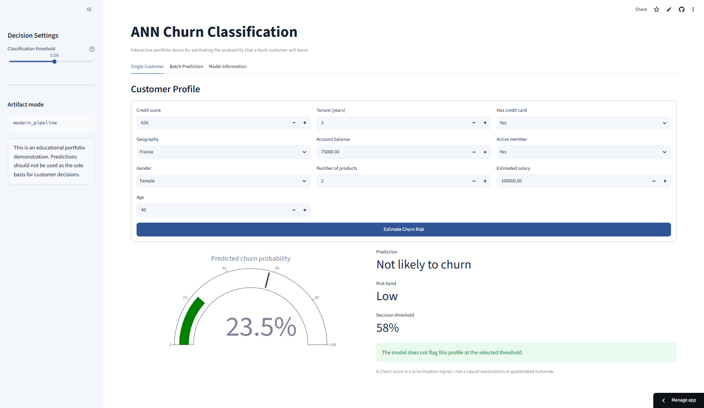
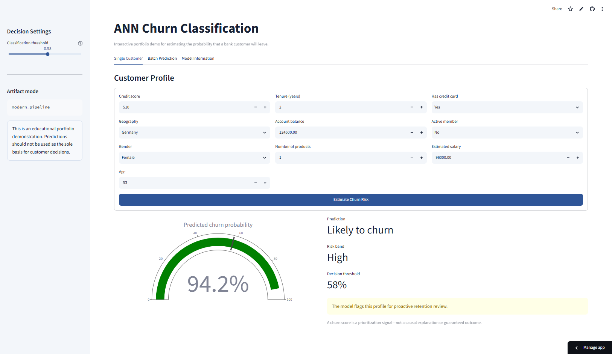
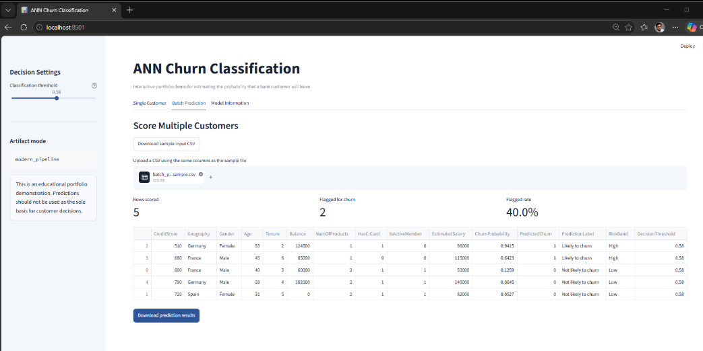
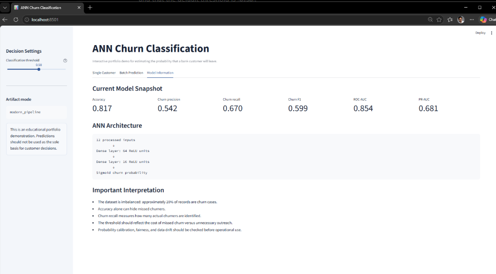
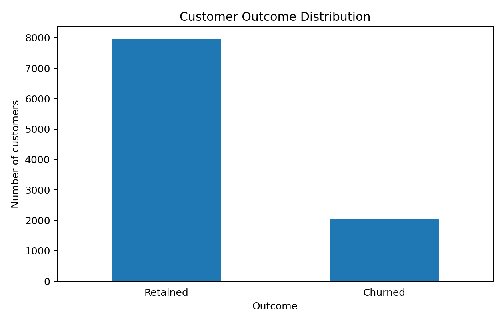
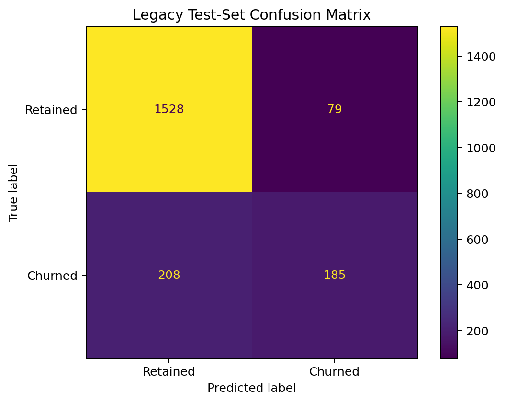
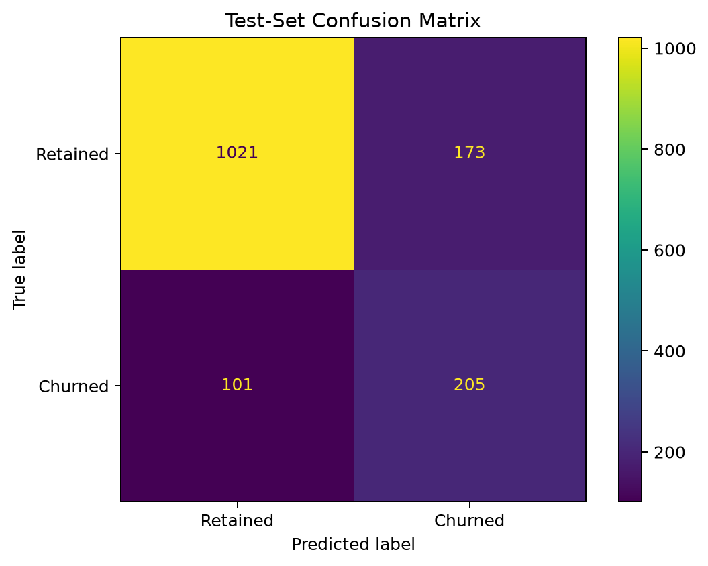
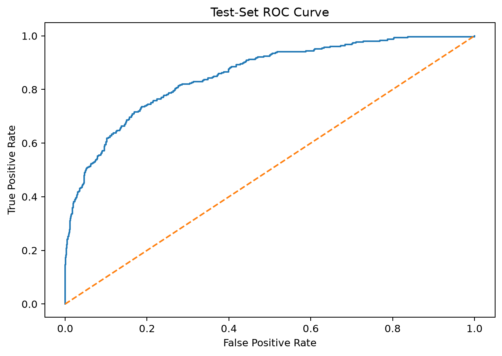
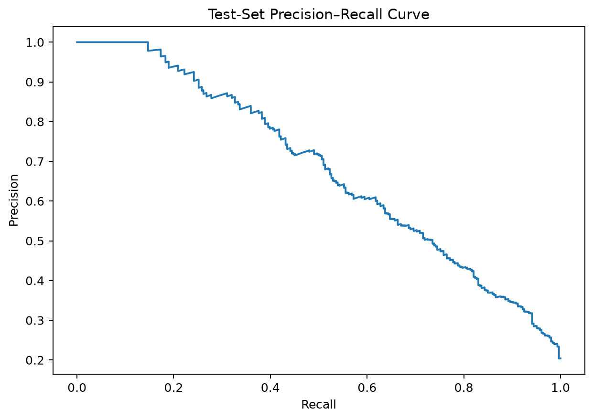

# ANN Churn Classification

> An end-to-end artificial neural network project that estimates customer churn probability and provides an interactive Streamlit demonstration for individual and batch prediction.

**Status:** Portfolio-ready  
**Live demo:** [Open the Streamlit application](https://churn-risk-ann.streamlit.app)  
[](https://churn-risk-ann.streamlit.app)
**Primary stack:** Python · Keras · TensorFlow · scikit-learn · Streamlit

---

## Project Overview

Customer churn directly affects revenue, retention cost, and long-term customer value. This project develops an artificial neural network that estimates the probability that a bank customer will leave based on profile, account, and engagement attributes.

The original notebook was converted into a recruiter-friendly machine-learning application with reusable source code, validation, batch prediction, model documentation, automated tests, Docker support, and deployment guidance.

## Business Problem

Retention teams cannot contact every customer with the same urgency. A churn probability model can help prioritize customers for further review and proactive outreach.

The solution provides:

- A churn probability rather than only a class label
- A configurable decision threshold
- Individual and batch scoring
- Downloadable prediction results
- Transparent performance metrics
- Responsible-use guidance

---

## Interactive Application

### Low-Risk Customer



### High-Risk Customer



### Batch Prediction



### Current Model Information



---

## Dataset Snapshot

| Item | Value |
|---|---:|
| Records | 10,000 |
| Raw columns | 14 |
| Model features | 10 raw / 12 processed |
| Retained customers | 7,963 |
| Churned customers | 2,037 |
| Churn rate | 20.37% |

Identifiers such as `RowNumber`, `CustomerId`, and `Surname` are excluded from model training.

> Before publishing the full raw CSV, confirm and document the original dataset source and redistribution license. See [`data/README.md`](data/README.md).

### Customer Outcome Distribution



The target is imbalanced: approximately 20% of customers are churn cases. Accuracy alone is therefore not sufficient for evaluation.

---

## ANN Workflow

```text
Customer data
      ↓
Remove identifier columns
      ↓
Create stratified train, validation, and test sets
      ↓
Fit preprocessing on training data
      ↓
Encode categorical features and scale numeric features
      ↓
ANN: 64 ReLU → Dropout → 16 ReLU → 1 Sigmoid
      ↓
Generate churn probability
      ↓
Apply validation-selected decision threshold
```

## Model Development

### Legacy Notebook Model

The original model used a `64 → 16 → 1` ANN architecture. Its final training used the test split as validation data during early stopping, so it is retained only as a legacy comparison benchmark.

### Improved Modern Pipeline

The modern training pipeline uses:

- Stratified train, validation, and test sets
- 7,000 training records
- 1,500 validation records
- 1,500 independent test records
- Training-only preprocessing fit
- Class weighting
- Dropout regularization
- Early stopping
- Validation-based threshold selection
- Independent test-set evaluation
- Unified saved preprocessing pipeline

The model completed 42 epochs before early stopping.

---

## Legacy vs Modern Performance

| Metric | Legacy ANN | Modern ANN |
|---|---:|---:|
| Accuracy | 85.65% | 81.73% |
| Churn precision | 70.08% | 54.23% |
| Churn recall | 47.07% | **66.99%** |
| Churn F1 | 56.32% | **59.94%** |
| ROC-AUC | 85.62% | 85.36% |
| PR-AUC | 67.63% | **68.15%** |
| Decision threshold | 0.50 | **0.58** |

### Business Interpretation

The modern ANN increased churn recall from **47.1% to 67.0%**. It identifies more actual churners, while accepting lower precision and overall accuracy because more retained customers are also flagged for review.

---

## Confusion Matrices

### Legacy Model

```text
                     Predicted retained   Predicted churn
Actual retained              1528               79
Actual churn                  208              185
```



### Modern Model

```text
                     Predicted retained   Predicted churn
Actual retained              1021              173
Actual churn                  101              205
```



The modern model correctly identified 205 of 306 churners and missed 101 churners on the independent test set.

### ROC Curve



### Precision–Recall Curve



---

## Interactive Demo Features

- Single-customer churn probability
- Adjustable classification threshold
- Risk band and prediction label
- Batch CSV upload
- Downloadable batch results
- Input-schema validation
- Model-performance summary
- Automatic loading of modern artifacts
- Automatic fallback to legacy artifacts

## Repository Structure

```text
01-churn-classification/
├── app.py
├── README.md
├── NEXT_STEPS.md
├── pytest.ini
├── assets/
│   ├── charts/
│   └── screenshots/
├── data/
├── docs/
├── models/
├── notebooks/
├── scripts/
├── src/
├── tests/
├── Dockerfile
├── requirements.txt
├── requirements-dev.txt
└── requirements-test.txt
```

## Run the Demo Locally

### Windows Quick Start

```bat
scripts\setup_windows.bat
scripts\run_app.bat
```

### Manual Setup

```bash
python -m venv .venv
.venv\Scripts\activate
python -m pip install -r requirements.txt
python -m streamlit run app.py
```

Open `http://localhost:8501`.

## Retrain the Modern Model

```bash
python -m pip install -r requirements-dev.txt
python -m src.train
```

The training process creates:

```text
models/model.keras
models/preprocessor.joblib
models/training_history.csv
models/metadata.json
```

## Run Tests

```bash
python -m pytest -q
```

Expected result:

```text
5 passed
```

## Docker

```bash
docker build -t ann-churn-classification .
docker run --rm -p 8501:8501 ann-churn-classification
```

## Deployment

The recommended public demo platform is Streamlit Community Cloud.

Use this entrypoint:

```text
01-churn-classification/app.py
```

Detailed instructions are available in [`docs/deployment.md`](docs/deployment.md).

## Portfolio Skills Demonstrated

- Business-problem framing
- Artificial neural networks
- Binary classification
- Categorical encoding and feature scaling
- Class-imbalance handling
- Stratified data splitting
- Threshold-based decisions
- Model evaluation beyond accuracy
- Streamlit development
- Batch inference
- Modular Python organization
- Input validation
- Automated testing
- Docker deployment
- Model documentation

## Responsible Use

This project is an educational portfolio demonstration. A churn prediction should be treated as a prioritization signal rather than a definitive outcome or causal explanation.

Production use would require calibration, fairness analysis, drift monitoring, governance, access controls, business-cost-based threshold selection, and human review.

## Future Improvements

1. Add logistic-regression, random-forest, and gradient-boosting baselines.
2. Compare ANN performance against established tabular models.
3. Add probability calibration and Brier score.
4. Add subgroup performance analysis.
5. Add SHAP or sensitivity-based explanations.
6. Add model and data drift monitoring.
7. Add an API endpoint for programmatic scoring.
8. Convert the model to a lighter inference format.
9. Add retention-cost optimization for threshold selection.

## Author

**Anmol Tripathi**  
Quality Data Scientist | Analytics | Machine Learning | Applied AI
