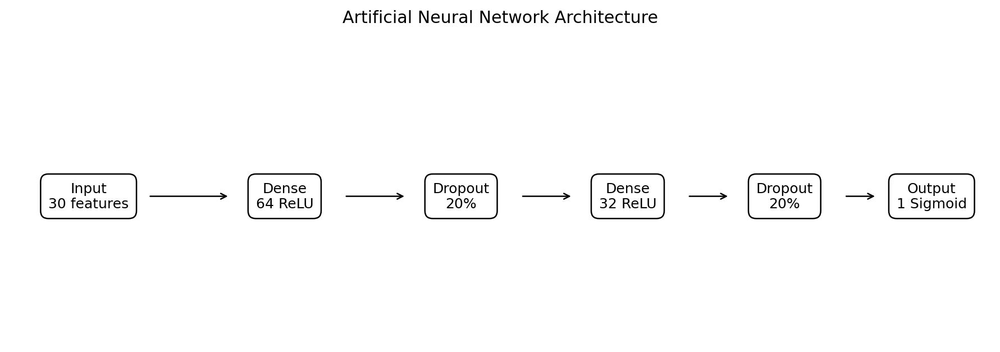
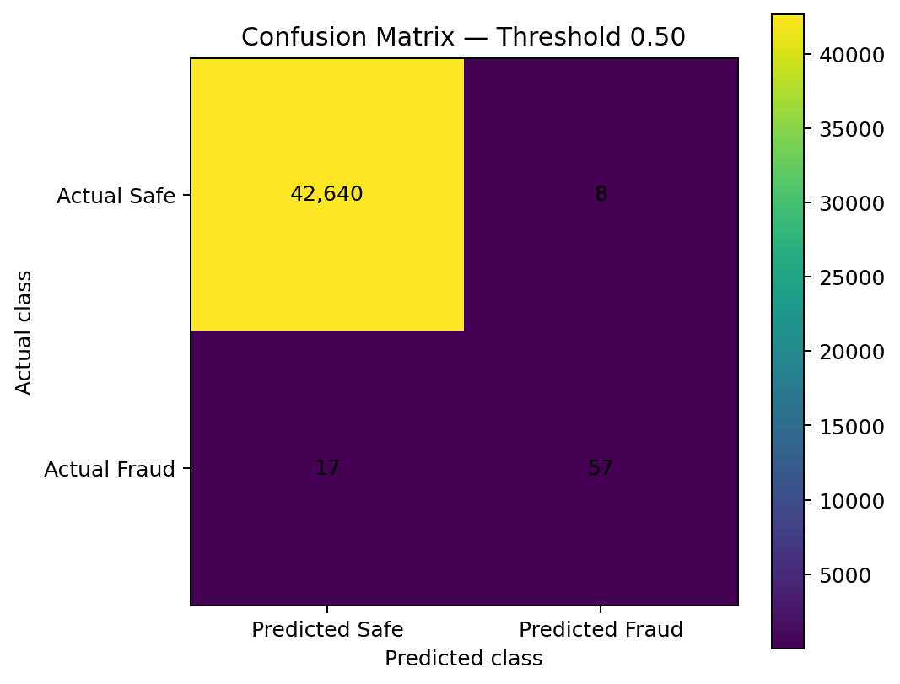
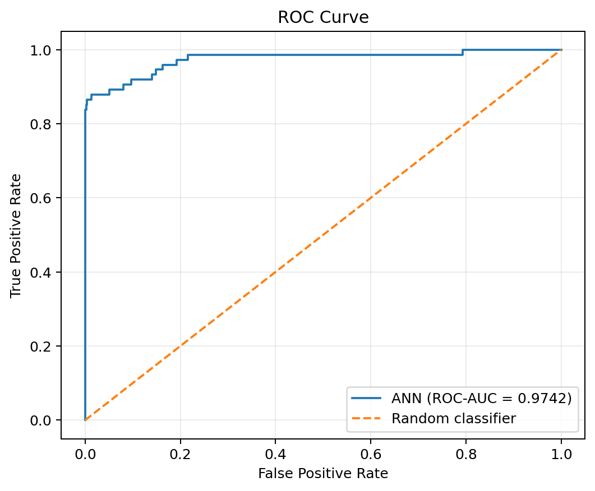
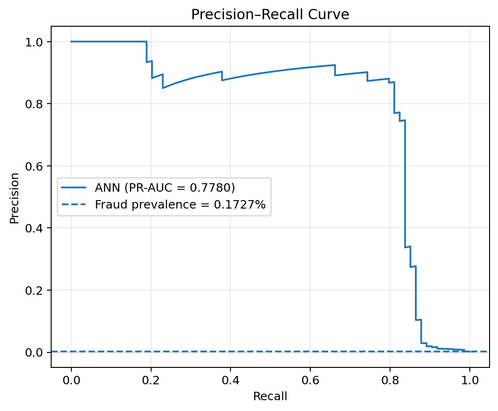
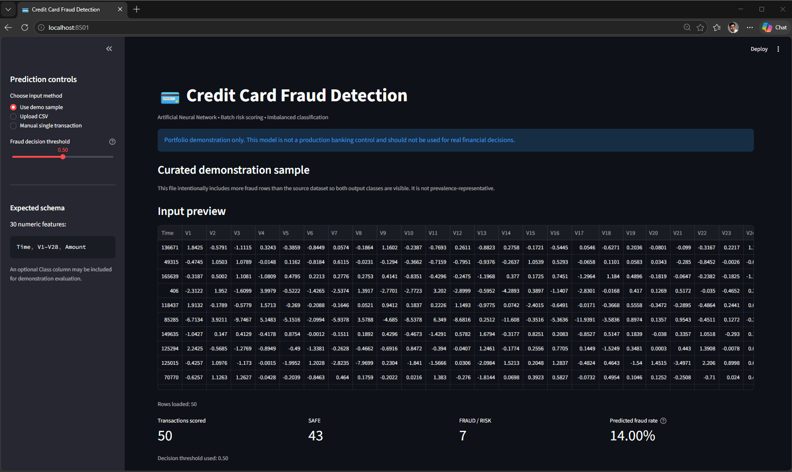
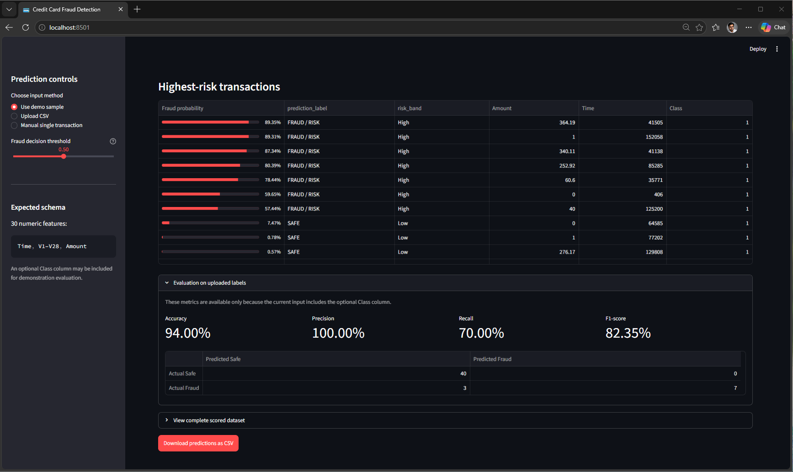
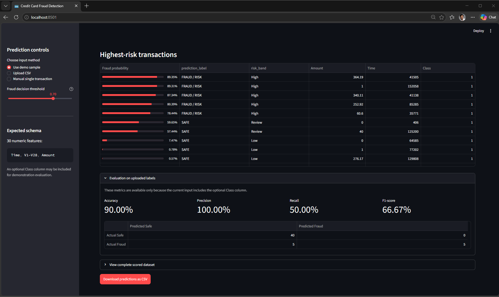

# Credit Card Fraud Detection using Artificial Neural Networks

[](https://www.python.org/)
[](https://www.tensorflow.org/)
[](https://ann-deep-learning-projects-dqnj5rpwbpmuxtd2tcm5mh.streamlit.app/)
[](LICENSE)

An end-to-end fraud-risk scoring project that uses an Artificial Neural Network
to identify rare fraudulent credit-card transactions. The repository includes
reproducible preprocessing and training code, imbalance-aware evaluation,
probability-based predictions, threshold controls, saved model artifacts, and a
Streamlit batch-scoring application.

**Status:** Portfolio-ready  
**Live demo:** [Open the Streamlit application](https://ann-deep-learning-projects-dqnj5rpwbpmuxtd2tcm5mh.streamlit.app/)  
[](https://ann-deep-learning-projects-dqnj5rpwbpmuxtd2tcm5mh.streamlit.app/)  
**Primary stack:** Python · Keras · TensorFlow · scikit-learn · Streamlit

---

## Business Problem

Credit-card fraud detection is an extremely imbalanced binary-classification
problem. In the source dataset, only **492 of 284,807 transactions (0.1727%)**
are labeled fraudulent. A model can therefore achieve more than 99.8% accuracy
by predicting every transaction as legitimate, while detecting no fraud at all.

A useful fraud model must balance two operational risks:

- **False negatives:** fraudulent transactions that are missed and may create
  financial loss, customer impact, or investigation delays.
- **False positives:** legitimate transactions incorrectly blocked or routed
  for review, creating customer friction and unnecessary operating cost.

For this reason, this project emphasizes precision, recall, F1-score, ROC-AUC,
PR-AUC, confusion-matrix analysis, fraud probabilities, and decision-threshold
selection rather than accuracy alone.

## Project Objective

Build a portfolio-ready ANN solution that can:

1. Validate and preprocess anonymized transaction features.
2. Learn non-linear fraud patterns using a feed-forward neural network.
3. Handle class imbalance using training-set class weights.
4. Evaluate ranking and threshold-dependent performance.
5. Produce fraud probability scores for individual or batch transactions.
6. Support an adjustable operating threshold in an interactive web application.
7. Save and reload all artifacts required for reproducible inference.

## Dataset

The project uses the public **Credit Card Fraud Detection** dataset originally
released for research on European cardholder transactions.

- **Rows:** 284,807
- **Model features:** 30
- **Target:** `Class`
- **Legitimate transactions:** 284,315
- **Fraudulent transactions:** 492
- **Fraud rate:** 0.1727%
- **Missing values in the supplied file:** 0
- **Features:** `Time`, `V1`–`V28`, and `Amount`
- **Target values:** `0 = legitimate`, `1 = fraud`

`V1`–`V28` are anonymized principal-component features. The complete dataset is
approximately 151 MB and is intentionally excluded from GitHub. Setup
instructions are available in [`data/README_data.md`](data/README_data.md).

Dataset page:  
https://www.kaggle.com/datasets/mlg-ulb/creditcardfraud

## Tools and Technologies

| Area | Technology |
|---|---|
| Language | Python |
| Data processing | pandas, NumPy |
| Modeling | TensorFlow / Keras |
| Preprocessing | scikit-learn |
| Evaluation | scikit-learn, Matplotlib |
| Demo application | Streamlit |
| Model persistence | Keras `.keras` format and Python pickle |
| Testing / quality | pytest, compile checks, GitHub Actions |
| Hosting | Streamlit Community Cloud |

## Project Workflow

```text
Raw transaction CSV
        │
        ▼
Schema and quality validation
        │
        ▼
Stratified 70% / 15% / 15% split
        │
        ▼
StandardScaler fitted on training data only
        │
        ▼
ANN training with class weights
        │
        ▼
Validation PR curve and threshold selection
        │
        ▼
Held-out test evaluation
        │
        ▼
Saved model + scaler + schema + threshold
        │
        ▼
Streamlit batch and single-transaction scoring
```

## ANN Architecture

The supplied reference artifact uses the following architecture:

```text
30 input features
      │
Dense(64, ReLU)
      │
Dropout(0.20)
      │
Dense(32, ReLU)
      │
Dropout(0.20)
      │
Dense(1, Sigmoid)
      │
Fraud probability
```

The improved training module additionally uses batch normalization and compiles
the model with:

- Binary cross-entropy loss
- Adam optimizer
- Binary accuracy
- ROC-AUC
- PR-AUC
- Precision
- Recall



## Handling Class Imbalance

The improved training pipeline uses **balanced class weights calculated from the
training split only**. This gives more importance to fraudulent rows without
creating synthetic transactions.

Class weighting was selected as the default approach because:

- the minority class is extremely small;
- the features are already PCA-transformed and anonymized;
- synthetic oversampling may create unrealistic points in transformed space;
- the original observations remain unchanged;
- threshold tuning can later reflect different business costs.

The decision threshold is selected on validation data, never on the test set.
The Streamlit application also exposes the threshold so reviewers can see the
precision-versus-recall trade-off.

## Audited Reference Results

The included pretrained model and scaler were evaluated using the exact
stratified split documented in the original notebook:

- Training: 199,364 rows
- Validation: 42,721 rows
- Test: 42,722 rows
- Fraud rows in the test set: 74
- Reference threshold: 0.50

| Metric | Result |
|---|---:|
| Accuracy | 99.9415% |
| Precision | 87.6923% |
| Recall | 77.0270% |
| F1-score | 82.0144% |
| ROC-AUC | 97.4227% |
| PR-AUC / Average Precision | 77.7964% |

Confusion matrix at threshold 0.50:

| | Predicted Safe | Predicted Fraud |
|---|---:|---:|
| **Actual Safe** | 42,640 | 8 |
| **Actual Fraud** | 17 | 57 |

These results show why accuracy is not sufficient: the model achieved very high
accuracy because legitimate transactions dominate the dataset, while recall
shows that 17 of 74 fraud cases were still missed at the reference threshold.



<p align="center">
  
  
</p>

> The included metrics describe the supplied pretrained artifact. Running the
> improved class-weighted training pipeline will generate a new model and may
> produce different results.

## Streamlit Demo

The application supports:

- Preloaded demonstration data
- CSV upload for batch scoring
- A one-row manual data editor
- Input schema validation
- Fraud probability scoring
- Adjustable decision threshold
- `SAFE` and `FRAUD / RISK` labels
- Prediction summary metrics
- Highest-risk transaction table
- Optional evaluation when the uploaded file contains `Class`
- Downloadable prediction results

The manual form is intended mainly for technical testing because `V1`–`V28` are
anonymized PCA features and are not intuitive business inputs. The included
demonstration sample is intentionally fraud-enriched so that both prediction
classes and the threshold trade-off are visible.

### Application Overview

At the default threshold of `0.50`, the demonstration sample scores 50
transactions and classifies 43 as `SAFE` and 7 as `FRAUD / RISK`.



### Highest-Risk Transactions and Demo Evaluation

The application ranks transactions by fraud probability and displays evaluation
metrics when the optional `Class` column is present. On the curated sample at
the default threshold, it reports 94.00% accuracy, 100.00% precision, 70.00%
recall, and an 82.35% F1-score.



### Decision-Threshold Sensitivity

Increasing the threshold from `0.50` to `0.70` reduces the number of fraud
alerts. In the demonstration sample, recall falls from 70.00% to 50.00% and the
F1-score falls from 82.35% to 66.67%, illustrating the operational trade-off
between fraud detection coverage and alert volume.



## Folder Structure

```text
ann-deep-learning-projects/
├── .github/
│   └── workflows/
│       └── credit-card-fraud-ci.yml
├── 01-churn-classification/
├── 02-credit-card-fraud-detection/
│   ├── app/
│   │   ├── requirements.txt
│   │   └── streamlit_app.py
│   ├── data/
│   │   ├── README_data.md
│   │   └── sample_input.csv
│   ├── images/
│   │   ├── demo_evaluation.png
│   │   ├── demo_screenshot.png
│   │   └── threshold_070_evaluation.png
│   ├── models/
│   │   ├── credit_card_best_params.json
│   │   ├── credit_card_fraud_ann.keras
│   │   ├── credit_card_scaler.pkl
│   │   ├── decision_threshold.json
│   │   ├── feature_schema.json
│   │   └── README_models.md
│   ├── notebooks/
│   │   ├── archive/
│   │   │   └── original_credit_card_fraud_detection.ipynb
│   │   └── credit_card_fraud_detection.ipynb
│   ├── outputs/
│   │   ├── class_distribution.png
│   │   ├── classification_report.csv
│   │   ├── confusion_matrix.png
│   │   ├── model_architecture.png
│   │   ├── model_metrics.json
│   │   ├── precision_recall_curve.png
│   │   ├── roc_curve.png
│   │   └── threshold_analysis.csv
│   ├── src/
│   │   ├── __init__.py
│   │   ├── config.py
│   │   ├── data_preprocessing.py
│   │   ├── model_evaluation.py
│   │   ├── model_training.py
│   │   └── prediction_pipeline.py
│   ├── tests/
│   │   ├── conftest.py
│   │   ├── test_data_preprocessing.py
│   │   └── test_model_evaluation.py
│   ├── .gitignore
│   ├── .python-version
│   ├── LICENSE
│   ├── PORTFOLIO_POSITIONING.md
│   ├── PROJECT_AUDIT.md
│   ├── README.md
│   ├── README_HOSTING.md
│   ├── requirements-dev.txt
│   └── requirements.txt
├── .gitignore
├── LICENSE
├── PROJECT_ROADMAP.md
└── README.md
```

## Run Locally

### 1. Open the project directory

```bash
cd ann-deep-learning-projects/02-credit-card-fraud-detection
```

### 2. Create a virtual environment

Windows PowerShell:

```powershell
py -3.12 -m venv .venv
.venv\Scripts\Activate.ps1
```

macOS or Linux:

```bash
python3.12 -m venv .venv
source .venv/bin/activate
```

### 3. Install dependencies

```bash
python -m pip install --upgrade pip
pip install -r requirements.txt
```

### 4. Launch the supplied pretrained demo

The pretrained model, scaler, schema, threshold configuration, and sample CSV
are already included.

```bash
python -m streamlit run app/streamlit_app.py
```

Open the local address displayed in the terminal, normally:

```text
http://localhost:8501
```

### 5. Optional: retrain the model

Download `creditcard.csv` and place it at:

```text
data/creditcard.csv
```

Then run:

```bash
python -m src.model_training --data data/creditcard.csv --epochs 40
```

For a recall-oriented threshold:

```bash
python -m src.model_training   --data data/creditcard.csv   --epochs 40   --threshold-strategy recall_target   --recall-target 0.85
```

Training saves or updates:

- `models/credit_card_fraud_ann.keras`
- `models/credit_card_scaler.pkl`
- `models/credit_card_best_params.json`
- `models/decision_threshold.json`
- `models/feature_schema.json`
- `outputs/model_metrics.json`
- Evaluation figures in `outputs/`

## Deploy

The application is deployed through Streamlit Community Cloud directly from
the public ANN portfolio repository.

- **Repository:** `unit-mole/ann-deep-learning-projects`
- **Branch:** `main`
- **Entrypoint:** `02-credit-card-fraud-detection/app/streamlit_app.py`
- **Python:** `3.12`
- **Live application:**  
  https://ann-deep-learning-projects-dqnj5rpwbpmuxtd2tcm5mh.streamlit.app/

The `app/requirements.txt` file contains the complete deployment dependency
list beside the Streamlit entrypoint. This allows Community Cloud to resolve
the environment reliably within the monorepo.

See the complete deployment and maintenance instructions in
[`README_HOSTING.md`](README_HOSTING.md).

## Testing

Run lightweight unit tests:

```bash
pytest -q
```

Check all Python files for syntax errors:

```bash
python -m compileall app src tests
```

## Future Improvements

- Cost-sensitive threshold optimization using estimated investigation and fraud
  loss values.
- Time-aware or cardholder-group-aware validation if non-anonymized identifiers
  become available.
- Model calibration to improve probability reliability.
- Comparison against strong tabular baselines such as logistic regression,
  gradient boosting, XGBoost, or LightGBM.
- Explainability using SHAP or permutation importance, with appropriate caution
  because the PCA features are anonymized.
- Drift monitoring and delayed-label performance tracking.
- API-based scoring for production integration.
- Experiment tracking with MLflow.
- Automated model and data validation in CI/CD.

## Skills Demonstrated

- Artificial Neural Networks for tabular data
- Highly imbalanced binary classification
- Data leakage prevention
- Stratified data splitting
- Feature scaling and artifact persistence
- Class weighting
- Precision-recall analysis
- Threshold optimization
- Fraud probability and risk scoring
- Model evaluation and error analysis
- Streamlit application development
- GitHub repository organization
- Deployment-ready ML engineering

## Responsible Use

This repository is an educational and portfolio demonstration. Real financial
fraud systems require institution-specific data, legal and compliance review,
security controls, model governance, fairness assessment, monitoring,
human-review workflows, and production validation.

## Author

**Anmol Tripathi**  
Quality Data Scientist transitioning toward Data Science, Machine Learning,
Applied AI, Analytics Engineering, and Quality Analytics roles.
