# Credit Risk Probability Scoring using Artificial Neural Networks

[](https://www.python.org/)
[](https://www.tensorflow.org/)
[](https://ann-deep-learning-projects-9p9vupmu9kbk5462v6hbkb.streamlit.app/)
[](LICENSE)

An end-to-end credit-risk probability scoring project that uses an Artificial Neural Network
to estimate applicant default risk and assign operational risk categories. The repository
includes reproducible preprocessing and training code, imbalance-aware evaluation,
probability-based scoring, threshold controls, saved model artifacts, risk recommendations,
and a Streamlit application for manual and batch scoring.

**Status:** Portfolio-ready  
**Live demo:** [Open the Streamlit application](https://ann-deep-learning-projects-9p9vupmu9kbk5462v6hbkb.streamlit.app/)  
[](https://ann-deep-learning-projects-9p9vupmu9kbk5462v6hbkb.streamlit.app/)  
**Primary stack:** Python · Keras · TensorFlow · scikit-learn · Streamlit

## Business Problem

Lenders need more than a binary approve/reject prediction. They need a comparable risk score that can rank applicants, support manual-review queues, and make decision policies transparent. This project answers:

> Given applicant information, what is the probability that the applicant belongs to a higher default-risk category?

The deployed pipeline returns:

- **Risk probability score**
- **Low / Medium / High risk category**
- **Decision recommendation and review priority**

## Portfolio Scope

This is an educational demonstration built on a deterministic **synthetic banking dataset**. It is not a production credit model and must not be used for real lending decisions.

## Dataset

The notebook generates 25,000 applicant records with demographic, financial, credit-history, collateral, and loan-purpose fields. The observed target distribution is:

| Class | Records | Share |
|---|---:|---:|
| Non-default | 19,682 | 78.73% |
| Default | 5,318 | 21.27% |

Six fields receive 1% controlled missingness to demonstrate imputation. No private customer data is included in GitHub.

## Workflow

1. Generate or load applicant-level data.
2. Create `monthly_income`, `loan_to_income`, and `collateral_ratio`.
3. Split data into 70% train, 15% validation, and 15% test sets with stratification.
4. Median-impute and standardize numerical fields.
5. Most-frequent-impute and one-hot encode categorical fields.
6. Handle imbalance with balanced class weights.
7. Train an ANN with early stopping, learning-rate reduction, and best-model checkpointing.
8. Select the binary classification threshold on validation F1.
9. Evaluate probability quality, classification performance, calibration, and error trade-offs.
10. Serve single and batch scoring through Streamlit.

## Feature Engineering

| Derived field | Formula | Purpose |
|---|---|---|
| Monthly income | Annual income / 12 | Monthly affordability proxy |
| Loan-to-income | Loan amount / annual income | Relative debt burden |
| Collateral ratio | Collateral value / loan amount | Security coverage proxy |

The portable preprocessing schema stores training medians, scaling statistics, categorical modes, category order, and final feature order. This makes the demo less dependent on scikit-learn pickle compatibility.

## ANN Architecture

```text
41 processed inputs
      ↓
Dense 256 + ReLU + L2 + BatchNorm + Dropout(0.30)
      ↓
Dense 128 + ReLU + L2 + BatchNorm + Dropout(0.25)
      ↓
Dense 64 + ReLU + L2 + BatchNorm + Dropout(0.20)
      ↓
Dense 32 + ReLU + Dropout(0.10)
      ↓
Sigmoid probability of default
```

Training uses Adam, binary cross-entropy, ROC-AUC, PR-AUC, balanced class weights, early stopping, and `ReduceLROnPlateau`.

## Probability and Decision Logic

The ANN outputs a continuous probability between 0 and 1. Two threshold layers are intentionally separated:

- **Classification threshold: 0.58** — selected on the validation set to maximize F1.
- **Operational risk bands:**
  - `< 0.20`: Low Risk
  - `0.20–<0.50`: Medium Risk
  - `>= 0.50`: High Risk

Risk bands are a policy layer for demonstration. A real lender would set them using expected-loss economics, approval capacity, portfolio appetite, calibration, fairness review, and regulation—not validation F1 alone.

## Model Results

| Metric | Test result |
|---|---:|
| Accuracy | 0.774 |
| Precision | 0.477 |
| Recall | 0.649 |
| F1-score | 0.550 |
| ROC-AUC | 0.813 |
| PR-AUC | 0.610 |
| Log loss | 0.518 |
| Brier score | 0.174 |

Confusion matrix at threshold 0.58:

| | Predicted non-default | Predicted default |
|---|---:|---:|
| Actual non-default | 2,384 | 568 |
| Actual default | 280 | 518 |

A **false negative** is a risky applicant treated as lower risk and can create credit loss. A **false positive** is a safer applicant flagged as risky and can reduce approvals, revenue, and customer access. Threshold selection therefore requires business-cost analysis, not accuracy alone.

## Class Imbalance

Defaults are only 21.27% of the synthetic data. The notebook uses balanced class weights (`0: 0.635`, `1: 2.351`) rather than generating synthetic minority examples. This retains original training rows while making default errors more influential. Precision-recall analysis and validation threshold tuning complement the class weighting.

## Explainability

Permutation importance identifies the strongest model-performance drivers in the executed notebook. The leading signals include loan-to-income ratio, debt-to-income ratio, monthly income, delinquency count, revolving utilization, grade, home ownership, and collateral value. These are global associations—not causal explanations or legally sufficient adverse-action reasons.

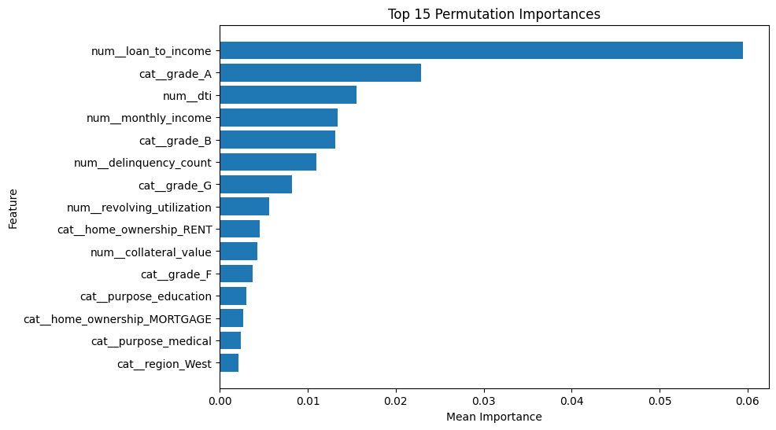

## Visual Model Results

| Confusion matrix | ROC curve |
|---|---|
| 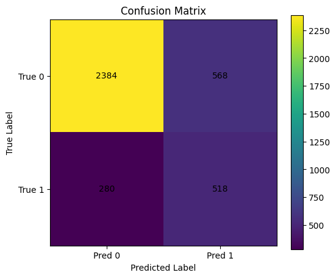 | 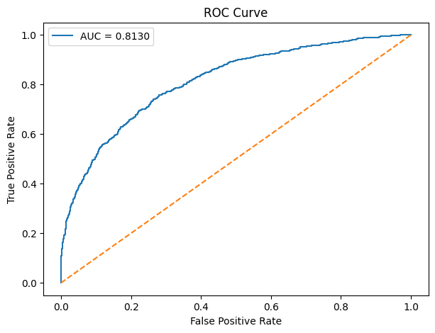 |

| Precision-recall curve | Calibration curve |
|---|---|
| 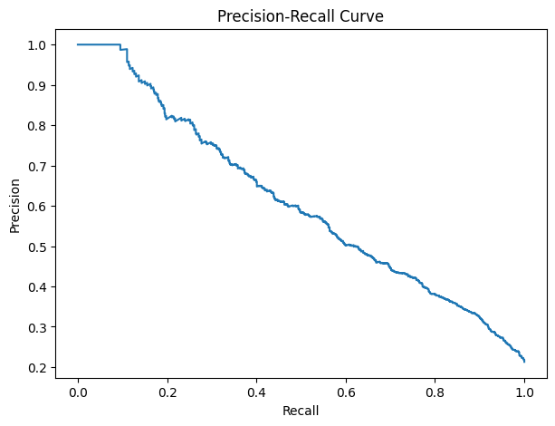 | 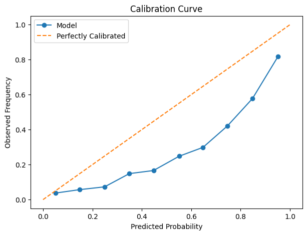 |

| Training AUC | Risk bands |
|---|---|
| 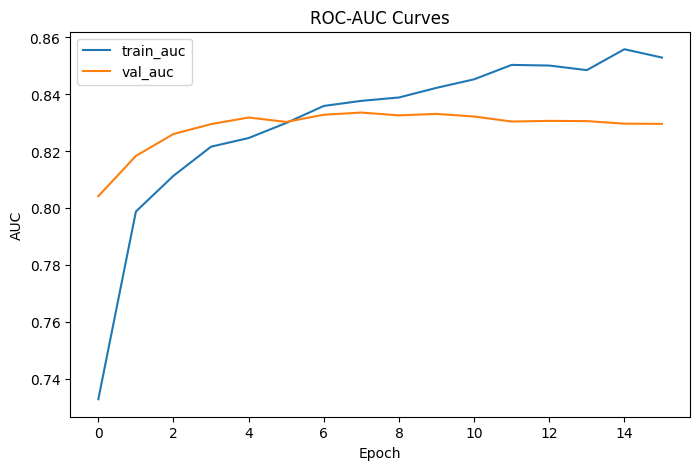 | 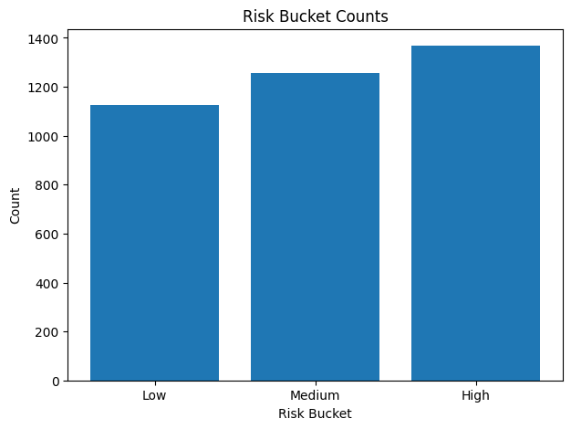 |

## Streamlit Demo

The application supports:

- Manual applicant entry
- CSV upload for batch scoring
- Preloaded safe sample data
- Probability, category, predicted class, and recommendation
- Risk-category distribution chart
- Downloadable scored CSV
- Input-schema guidance for reviewers

### Application Overview

The home screen presents the business purpose, model threshold, and three supported scoring modes: manual entry, CSV upload, and preloaded sample data.

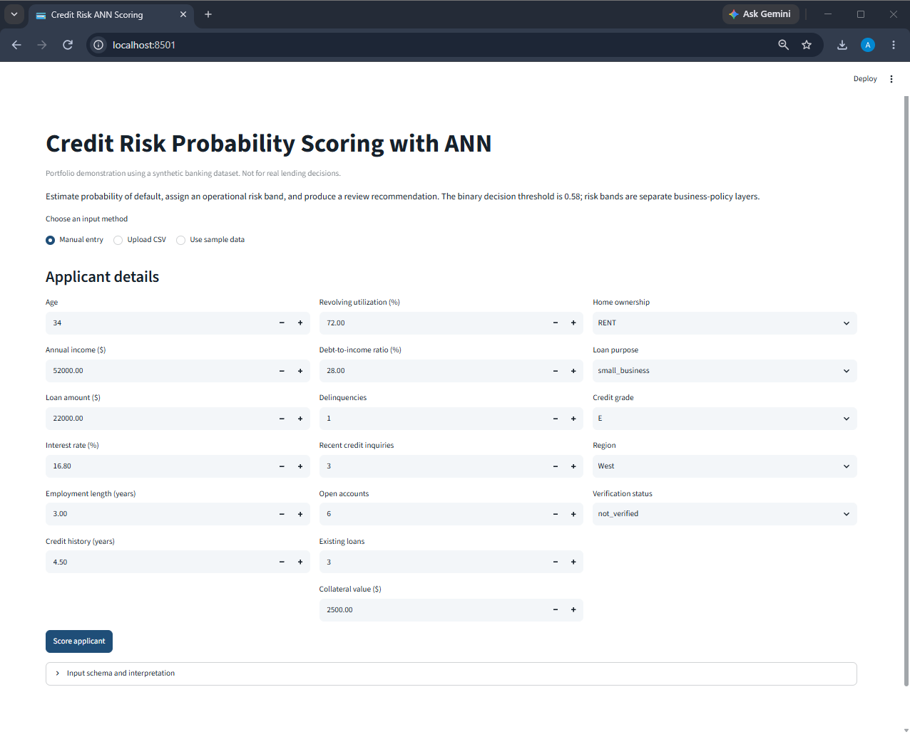

The main demonstration view summarizes the scoring output and connects model probabilities to business-facing risk categories and review recommendations.


### Sample Applicant Workflow

The preloaded sample data provides a safe, reproducible way to test the application without uploading private information.

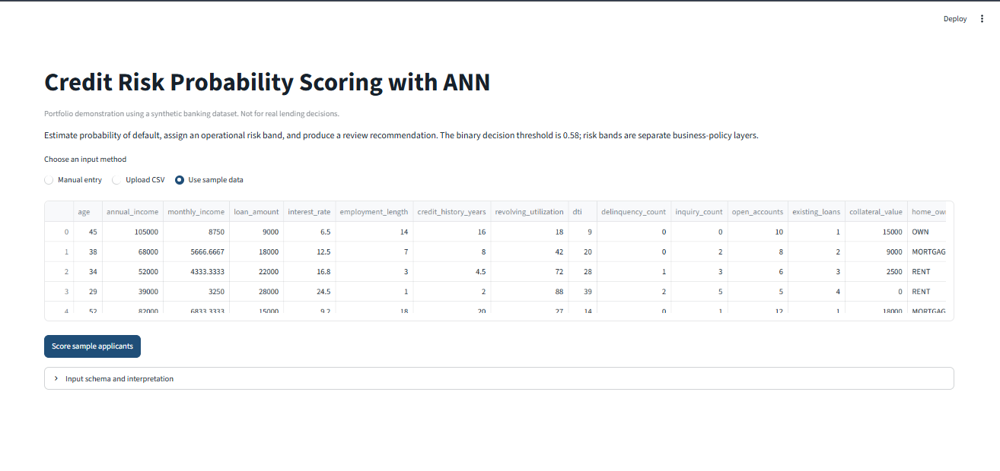

After scoring, the application displays the first applicant's probability, risk category, predicted class, recommendation, and the portfolio-level distribution of risk bands.

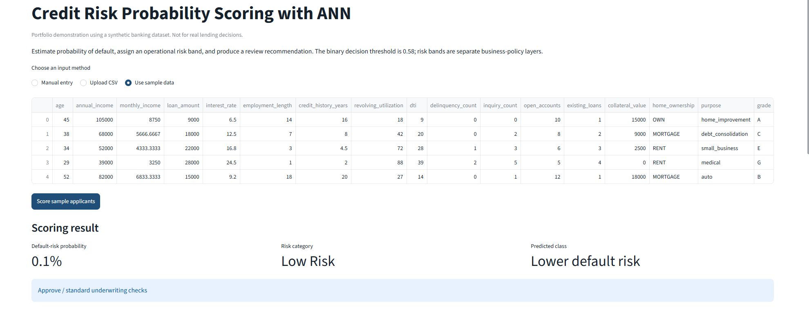

### Risk Distribution and Detailed Scored Output

The demonstration sample contains applicants across Low, Medium, and High Risk categories, making the model's operational segmentation visible.

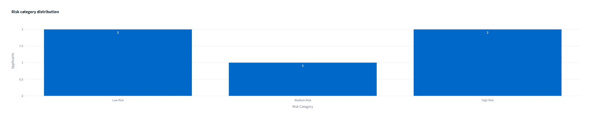

The detailed table preserves the applicant inputs and adds the scoring fields:

- `risk_probability`
- `risk_category`
- `predicted_default`
- `decision_recommendation`
- `review_priority`

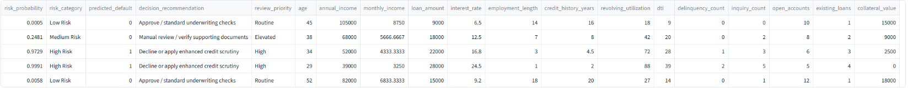

### Manual Low-Risk Prediction

A stronger applicant profile with lower leverage, longer credit history, lower utilization, and verified information produces a Low Risk result and a standard underwriting recommendation.

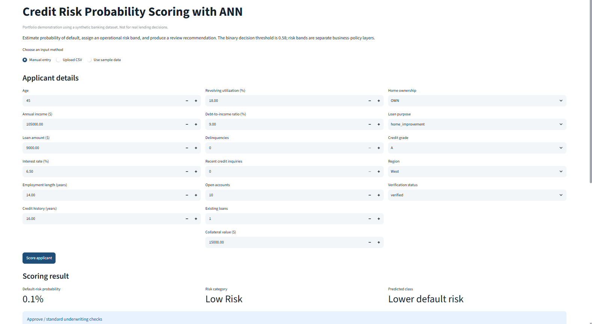

### Manual High-Risk Prediction

A weaker applicant profile with high utilization, high debt burden, limited credit history, delinquencies, and a lower credit grade produces a High Risk result and enhanced scrutiny recommendation.

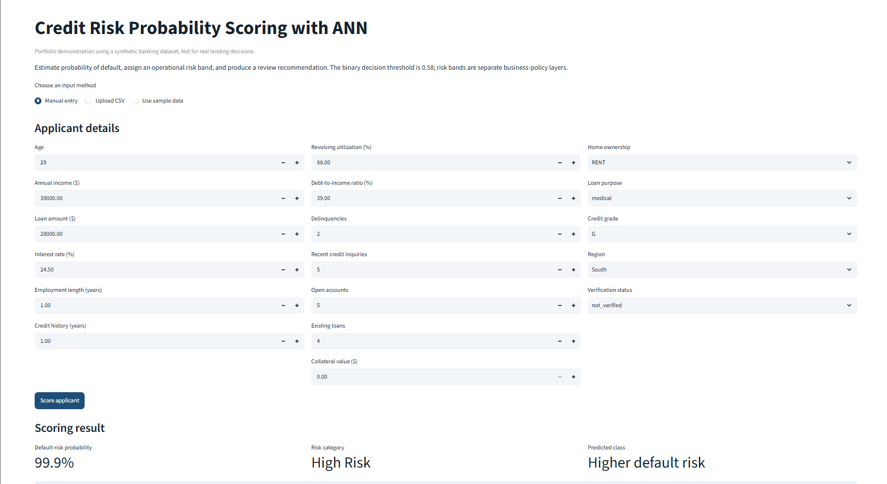

### CSV Batch Scoring

The upload workflow previews the incoming applicant data before scoring, which helps reviewers validate the schema and record structure.

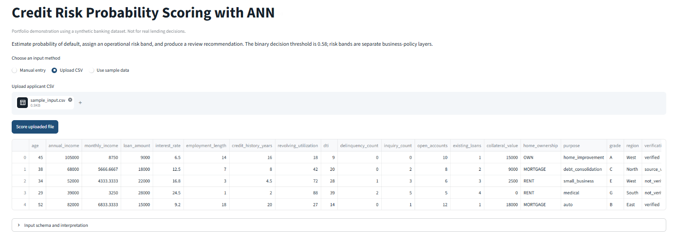

After scoring, the application displays the risk summary, category distribution, detailed output, and a button for downloading the scored CSV.

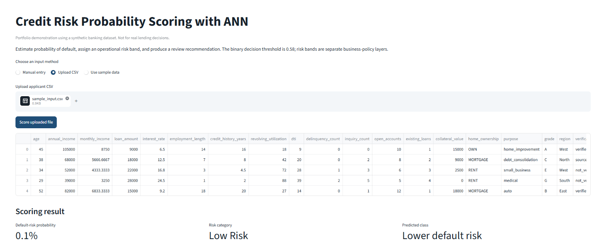

### Input Schema and Interpretation

The app documents the required raw columns, automatically derived fields, and the treatment of previously unseen categorical values.

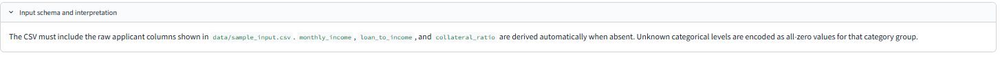

## Run Locally

```bash
cd ann-deep-learning-projects/03-credit-risk-probability-scoring
python -m venv .venv
```

Windows:

```bash
.venv\Scripts\activate
python -m pip install --upgrade pip
pip install -r requirements.txt
streamlit run app/streamlit_app.py
```

macOS/Linux:

```bash
source .venv/bin/activate
python -m pip install --upgrade pip
pip install -r requirements.txt
streamlit run app/streamlit_app.py
```

Open the local URL printed by Streamlit, normally `http://localhost:8501`.

## Retrain the Model

The included model is ready for the demo. To reproduce training on the synthetic dataset:

```bash
python -m src.model_training
```

To train on a compatible CSV containing `default_flag`:

```bash
python -m src.model_training --data path/to/training_data.csv
```

The script writes model checkpoints to `models/` and training logs to `outputs/`.

## Deploy

The application is deployed through Streamlit Community Cloud directly from the public ANN portfolio repository.

- **Repository:** `unit-mole/ann-deep-learning-projects`
- **Branch:** `main`
- **Entrypoint:** `03-credit-risk-probability-scoring/app/streamlit_app.py`
- **Python:** `3.12`
- **Live application:**  
  https://ann-deep-learning-projects-9p9vupmu9kbk5462v6hbkb.streamlit.app/

The `app/requirements.txt` file contains the deployment dependency list beside the Streamlit entrypoint. This allows Community Cloud to resolve the environment reliably within the monorepo.

See [`README_HOSTING.md`](README_HOSTING.md) for detailed deployment and maintenance instructions.

## Project Structure

```text
ann-deep-learning-projects/
├── .github/
│   └── workflows/
│       └── credit-risk-ann-ci.yml
├── 01-churn-classification/
├── 02-credit-card-fraud-detection/
├── 03-credit-risk-probability-scoring/
│   ├── app/
│   │   ├── requirements.txt
│   │   └── streamlit_app.py
│   ├── data/
│   │   ├── README_data.md
│   │   └── sample_input.csv
│   ├── images/
│   │   ├── 01_app_home.png
│   │   ├── 02_sample_input_preview.png
│   │   ├── 03_sample_scoring_summary.png
│   │   ├── 04_risk_category_distribution.png
│   │   ├── 05_sample_scored_table.png
│   │   ├── 06_manual_low_risk_prediction.png
│   │   ├── 07_manual_high_risk_prediction.png
│   │   ├── 08_batch_upload_preview.png
│   │   ├── 09_batch_scoring_results.png
│   │   ├── 10_input_schema_information.png
│   │   └── demo_screenshot.png
│   ├── models/
│   │   ├── final_credit_risk_ann_model.keras
│   │   ├── best_credit_risk_ann_model.keras
│   │   ├── preprocessor.joblib
│   │   ├── preprocessing_schema.json
│   │   └── project_metadata.json
│   ├── notebooks/
│   │   └── credit_risk_probability_scoring.ipynb
│   ├── outputs/
│   ├── src/
│   │   ├── __init__.py
│   │   ├── config.py
│   │   ├── data_preprocessing.py
│   │   ├── feature_engineering.py
│   │   ├── model_training.py
│   │   ├── model_evaluation.py
│   │   ├── risk_scoring.py
│   │   └── prediction_pipeline.py
│   ├── tests/
│   │   ├── conftest.py
│   │   ├── test_preprocessing.py
│   │   └── test_risk_scoring.py
│   ├── .gitignore
│   ├── .streamlit/
│   │   └── config.toml
│   ├── Dockerfile
│   ├── LICENSE
│   ├── MODEL_CARD.md
│   ├── PROJECT_FILE_INVENTORY.json
│   ├── README.md
│   ├── README_HOSTING.md
│   ├── requirements-dev.txt
│   └── requirements.txt
├── .gitignore
├── LICENSE
├── PROJECT_ROADMAP.md
└── README.md
```

## Future Improvements

- Validate on a public real-world dataset with a documented license.
- Add probability calibration comparison using Platt scaling or isotonic regression.
- Optimize thresholds using expected loss and approval capacity.
- Add segment fairness analysis and governance documentation.
- Compare ANN performance with logistic regression, gradient boosting, and calibrated tree models.
- Add SHAP explanations with carefully designed, non-causal language.
- Track drift, calibration decay, and stability over time.
- Add model registry, API serving, and automated deployment tests.

## Skills Demonstrated

Artificial neural networks, binary classification, probability scoring, imbalanced learning, preprocessing pipelines, feature engineering, threshold tuning, ROC/PR analysis, calibration, explainability, modular Python, Streamlit, testing, CI, Docker, model documentation, and responsible AI framing.

## Portfolio Positioning

**One-line description:** ANN-based credit risk engine that produces probability-of-default scores, risk bands, and review recommendations through an interactive Streamlit app.

**Pinned repository description:** End-to-end tabular deep-learning project with reproducible preprocessing, class-weighted ANN training, probability calibration metrics, threshold tuning, explainability, and deployable batch scoring.

This project supports a transition from Quality Data Scientist to broader Data Science / ML / AI roles by showing that the same strengths used in quality analytics—risk identification, structured root-cause thinking, metric interpretation, automation, and stakeholder-oriented decisions—can be applied to a governed predictive modeling workflow.

## Responsible Use

This repository is a portfolio demonstration. It is not validated for production underwriting and does not assess legal compliance, bias, protected classes, or adverse-action obligations.
