# Customer Lifetime Value Forecasting using Artificial Neural Networks

[](https://www.python.org/)
[](https://www.tensorflow.org/)
[](https://keras.io/)
[](https://ann-deep-learning-projects-u4gymvvpwuaowqnmkjq3wa.streamlit.app/)
[](../LICENSE)
[](https://github.com/unit-mole/ann-deep-learning-projects/actions/workflows/clv-ann-ci.yml)

An end-to-end customer analytics project that uses a multi-task Artificial Neural Network
to forecast next-90-day customer value and retention probability. The project combines
RFM, cohort, engagement, customer-diversity, and profile features to generate predicted
customer value, assign business-friendly value segments, and recommend targeted retention
and growth actions. The repository includes reproducible preprocessing and training code,
saved model artifacts, regression and retention evaluation, manual and batch scoring,
automated testing, and a Streamlit application.

**Status:** Portfolio-ready  
**Live demo:** [Open the Streamlit application](https://ann-deep-learning-projects-u4gymvvpwuaowqnmkjq3wa.streamlit.app/)  
[](https://ann-deep-learning-projects-u4gymvvpwuaowqnmkjq3wa.streamlit.app/)  
**Primary stack:** Python · Keras · TensorFlow · scikit-learn · pandas · Streamlit

---

## Business Problem

Marketing and retention teams need to decide where to invest limited budget. Historical spend alone does not indicate which customers are likely to remain active or generate meaningful future revenue.

This project answers:

> Given a customer's profile and observed purchase behavior, what value might the customer generate during the next 90 days, how likely are they to remain active, and what action should the business take?

The application produces:

- **Predicted 90-day Customer Lifetime Value proxy**
- **Predicted retention probability**
- **Customer value segment**
- **Business recommendation**

---

## Project Highlights

- End-to-end customer analytics workflow from transaction aggregation to deployment
- Multi-input ANN with learned categorical embeddings
- Multi-task prediction of future customer value and retention probability
- Customer segmentation into Low, Medium, High, and VIP groups
- Single-customer and batch-scoring workflows
- Downloadable scored customer data
- Model evaluation with regression and classification metrics
- Modular Python source code, tests, CI workflow, and Streamlit interface

---

## Application Preview

### 1. Application overview

The overview presents the business objective, project workflow, model scope, and key evaluation metrics.

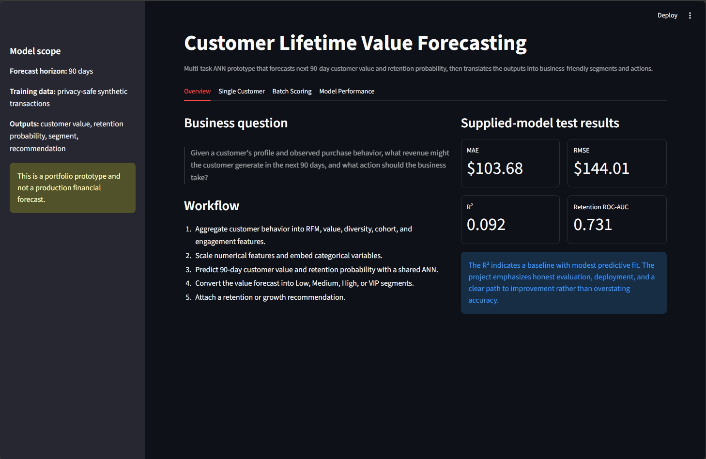

### 2. Single-customer scoring

Users can enter customer profile, purchasing, engagement, and behavioral information manually.

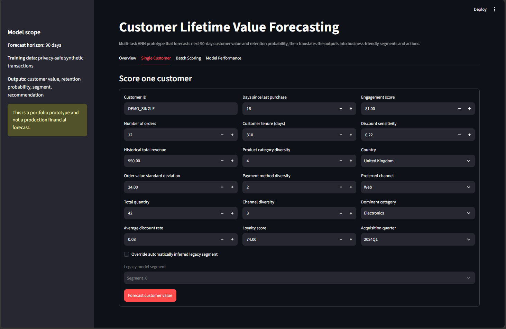

The application returns the predicted 90-day customer value, value segment, retention probability, and recommended business action.

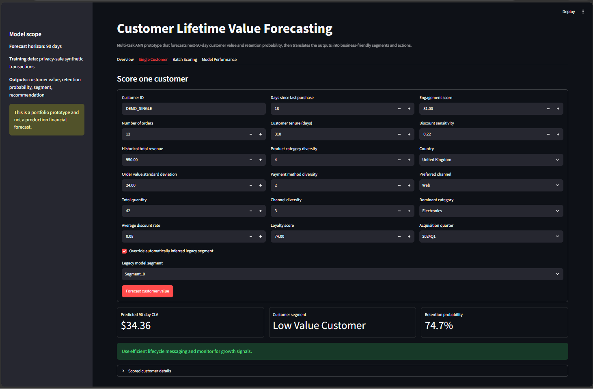

### 3. Batch customer scoring

Users can evaluate the included sample dataset or upload a compatible CSV file for batch forecasting.

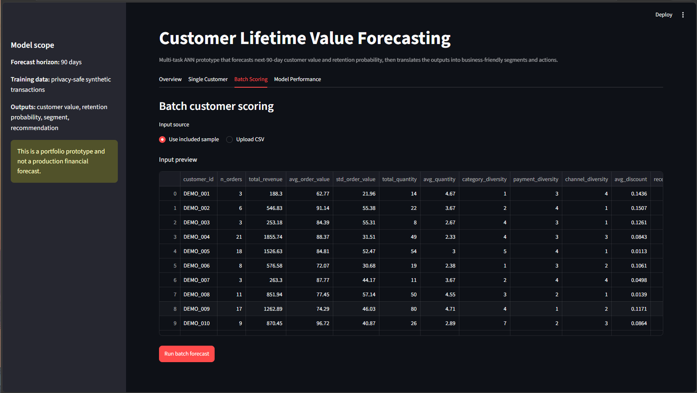

The application summarizes the number of customers scored, average predicted value, VIP customers, and customers with elevated retention risk.

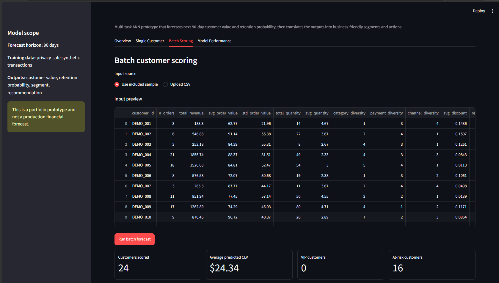

#### Predicted customer-value distribution

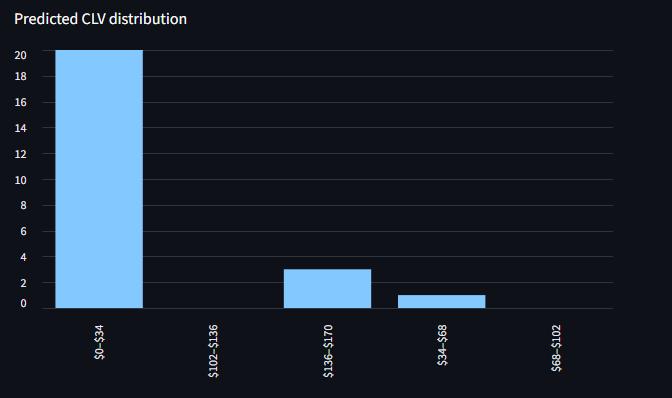

#### Customer-segment distribution

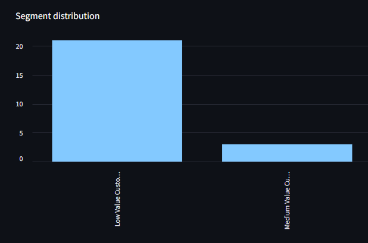

The complete scored customer table can be reviewed and downloaded as a CSV file.

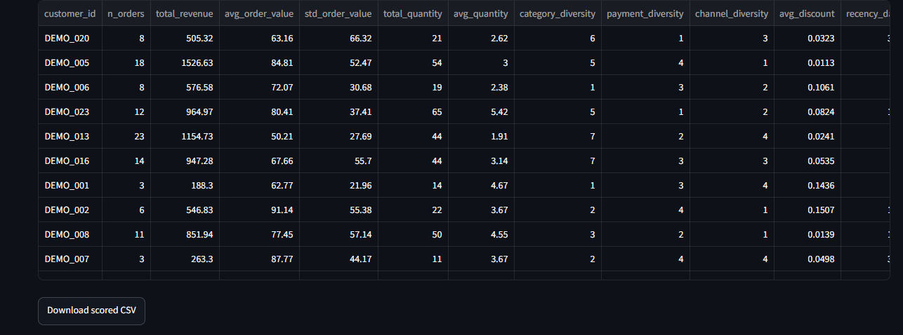

### 4. Model-performance dashboard

The model-performance section reports regression and retention metrics calculated from the supplied held-out prediction artifact.

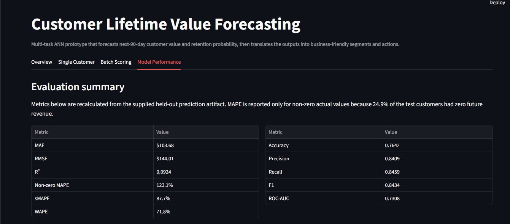

#### Actual vs. predicted customer value

This plot compares observed future revenue with ANN predictions. Points closer to the diagonal reference line represent more accurate predictions.

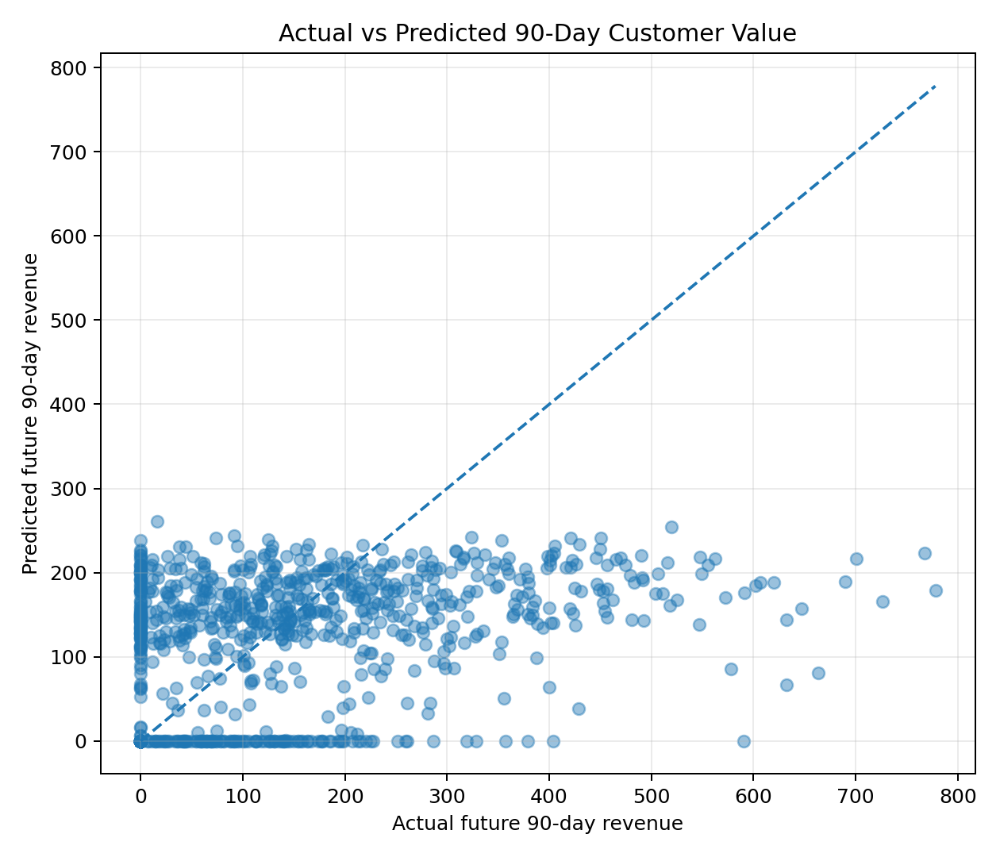

#### Residual analysis

Residuals help reveal systematic overprediction, underprediction, non-constant error variance, and performance differences across the prediction range.

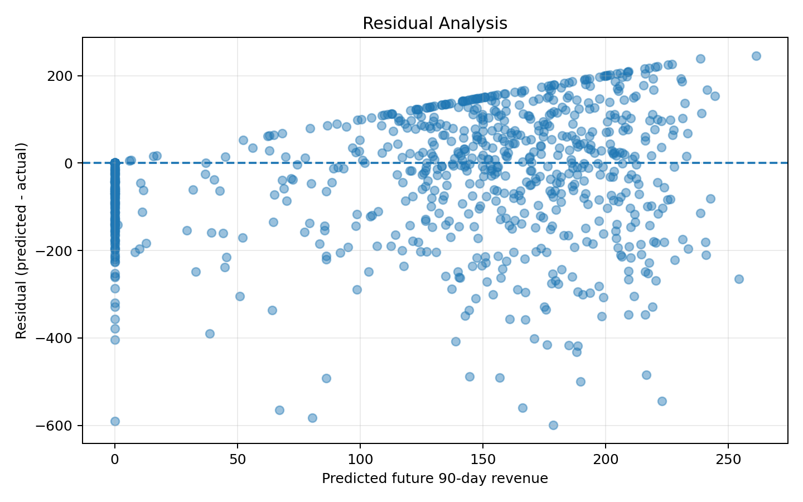

#### Actual and predicted distributions

The distribution comparison shows whether the model reproduces the overall shape and range of observed future customer value.

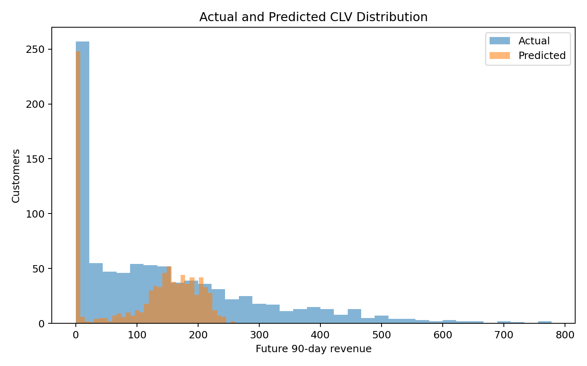

#### Value-segment distribution

The segmentation layer converts continuous ANN predictions into business-friendly customer groups.

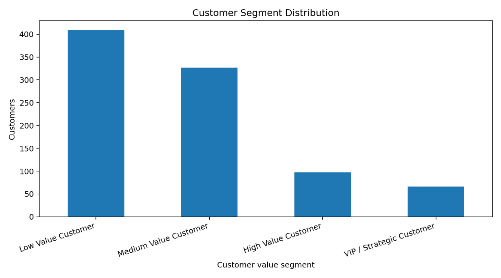

#### Training and validation MAE

The training-history chart compares training and validation mean absolute error across epochs to help identify convergence and overfitting.

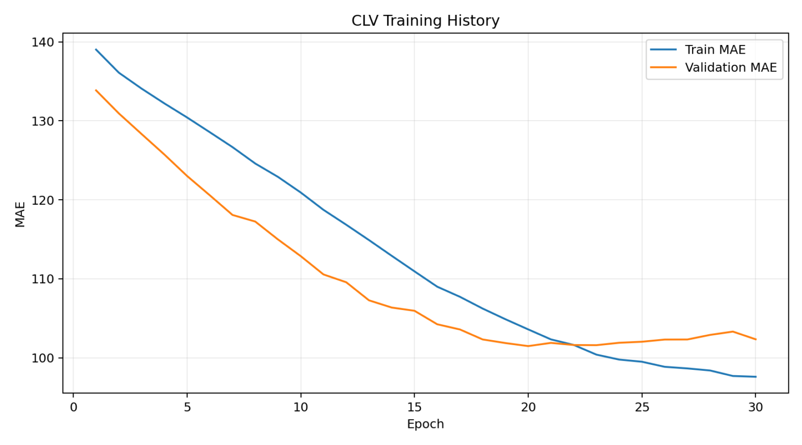

#### Retention confusion matrix

The confusion matrix summarizes correct and incorrect retained-versus-not-retained classifications.

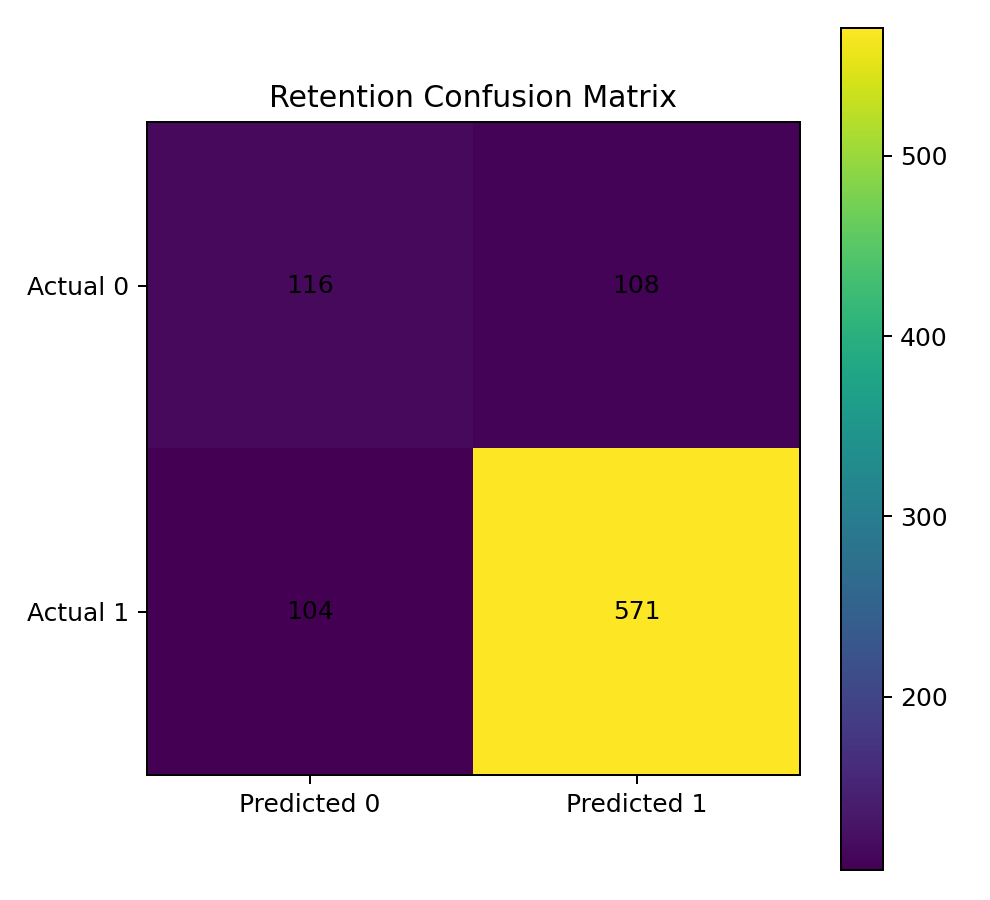

---

## Project Status and Honest Scope

This is a complete, deployable portfolio prototype built from the supplied notebook and trained artifacts. The underlying transactions are **synthetic and privacy-safe**, not real customer records. The project is suitable for demonstrating customer analytics, deep learning, model evaluation, modular engineering, and deployment. It should not be used for production financial decisions without retraining and validating it on governed business data.

The term *CLV* is used as a practical business shorthand. The supervised target is specifically **future revenue within a fixed 90-day forecast window**, not an uncapped lifetime-value estimate.

---

## Dataset

The supplied notebook generated synthetic transactions for 6,000 customer IDs. After creating an observation-window snapshot, 5,990 customers were available for modeling.

| Dataset detail | Value |
|---|---:|
| Observation window end | September 30, 2024 |
| Forecast window | October 1–December 29, 2024 |
| Modeling customers | 5,990 |
| Test customers | 899 |
| Personal data | None |

Customer-level features include:

- Recency, order frequency, total revenue, average order value, and revenue per month
- Quantity and product-category diversity
- Payment-method and sales-channel diversity
- Discount behavior, loyalty score, and engagement score
- Customer tenure and cohort age
- Country, preferred channel, dominant category, acquisition quarter, and customer segment

---

## Feature Engineering

The modeling workflow converts transaction-level data into customer-level predictors, including:

- **Recency:** Days since the most recent purchase
- **Frequency:** Number of historical customer orders
- **Monetary value:** Total and average historical revenue
- **Customer tenure:** Time between acquisition and the observation date
- **Revenue per month:** Spend normalized by active tenure
- **Average quantity:** Mean quantity purchased per order
- **Discount sensitivity:** Customer response to historical discounting
- **Product diversity:** Number of categories purchased
- **Payment diversity:** Number of payment methods used
- **Channel diversity:** Number of sales channels used
- **Loyalty and engagement scores:** Synthetic behavioral indicators
- **Categorical profile features:** Country, preferred channel, dominant category, acquisition quarter, and customer segment

Numerical features are scaled before training. Categorical features are encoded and passed through learned embeddings.

---

## Technical Workflow

1. Generate or load transaction data.
2. Split transactions into observation and future windows.
3. Aggregate transactions into customer-level features.
4. Create RFM, cohort, diversity, engagement, and rate features.
5. Split customers into training, validation, and test sets.
6. Fit numerical scaling and categorical encoders.
7. Learn categorical embeddings and a shared dense representation.
8. Predict 90-day revenue and retention probability through two output heads.
9. Evaluate regression and classification performance.
10. Convert continuous value predictions into customer segments.
11. Generate business recommendations.
12. Serve single-customer and batch predictions through Streamlit.

---

## ANN Architecture

The supplied Keras model contains **77,346 parameters**.

```text
19 numerical features
    -> Dense 128 -> Batch Normalization -> Dropout
    -> Dense 64  -> Batch Normalization -> Dropout

5 categorical inputs
    -> Separate learned embeddings

Concatenate all representations
    -> Dense 256 -> Batch Normalization -> Dropout
    -> Dense 128 -> Batch Normalization -> Dropout
    -> Dense 64  -> Batch Normalization -> Dropout
    -> CLV regression head
    -> Retention probability head
```

The cleaned retraining pipeline improves the original approach by:

- fitting preprocessing on the training split only,
- saving the K-means scaler and estimator,
- training the revenue head on `log1p(revenue)` with Huber loss,
- learning segmentation thresholds from validation predictions,
- reporting zero-safe error metrics,
- generating numerical permutation importance.

---

## Supplied-Model Test Results

| Task | Metric | Result |
|---|---:|---:|
| 90-day value regression | MAE | **$103.68** |
| 90-day value regression | RMSE | **$144.01** |
| 90-day value regression | R² | **0.0924** |
| 90-day value regression | Non-zero MAPE | **123.1%** |
| 90-day value regression | sMAPE | **87.7%** |
| 90-day value regression | WAPE | **71.8%** |
| Retention classification | Accuracy | **0.7642** |
| Retention classification | Precision | **0.8409** |
| Retention classification | Recall | **0.8459** |
| Retention classification | F1 | **0.8434** |
| Retention classification | ROC-AUC | **0.7308** |

### Metric interpretation

- **MAE** represents the average absolute future-revenue prediction error in business currency.
- **RMSE** penalizes large prediction errors more heavily than MAE.
- **R²** measures how much variance in future customer value is explained by the model.
- **Non-zero MAPE** is calculated only for customers with positive actual future revenue.
- **sMAPE and WAPE** provide more stable percentage-based evaluation when actual values include zeros.
- **Residual analysis** helps identify prediction bias and underprediction or overprediction across value ranges.
- **ROC-AUC** measures how well the retention head ranks retained customers above non-retained customers.

The supplied model's R² is modest, so the revenue forecast should be treated as a transparent portfolio baseline. The original notebook's ordinary MAPE is not used as a headline metric because 24.9% of test customers had zero future revenue, which makes standard MAPE unstable.

---

## Customer Value Segmentation

The demo uses thresholds calculated from positive predictions in the supplied evaluation artifact:

| Segment | Predicted 90-day value | Example business action |
|---|---:|---|
| Low Value Customer | `<= $132.71` | Use low-cost nurture and cross-sell campaigns |
| Medium Value Customer | `$132.71–$192.96` | Encourage repeat purchases and category expansion |
| High Value Customer | `$192.96–$213.08` | Prioritize retention and personalized offers |
| VIP / Strategic Customer | `> $213.08` | Provide premium service, loyalty benefits, and proactive retention |

These thresholds are a demonstration layer rather than universal business rules. The cleaned retraining pipeline calculates thresholds from validation predictions so the test set remains untouched.

---

## Streamlit Application

The application supports:

- Manual customer entry with automatically calculated rate features
- Included privacy-safe sample customer data
- Batch CSV upload
- Predicted 90-day customer value
- Predicted retention probability
- Low, Medium, High, and VIP value segmentation
- Business recommendations
- CLV and segment-distribution charts
- Downloadable scored CSV output
- Model-performance visualizations and limitations

---

## Project Structure

```text
ann-deep-learning-projects/
├── .github/
│   └── workflows/
│       └── clv-ann-ci.yml
│
└── 04-customer-lifetime-value-forecasting/
    ├── app/
    │   ├── streamlit_app.py
    │   └── requirements.txt
    ├── data/
    │   ├── README_data.md
    │   └── sample_input.csv
    ├── images/
    │   ├── 01_app_overview.png
    │   ├── 02_single_customer_input.png
    │   ├── 03_single_customer_prediction.png
    │   ├── 04_batch_input_preview.png
    │   ├── 05_batch_scoring_summary.png
    │   ├── 06_clv_distribution.png
    │   ├── 07_segment_distribution.png
    │   ├── 08_download_predictions.png
    │   ├── 09_model_performance.png
    │   ├── 10_actual_vs_predicted_customer_value.png
    │   ├── 11_residual_analysis.png
    │   ├── 12_actual_predicted_distributions.png
    │   ├── 13_value_segment_distribution.png
    │   ├── 14_training_validation_mae.png
    │   └── 15_retention_confusion_matrix.png
    ├── notebooks/
    │   ├── customer_lifetime_value_forecasting.ipynb
    │   └── archive/
    │       └── customer_lifetime_value_forecasting_original.ipynb
    ├── src/
    │   ├── clv_scoring.py
    │   ├── config.py
    │   ├── data_generation.py
    │   ├── data_preprocessing.py
    │   ├── feature_engineering.py
    │   ├── model_evaluation.py
    │   ├── model_training.py
    │   └── prediction_pipeline.py
    ├── models/
    │   ├── clv_ann_model.keras
    │   ├── label_encoders.pkl
    │   ├── numeric_scaler.pkl
    │   ├── model_metadata.json
    │   └── MODEL_CARD.md
    ├── outputs/
    │   ├── actual_vs_predicted.png
    │   ├── residual_plot.png
    │   ├── clv_distribution.png
    │   ├── customer_segment_distribution.png
    │   ├── retention_confusion_matrix.png
    │   ├── training_history.png
    │   ├── model_metrics.json
    │   ├── test_predictions.csv
    │   └── training_history.csv
    ├── tests/
    ├── .gitignore
    ├── PROJECT_REVIEW.md
    ├── README.md
    ├── README_HOSTING.md
    ├── requirements.txt
    ├── requirements-ci.txt
    └── run_app.bat
```

---

## Run Locally

Use Python 3.12 to match the recommended deployment environment.

### Windows Command Prompt

```bat
cd /d "C:\Users\atripathi\OneDrive - Veralto\Desktop\AI Codes\GIT Projects\ann-deep-learning-projects\04-customer-lifetime-value-forecasting"

py -3.12 -m venv .venv
.venv\Scripts\activate.bat

python -m pip install --upgrade pip setuptools wheel
python -m pip install -r requirements.txt -r requirements-ci.txt

python -m pytest -q
python -m streamlit run app\streamlit_app.py
```

Open the local URL displayed by Streamlit, normally:

```text
http://localhost:8501
```

### Future local runs

After the first installation:

```bat
cd /d "C:\Users\atripathi\OneDrive - Veralto\Desktop\AI Codes\GIT Projects\ann-deep-learning-projects\04-customer-lifetime-value-forecasting"
.venv\Scripts\activate.bat
python -m streamlit run app\streamlit_app.py
```

---

## Optional Retraining

The included model runs without retraining. To rebuild all artifacts from privacy-safe synthetic data:

```bash
python -m src.model_training --customers 6000 --epochs 60 --batch-size 128
```

Retraining overwrites files in `models/` and regenerates evaluation artifacts in `outputs/`. Retraining is not required to run the included application.

---

## Deployment

Streamlit Community Cloud is the recommended hosting option because the application is already written in Streamlit, connects directly to GitHub, and does not require a separate container configuration.

Use this application entrypoint:

```text
04-customer-lifetime-value-forecasting/app/streamlit_app.py
```

See [README_HOSTING.md](README_HOSTING.md) for the full deployment checklist. After deployment, replace the pending live-demo text at the top of this README with the final Streamlit URL.

---

## Data and Repository Safety

- The full training workflow uses synthetic, privacy-safe data.
- Only a small sample input file is included for application testing.
- Virtual environments, temporary files, logs, local scored outputs, and secrets are excluded through `.gitignore`.
- Streamlit secrets must not be committed to GitHub.
- The included model artifacts are required for inference and should remain under `models/`.

---

## Known Limitations

- Synthetic data limits external validity.
- The supplied regression model explains limited future-revenue variance.
- High-value customers are systematically underpredicted.
- The original model's K-means scaler and estimator were not saved. The deployment pipeline therefore uses a documented fallback heuristic when `customer_segment_name` is absent.
- The supplied label encoders were fitted using categories from all splits. The cleaned training code removes this leakage during retraining.
- A fixed 90-day value forecast is not a full contractual or infinite-horizon CLV estimate.
- Production use would require real-data retraining, governance review, drift monitoring, calibration, and business-specific segmentation thresholds.

---

## Future Improvements

- Retrain on real, governed transaction data
- Compare the ANN with XGBoost, LightGBM, CatBoost, and probabilistic CLV baselines
- Add temporal and cohort-based cross-validation
- Improve calibration for high-value customers
- Add SHAP or permutation-based local explanations
- Introduce uncertainty intervals around CLV predictions
- Add model and data-drift monitoring
- Optimize value segments against campaign economics and retention costs
- Add authentication and persistent scoring history for enterprise deployment

---

## Skills Demonstrated

`Customer Analytics` · `Artificial Neural Networks` · `Multi-task Learning` · `Categorical Embeddings` · `RFM Analysis` · `Feature Engineering` · `Regression Evaluation` · `Classification Evaluation` · `Customer Segmentation` · `TensorFlow` · `Keras` · `Streamlit` · `Model Deployment` · `Testing` · `CI/CD` · `Business Translation`

---

## Portfolio Description

**One-line description**

> Built and deployed a multi-task ANN that forecasts 90-day customer value and retention probability, segments customers, and recommends targeted retention and growth actions.

**Pinned-repository description**

> End-to-end customer analytics project featuring RFM and cohort feature engineering, categorical embeddings, ANN regression and retention heads, customer segmentation, batch scoring, testing, CI/CD, and Streamlit deployment.

---

## Author

**Anmol Tripathi**  
Quality Data Scientist | Data Science | Machine Learning | Applied AI | Analytics
