# Diabetes Risk Screening with an Artificial Neural Network

[](https://www.python.org/)
[](https://www.tensorflow.org/)
[](#live-demo)
[](https://github.com/unit-mole/ann-deep-learning-projects/actions/workflows/diabetes-ann-ci.yml)

A healthcare analytics portfolio project that uses a Keras artificial neural network to estimate a **diabetes screening risk probability** from eight patient health indicators.

> [!CAUTION]
> **Healthcare disclaimer:** This project is for educational and portfolio demonstration purposes only. It is not a medical diagnostic tool. The prediction should not be used as medical advice. Users should consult a qualified healthcare professional for medical decisions.

## Live demo

**Streamlit Community Cloud:** `https://YOUR-APP-NAME.streamlit.app/`

## Business and analytical question

> Given patient health indicators, what is the estimated model probability that the patient may be at risk of diabetes?

The app returns:

- **Diabetes risk probability** between 0 and 1.
- **Risk category** using transparent Low, Medium, and High communication bands.
- **Screening flag** based on a validation-tuned classification threshold.
- **Cautious interpretation** that directs medical decisions to qualified professionals.

## Why this project is portfolio-ready

This implementation goes beyond a notebook-only classifier. It provides a leakage-safe preprocessing pipeline, class-imbalance handling, threshold tuning, reusable inference, held-out evaluation, explainability, automated tests, CI, and an interactive Streamlit interface.

## Dataset

The project uses the public Pima Indians Diabetes benchmark dataset:

- **768 rows**
- **8 numeric predictors**
- **500 negative / 268 positive outcomes**
- **Positive rate:** 34.9%

| Feature | Description |
|---|---|
| Pregnancies | Number of pregnancies |
| Glucose | Plasma glucose concentration |
| BloodPressure | Diastolic blood pressure |
| SkinThickness | Triceps skin-fold thickness |
| Insulin | Two-hour serum insulin |
| BMI | Body mass index |
| DiabetesPedigreeFunction | Family-history-related score in the benchmark data |
| Age | Age in years |

### Zero-value and missing-value handling

The CSV has no explicit nulls, but several fields use zero as an implausible measurement and likely missing-value marker:

| Field | Zero markers |
|---|---:|
| Glucose | 5 |
| BloodPressure | 35 |
| SkinThickness | 227 |
| Insulin | 374 |
| BMI | 11 |

The pipeline converts those zeros to missing values and then performs **median imputation fitted only on the training partition**. It also adds missing-value indicators and applies `StandardScaler`. Zero pregnancies remains valid.

## Project workflow

```text
Raw CSV
  -> schema and numeric validation
  -> implausible zero markers converted to missing
  -> stratified train/validation/test split (70/15/15)
  -> train-only median imputation + missing indicators
  -> standardization
  -> ANN training with balanced class weights
  -> validation-set F2 threshold tuning
  -> held-out test evaluation
  -> saved model + preprocessing artifacts
  -> Streamlit single and batch scoring
```

## ANN architecture

```text
Preprocessed input (13 values: 8 features + 5 missing indicators)
  -> Dense(64, ReLU, L2)
  -> Batch Normalization
  -> Dropout(0.30)
  -> Dense(32, ReLU, L2)
  -> Dropout(0.15)
  -> Dense(1, Sigmoid)
```

Training configuration:

- Binary cross-entropy loss
- Adam optimizer, initial learning rate `0.001`
- Batch size `32`
- Early stopping on validation PR-AUC
- Reduce-on-plateau learning-rate scheduling
- Balanced class weights: `0 = 0.767`, `1 = 1.436`

The uploaded parameter file identified `64` hidden units, `0.30` dropout, `0.001` learning rate, and batch size `32`; the portfolio model retains those core choices and adds regularization and screening-oriented evaluation.

## Probability, risk bands, and threshold

Risk bands are simple communication ranges, not medical categories:

| Probability | Risk band |
|---:|---|
| `< 0.30` | Low Risk |
| `0.30 to < 0.60` | Medium Risk |
| `>= 0.60` | High Risk |

The binary screening threshold is **0.33**. It was selected using the validation set only by maximizing **F2**, which weights recall more heavily than precision. The threshold is kept separate from the three risk bands because they serve different purposes.

## Held-out test results

| Metric | Result |
|---|---:|
| Accuracy | 0.741 |
| Precision | 0.593 |
| Recall | 0.854 |
| F1-score | 0.700 |
| ROC-AUC | 0.856 |
| PR-AUC | 0.772 |

Confusion matrix: `[[51, 24], [6, 35]]`

The model intentionally emphasizes **recall** for this screening demonstration. A false negative means a positive benchmark case is not flagged, whereas a false positive means a negative benchmark case receives an elevated screening flag. Neither outcome should be interpreted clinically.

### Change from the original notebook baseline

The original notebook used raw zero markers, a scaler-only artifact, class threshold `0.50`, and no class weighting. On the same 116-row test split, the portfolio version intentionally trades some precision and accuracy for substantially higher positive-class recall.

| Version | Accuracy | Precision | Recall | F1 | ROC-AUC | False negatives |
|---|---:|---:|---:|---:|---:|---:|
| Original notebook | 0.750 | 0.731 | 0.463 | 0.567 | 0.854 | 22 |
| Portfolio pipeline | 0.741 | 0.593 | 0.854 | 0.700 | 0.856 | 6 |

This comparison is not a claim of clinical superiority; it shows how the project was redesigned around a screening-oriented metric trade-off.

### Evaluation visuals

| Confusion matrix | ROC curve |
|---|---|
| 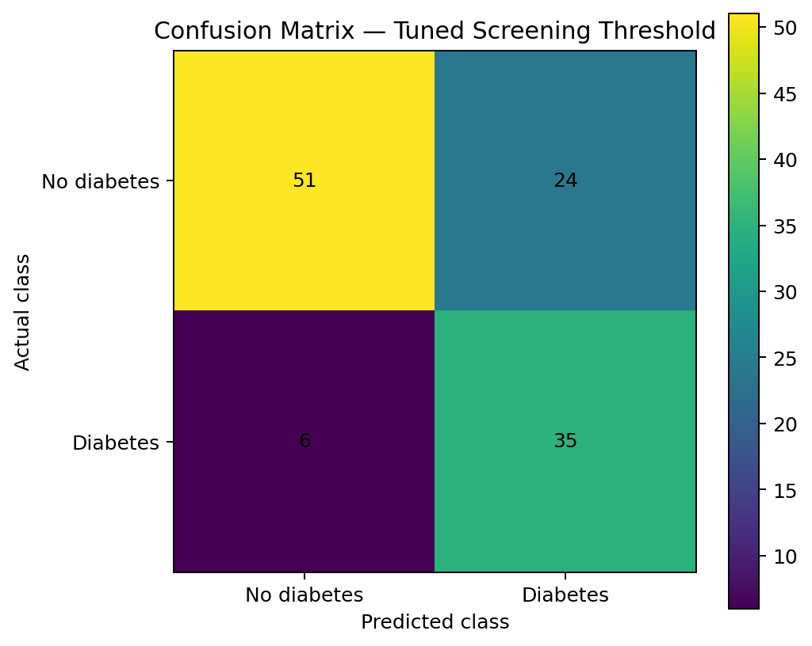 | 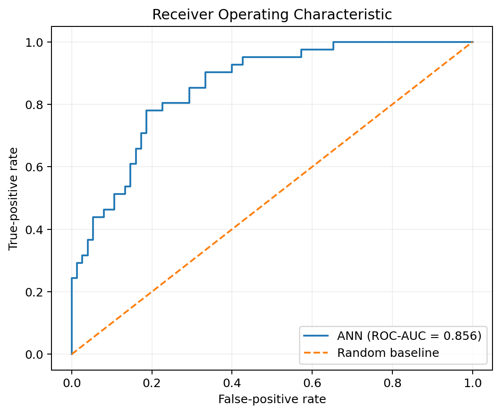 |

| Precision–recall curve | Risk probability distribution |
|---|---|
| 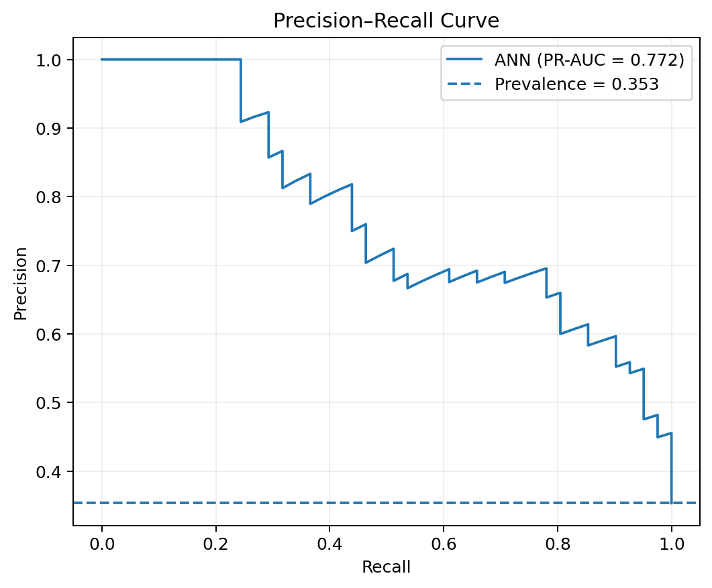 | 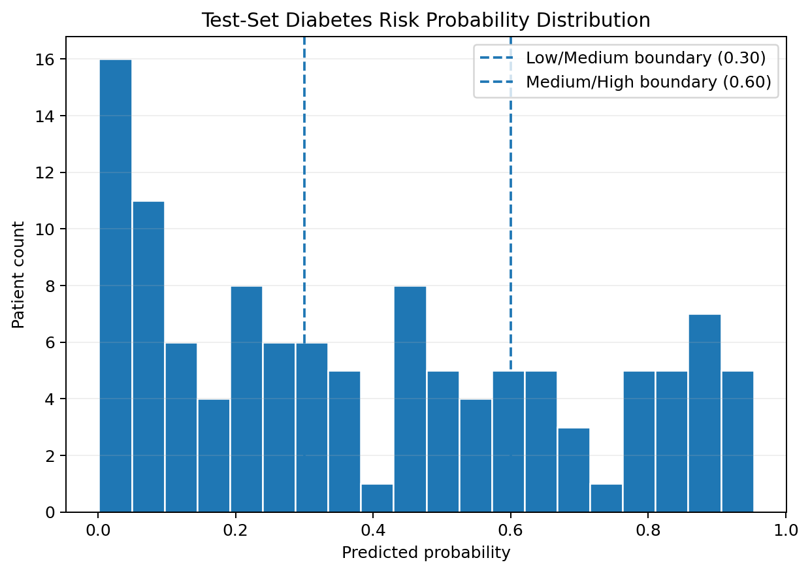 |

### Explainability

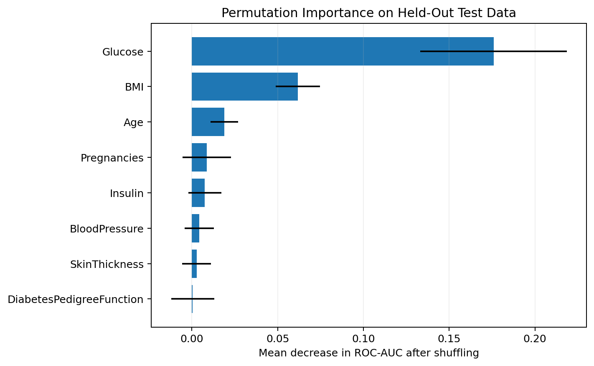

Permutation importance measures the held-out ROC-AUC decrease after shuffling one feature. It describes model dependence within this dataset; it does **not** establish medical causality.

## Streamlit demo capabilities

- Manual scoring for one patient profile
- Included sample or CSV upload for batch scoring
- Input preview and schema validation
- Risk probability, risk band, screening flag, and interpretation
- Low/Medium/High distribution chart
- Downloadable scored CSV
- Model-card metrics and permutation importance
- Repeated healthcare disclaimer

## Repository structure

```text
05-diabetes-prediction/
├── app/
│   ├── requirements.txt
│   └── streamlit_app.py
├── data/
│   ├── diabetes.csv
│   ├── sample_input.csv
│   └── README_data.md
├── images/
│   ├── 01_app_home.png
│   ├── 02_individual_low_risk.png
│   ├── 03_individual_high_risk.png
│   ├── 04_batch_input_preview.png
│   ├── 05_batch_risk_distribution.png
│   ├── 06_batch_risk_distribution.png
│   ├── 07_model_card_metrics.png
│   ├── 08_feature_importance.png
│   └── README.md
├── models/
│   ├── diabetes_ann.keras
│   ├── model_metadata.json
│   └── preprocessor.joblib
├── notebooks/
│   └── diabetes_prediction_portfolio.ipynb
├── outputs/
│   ├── confusion_matrix.png
│   ├── data_quality_report.json
│   ├── feature_importance.csv
│   ├── feature_importance.png
│   ├── model_metrics.json
│   ├── precision_recall_curve.png
│   ├── risk_distribution.png
│   ├── roc_curve.png
│   ├── scored_test_sample.csv
│   ├── threshold_analysis.csv
│   └── training_history.csv
├── src/
│   ├── config.py
│   ├── data_preprocessing.py
│   ├── feature_engineering.py
│   ├── model_evaluation.py
│   ├── model_training.py
│   ├── prediction_pipeline.py
│   └── risk_scoring.py
├── tests/
├── .gitignore
├── .python-version
├── CHANGELOG.md
├── README.md
├── README_HOSTING.md
├── requirements-dev.txt
└── requirements.txt
```

No encoder is required because all eight model inputs are numeric. `preprocessor.joblib` replaces the separate scaler/encoder pattern by saving the complete imputation-and-scaling pipeline.

## Run locally on Windows

```bat
cd /d "C:\path\to\ann-deep-learning-projects\05-diabetes-prediction"
py -3.12 -m venv .venv
.venv\Scripts\activate
python -m pip install --upgrade pip
pip install -r requirements.txt
streamlit run app/streamlit_app.py
```

The trained artifacts are included. To reproduce model training:

```bat
python -m src.model_training --data data/diabetes.csv
```

Run tests:

```bat
pip install -r requirements-dev.txt
pytest -q
```

## Deploy

Streamlit Community Cloud is the recommended host because this is a Streamlit-native portfolio app connected to a public GitHub monorepo. Use:

- Repository: `unit-mole/ann-deep-learning-projects`
- Branch: `main`
- Main file path: `05-diabetes-prediction/app/streamlit_app.py`
- Python: `3.12`

See [README_HOSTING.md](README_HOSTING.md) for the full deployment and troubleshooting guide.

## Application screenshots

The screenshots below demonstrate the complete Streamlit workflow, including manual screening, batch scoring, model evaluation, and explainability.

### Application home

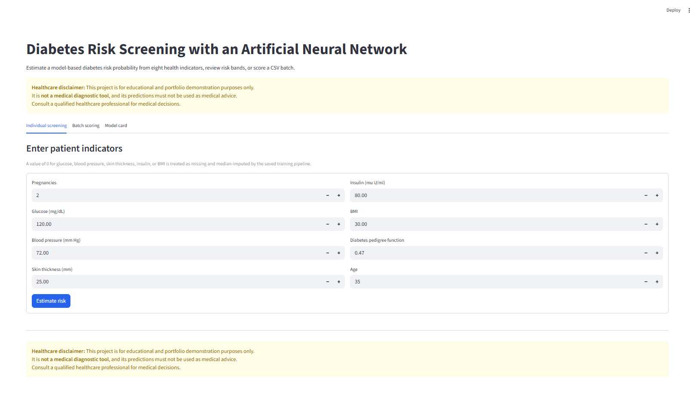

### Individual screening examples

| Low-risk example | High-risk example |
|---|---|
| 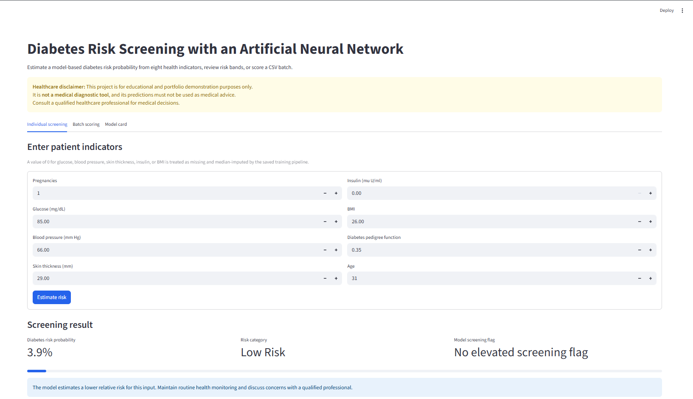 | 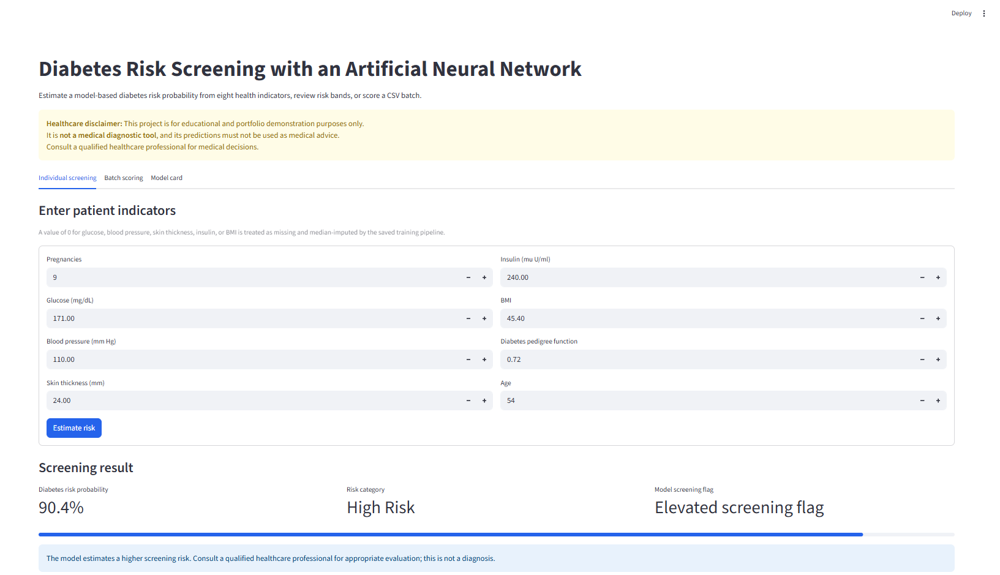 |

### Batch scoring workflow

| Batch input preview | Batch scoring output |
|---|---|
| 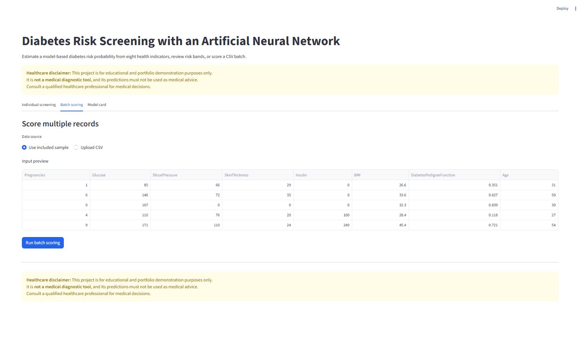 | 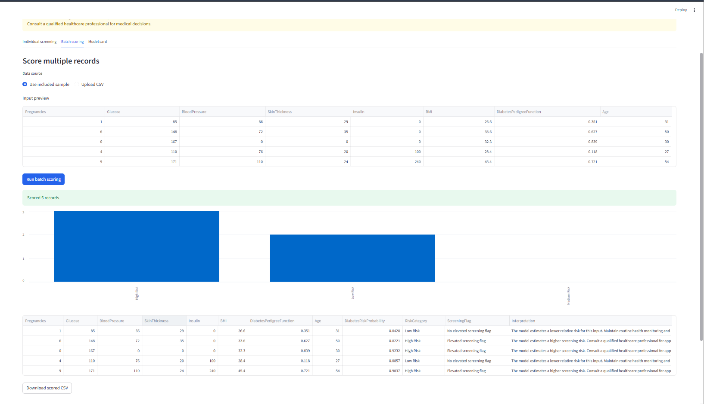 |

### Batch risk distribution

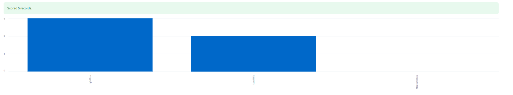

### Model card and explainability

| Model performance metrics | Permutation feature importance |
|---|---|
| 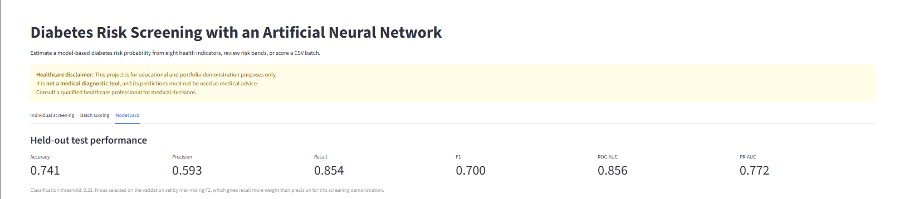 | 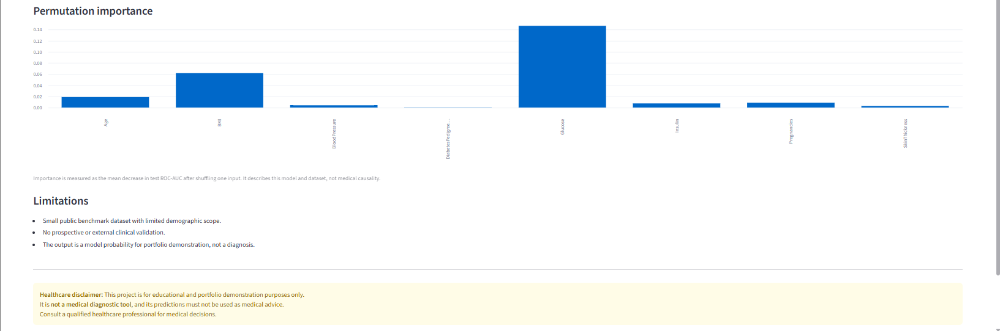 |

## Limitations and responsible use

- This is a small benchmark dataset with limited demographic scope.
- The model has not undergone prospective, external, or clinical validation.
- Input ranges are not a substitute for clinical data-quality controls.
- Probability calibration may shift on a different population.
- Permutation importance is model-specific, not causal.
- The project must never be presented as a diagnostic system.

## Future improvements

- External validation on a distinct, appropriately governed dataset
- Probability calibration and calibration-curve reporting
- Fairness analysis across available demographic groups
- Repeated stratified cross-validation with confidence intervals
- Model monitoring and drift checks
- Clinician-led threshold design in a legitimate research setting
- SHAP explanations after validating dependency and deployment cost

## Skills demonstrated

`Artificial Neural Networks` · `TensorFlow/Keras` · `Healthcare Analytics` · `Data Quality` · `Missing-Value Imputation` · `Class Weights` · `Threshold Tuning` · `ROC-AUC` · `PR-AUC` · `Permutation Importance` · `Streamlit` · `Batch Inference` · `Model Packaging` · `Testing` · `CI/CD`

## Portfolio descriptions

**One-line description:** ANN-based diabetes risk screening demo with leakage-safe medical zero handling, class-weighted training, recall-focused threshold tuning, explainability, and Streamlit deployment.

**Pinned repository description:** A production-structured Keras ANN project that converts eight health indicators into a diabetes risk probability and transparent risk band, with batch scoring, model-card evaluation, and responsible healthcare disclaimers.

This project supports a transition from Quality Data Scientist to Data Science / ML / AI roles by demonstrating the same core strengths used in quality analytics—data validation, traceability, risk prioritization, reproducible pipelines, metric trade-offs, and stakeholder-friendly decision support—within a complete deployed machine-learning workflow.
