# ANN Dynamic Pricing Optimization System

[](https://www.python.org/)
[](https://keras.io/)
[](https://pytorch.org/)
[](https://ann-deep-learning-projects-tgcmwtdfyxorbrexrmbcin.streamlit.app/)
[](../LICENSE)
[](https://github.com/unit-mole/ann-deep-learning-projects/actions/workflows/dynamic-pricing-ci.yml)

An end-to-end pricing analytics project that uses Artificial Neural Networks to forecast price-dependent demand, evaluate constrained pricing scenarios, and recommend business-friendly prices for revenue, gross-margin, or balanced optimization objectives. The repository includes leakage-safe feature engineering, categorical embeddings, saved model artifacts, regression and classification evaluation, transparent pricing guardrails, manual and batch optimization, automated testing, CI, and a deployed Streamlit application.

**Status:** Portfolio-ready  
**Live demo:** [Open the Streamlit application](https://ann-deep-learning-projects-tgcmwtdfyxorbrexrmbcin.streamlit.app/)  
[](https://ann-deep-learning-projects-tgcmwtdfyxorbrexrmbcin.streamlit.app/)

**Primary stack:** Python · Keras 3 · PyTorch · scikit-learn · pandas · NumPy · Plotly · Streamlit

---

## Executive Summary

Dynamic pricing is not simply a regression problem that predicts a pre-calculated "optimal price." A deployable system must estimate how demand changes when price changes, convert those predictions into expected revenue and margin, apply operational guardrails, and then make a recommendation that a business user can review.

This project implements that workflow with:

- a Keras 3 multi-input ANN for price-dependent demand forecasting;
- categorical embeddings for category, region, and channel;
- a supporting ANN classifier for high-demand probability;
- grid-based price scenario simulation;
- revenue, gross-margin, and balanced optimization objectives;
- transparent cost, inventory, price-change, and competitor guardrails;
- rule-based pricing segments and recommendation text;
- single-product and batch optimization in Streamlit;
- reproducible synthetic data generation, tests, CI, and deployment instructions.

## Business Problem

Pricing teams must decide:

> Given product, cost, competitor, inventory, seasonality, marketing, customer, and historical-sales information, what price should be recommended to improve revenue or margin without violating business constraints?

The system returns:

```text
Predicted demand at current price
Predicted demand at recommended price
Predicted revenue
Predicted gross margin
Recommended price
Pricing action
Pricing segment
Business recommendation
```

## Why the Modeling Approach Changed

The original notebook predicted an engineered `optimal_price` and used a segment derived from `realized_demand` and `optimal_price` as an ANN input. Those fields are not known when a live price decision is made, creating target leakage and an unrealistic deployment dependency.

The rebuilt system uses a defensible decision-time formulation:

1. **Price is an input.**
2. **Observed demand is the regression target.**
3. The ANN forecasts demand for each candidate price.
4. Revenue and gross margin are calculated for every scenario.
5. The selected objective determines the recommended price.
6. Business guardrails restrict unsafe scenarios.

See [`docs/original_model_review.md`](docs/original_model_review.md) for the detailed review.

## Dataset

The repository uses **reproducible synthetic retail pricing data** generated by [`src/data_generation.py`](src/data_generation.py). This is intentional: no public, production-grade commercial dataset was supplied with the original project, and the repository should not imply that synthetic rows are real customer transactions.

The generator creates price-demand observations across six product categories, four regions, and three channels. Demand responds to price position, product elasticity, historical sales, demand index, marketing, promotions, seasonality, ratings, inventory constraints, and random noise.

### Core inputs

| Group | Features |
|---|---|
| Product and market | category, region, channel, rating |
| Calendar | day of year, weekend, holiday, seasonal cycles |
| Pricing | unit cost, proposed/current price, competitor price |
| Commercial | promotion flags, marketing index, demand index |
| Operations | inventory level, historical sales |
| Customer context | customer-income index |

### Engineered features

- month and week of year;
- cyclical sine/cosine calendar features;
- peak-season and summer flags;
- price gap versus competitor;
- markup percentage;
- inventory pressure versus historical sales;
- promotion/competitor-promotion interaction.

Only variables available at decision time are used. See [`data/README_data.md`](data/README_data.md) for the CSV schema.

## End-to-End Workflow

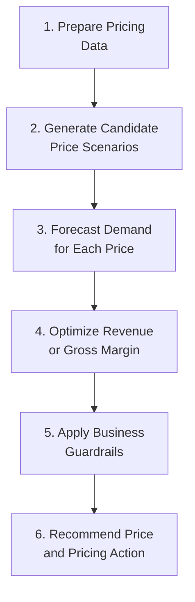

The workflow follows the deployable pricing sequence used by the application:

1. **Prepare Pricing Data**
2. **Generate Candidate Price Scenarios**
3. **Forecast Demand for Each Price**
4. **Optimize Revenue or Gross Margin**
5. **Apply Business Guardrails**
6. **Recommend Price and Pricing Action**

## ANN Architecture

The demand regressor uses:

- one numerical input branch containing 28 scaled numerical/engineered features;
- embedding inputs for category, region, and channel;
- concatenation of numerical and embedding representations;
- dense hidden layers with ReLU activation;
- batch normalization and dropout for training stability and regularization;
- one linear regression output;
- Huber loss on `log1p(demand)` to reduce sensitivity to large errors;
- Adam optimizer and early stopping.

A second ANN uses the same input representation and predicts whether demand exceeds the training-set high-demand cutoff. Its probability is displayed as a supporting decision signal; it does not select the optimized price.

The portable `.keras` model files were trained with the JAX backend and validated for hosted inference with the PyTorch backend.

## Price Optimization Logic

For every row, the system generates a candidate price range and predicts demand for each candidate. It then calculates:

```text
Predicted Revenue = Candidate Price × Predicted Demand
Predicted Gross Margin = (Candidate Price − Unit Cost) × Predicted Demand
```

Available objectives:

| Objective | Selection logic |
|---|---|
| Maximize Margin | Highest predicted gross margin |
| Maximize Revenue | Highest predicted revenue |
| Balance Demand and Margin | 60% normalized margin + 25% normalized revenue + 15% normalized demand |

The default objective is **Maximize Margin** because a revenue-only recommendation can favor high sales without protecting contribution economics.

## Transparent Business Guardrails

- never recommend below cost plus a 5% minimum markup;
- limit one-step increases to 20%;
- limit one-step decreases to 30%;
- restrict aggressive discounting when inventory is low relative to expected demand;
- constrain upward movement when the current competitor gap is unusually large;
- flag unusually risky competitive/demand combinations for manual review.

Possible actions:

```text
Maintain Price
Increase Price
Decrease Price
Promotional Discount
Manual Review
```

## Held-Out Model Results

The test set contains **2,400 rows** not used for training or validation.

### Demand regression

| Metric | Result | Business interpretation |
|---|---:|---|
| MAE | **12.25 units** | Average absolute demand error |
| RMSE | **15.68 units** | Penalizes larger demand misses more heavily |
| R² | **0.667** | Explains approximately 66.7% of held-out demand variation |
| MAPE | **14.41%** | Average relative demand error on this positive-demand dataset |

### High-demand classifier

| Metric | Result |
|---|---:|
| Accuracy | **92.54%** |
| Precision | **87.80%** |
| Recall | **90.31%** |
| F1 score | **0.890** |

These results are intentionally reported instead of the more optimistic leaked metrics from the original notebook.

## Evaluation and Explainability

### Actual vs predicted demand

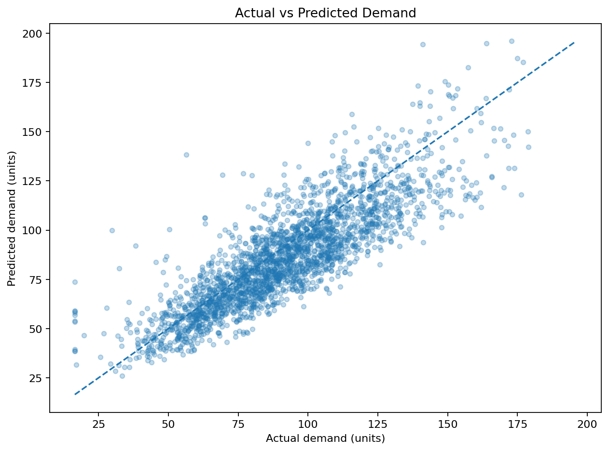

### Residual analysis

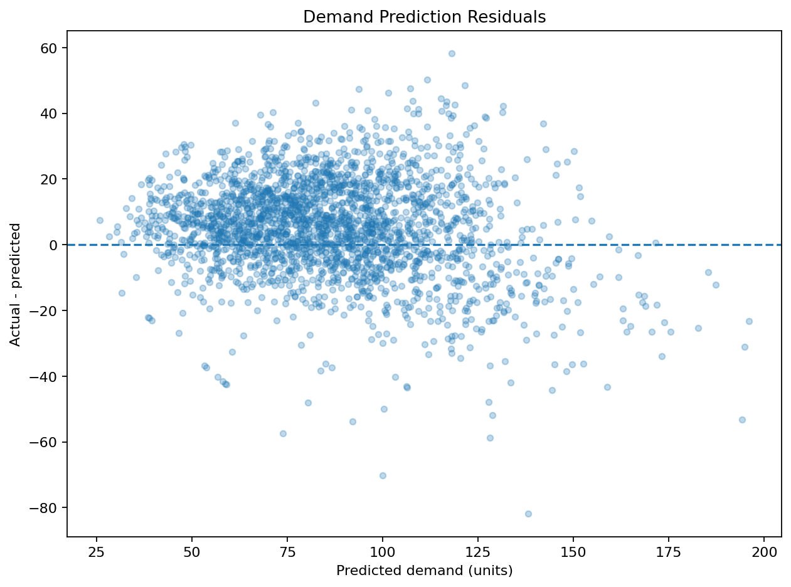

### Price sensitivity and optimization curves

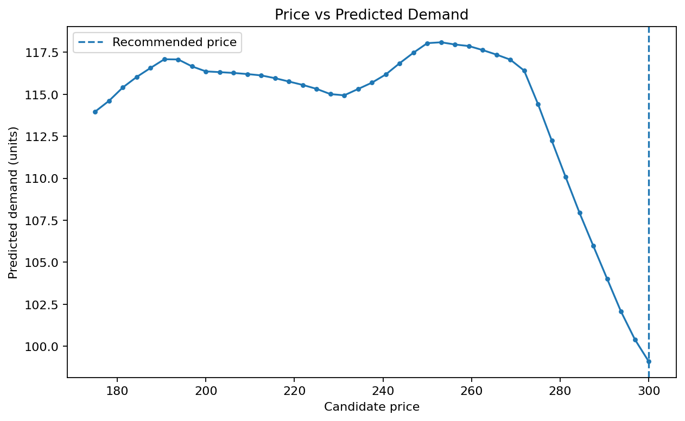

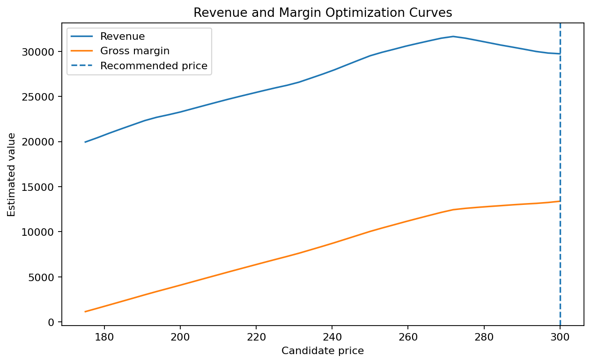

### Permutation-based demand drivers

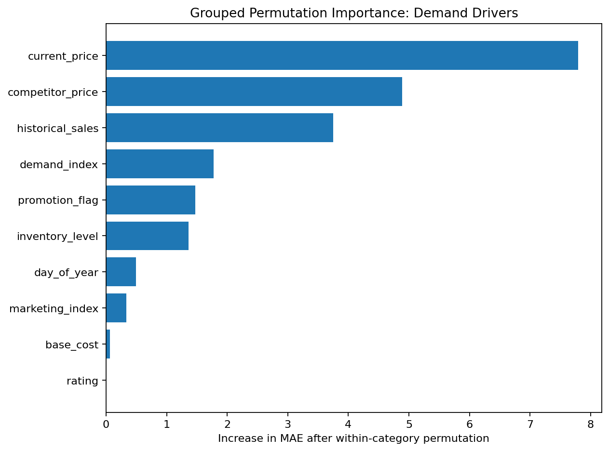

Permutation importance is used as a lightweight model-agnostic explanation. It measures how much held-out MAE worsens after one feature is shuffled. The scenario curves provide an additional business-facing explanation by showing the model's estimated price sensitivity.

## Streamlit Demo

The app supports:

- manual product and pricing inputs;
- selectable optimization objective;
- current versus recommended price metrics;
- predicted demand, revenue, margin, and uplift;
- pricing action, segment, high-demand probability, and recommendation text;
- interactive price-demand and revenue curves;
- scenario table showing the selected candidate;
- sample-data or uploaded-CSV batch optimization;
- portfolio-level summary and downloadable optimized CSV.

### Application Screenshots

#### 1. Application overview

The main interface provides configurable business objectives, candidate-price controls, and manual product inputs for a single pricing recommendation.

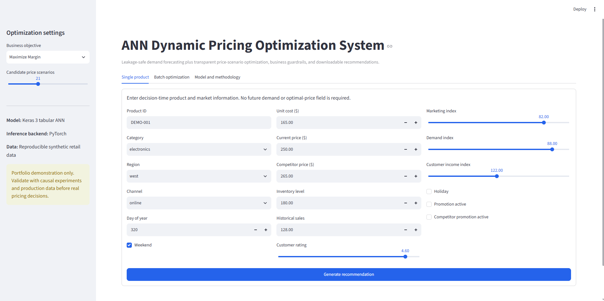

#### 2. Single-product pricing recommendation

The recommendation view compares the current and optimized price, predicted demand, revenue, margin, pricing action, segment, and business guidance.

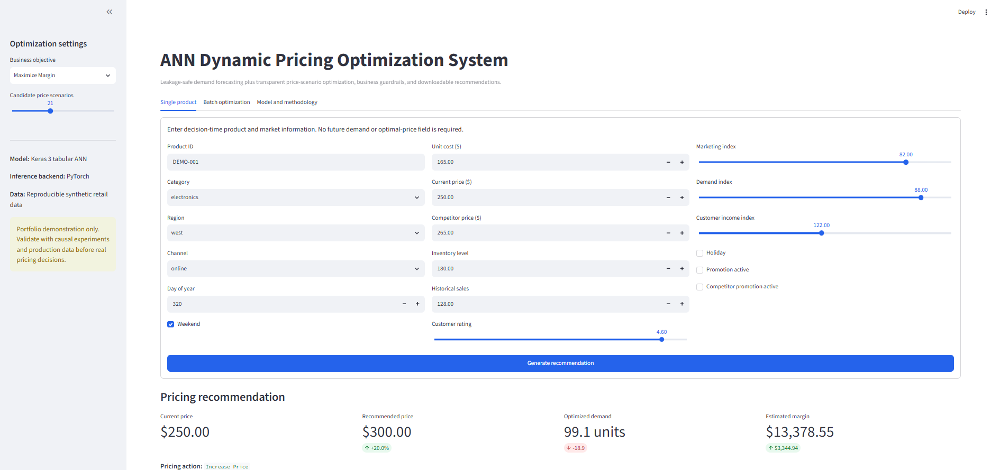

#### 3. Price sensitivity and optimization curve

The interactive scenario visualization shows how predicted demand, revenue, and gross margin respond across the constrained candidate-price range.

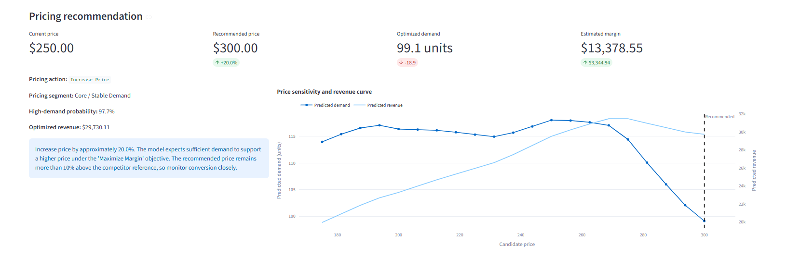

#### 4. Candidate-price scenario table

Each candidate price is evaluated using predicted demand, revenue, gross margin, price-change percentage, and the selected optimization objective.

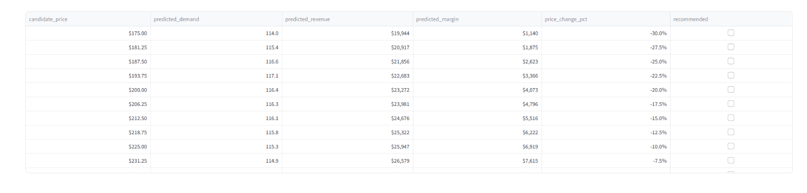

#### 5. Batch input preview

Users can optimize the bundled sample data or upload a compatible CSV file and review the input records before scoring.

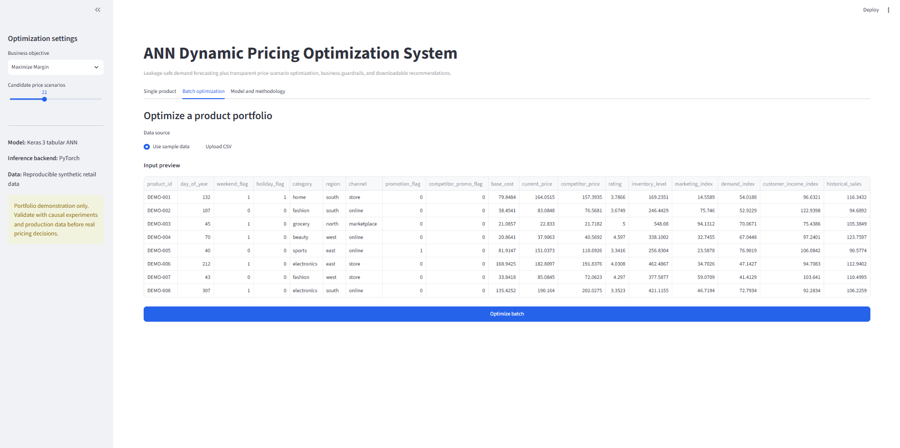

#### 6. Batch optimization results

The batch-results view summarizes product coverage, median price movement, projected margin uplift, manual-review flags, and pricing-action distribution.

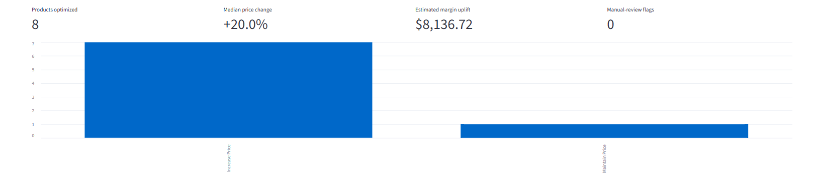

#### 7. Downloadable pricing output

The complete optimized pricing table can be reviewed in the app and downloaded as a CSV file for further analysis or reporting.

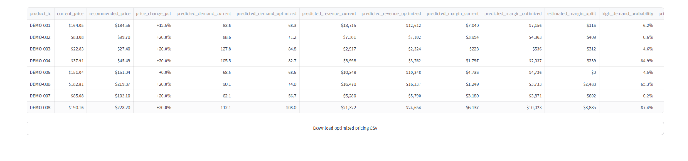

#### 8. Model methodology and validation

The methodology page documents the ANN design, leakage-safe modeling approach, held-out metrics, and supporting evaluation information.

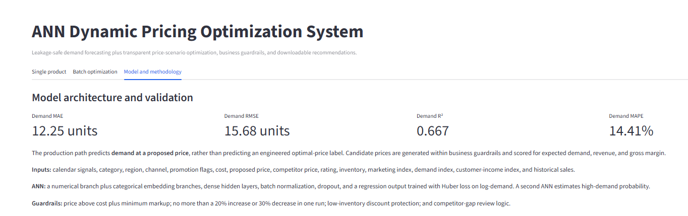

## Repository Structure

```text
06-dynamic-pricing-optimization/
├── app/
│   ├── streamlit_app.py
│   └── requirements.txt
├── data/
│   ├── README_data.md
│   ├── sample_input.csv
│   └── sample_training_data.csv
├── docs/
│   ├── original_model_review.md
│   └── portfolio_positioning.md
├── images/
│   ├── 01_app_overview.png
│   ├── 02_single_product_recommendation.png
│   ├── 03_price_sensitivity_curve.png
│   ├── 04_scenario_table.png
│   ├── 05_batch_input_preview.png
│   ├── 06_batch_results.png
│   ├── 07_download_output.png
│   ├── 08_model_methodology.png
│   ├── 09_actual_vs_predicted_demand.png
│   ├── 10_grouped_permutation_importance.png
│   └── README.md
├── models/
│   ├── dynamic_pricing_demand_ann.keras
│   ├── dynamic_pricing_demand_state_ann.keras
│   ├── model_metadata.json
│   ├── model_metrics.json
│   └── numeric_scaler.joblib
├── notebooks/
│   └── dynamic_pricing_optimization.ipynb
├── outputs/
│   ├── actual_vs_predicted_demand.png
│   ├── residual_plot.png
│   ├── price_vs_demand_curve.png
│   ├── revenue_optimization_curve.png
│   ├── optimized_price_distribution.png
│   ├── feature_importance.png
│   ├── model_metrics.json
│   └── example_optimized_output.csv
├── src/
│   ├── constants.py
│   ├── data_generation.py
│   ├── data_preprocessing.py
│   ├── feature_engineering.py
│   ├── model_training.py
│   ├── model_evaluation.py
│   ├── price_optimization.py
│   ├── pricing_rules.py
│   ├── prediction_pipeline.py
│   ├── finalize.py
│   └── train.py
├── tests/
├── .gitignore
├── .python-version
├── DELIVERY_NOTES.md
├── README.md
├── README_HOSTING.md
├── requirements.txt
└── requirements-training.txt
```

## Run Locally

### 1. Open the project folder

```bash
cd 06-dynamic-pricing-optimization
```

### 2. Create and activate a virtual environment

Windows Command Prompt:

```bat
py -3.12 -m venv .venv
.venv\Scripts\activate
```

macOS/Linux:

```bash
python3.12 -m venv .venv
source .venv/bin/activate
```

### 3. Install app dependencies

```bash
python -m pip install --upgrade pip
pip install -r requirements.txt
```

### 4. Start Streamlit

```bash
streamlit run app/streamlit_app.py
```

The committed models are inference-ready; retraining is not required to run the app.

## Reproduce Training

Training is optional and uses the synthetic data generator:

```bash
pip install -r requirements-training.txt
python -m src.train --samples 16000 --epochs-regression 20 --epochs-classification 5
```

This regenerates model artifacts and evaluation plots. Training selects the JAX Keras backend; final evaluation validates the same portable `.keras` files with the PyTorch backend used by Streamlit.

## Deploy

Follow [`README_HOSTING.md`](README_HOSTING.md). The recommended host is Streamlit Community Cloud.

## Testing

```bash
pytest -q
```

The CI workflow tests preprocessing, feature engineering, pricing guardrails, and an end-to-end model recommendation.

## Limitations

- The data is synthetic and should not be interpreted as evidence of commercial impact.
- The optimization is predictive, not causal; historical price-demand relationships can be confounded.
- Candidate-price search is constrained grid optimization rather than continuous mathematical optimization.
- Competitor prices, demand indices, and inventory must be refreshed reliably in a real system.
- Production deployment would require A/B testing, elasticity monitoring, fairness/legal review, drift detection, approvals, and rollback controls.

## Future Improvements

- train on real transaction-level data with randomized price experiments;
- model product-level price elasticity hierarchically;
- add quantile forecasts and prediction intervals;
- optimize lifetime value or contribution after fulfillment costs;
- incorporate inventory replenishment and stock-out probability;
- add model/feature drift monitoring;
- add SHAP explanations for selected scenarios;
- compare ANN performance with gradient boosting and generalized additive models;
- expose the scoring pipeline through an API and add experiment logging.

## Skills Demonstrated

`Artificial Neural Networks` · `Keras 3` · `Tabular Embeddings` · `Regression` · `Classification` · `Feature Engineering` · `Model Evaluation` · `Target Leakage Prevention` · `Dynamic Pricing` · `Demand Forecasting` · `Scenario Optimization` · `Business Rules` · `Explainability` · `Streamlit` · `Testing` · `CI/CD` · `Deployment Documentation`

## Portfolio Description

**One line:** ANN-powered dynamic pricing system that forecasts demand across candidate prices and recommends revenue- or margin-optimized prices under transparent business guardrails.

See [`docs/portfolio_positioning.md`](docs/portfolio_positioning.md) for the pinned-repository description, resume bullet, screenshot plan, and career-transition framing.

## Responsible Use

This repository is an educational portfolio project. Pricing decisions can affect customers and markets; real deployment requires legal, ethical, competitive, and consumer-protection review in addition to model validation.
