# ANN Handwritten Digit Recognition System

[](https://www.python.org/)
[](https://www.tensorflow.org/)
[](https://keras.io/)
[](https://ann-deep-learning-projects-gsnhfzexxframenzenm5rx.streamlit.app/)
[](LICENSE)
[](https://github.com/unit-mole/ann-deep-learning-projects/actions/workflows/handwritten-digit-recognition-ci.yml)

An end-to-end computer-vision project that uses a tuned Artificial Neural Network to classify isolated handwritten digits from 0 to 9. The system standardizes uploaded images into an MNIST-aligned format, generates ranked class probabilities, analyzes misclassifications, and serves real-time predictions through a deployed Streamlit application. The repository includes saved model artifacts, reusable preprocessing and inference pipelines, evaluation outputs, automated testing, CI, and deployment documentation.

**Status:** Portfolio-ready  
**Live demo:** [Open the Streamlit application](https://ann-deep-learning-projects-gsnhfzexxframenzenm5rx.streamlit.app/)  
[](https://ann-deep-learning-projects-gsnhfzexxframenzenm5rx.streamlit.app/)

**Primary stack:** Python · TensorFlow · Keras · NumPy · scikit-learn · Pillow · Plotly · Streamlit

---

## Executive Summary

Handwritten digit recognition is a foundational computer-vision task, but a deployable solution requires more than training a model on clean MNIST images. Images uploaded by users may differ in dimensions, background polarity, contrast, centering, scale, and handwriting style.

This project converts the original ANN experiment into a reusable inference system with:

- a tuned dense neural network for classifying digits from 0 to 9;
- automatic grayscale conversion and background-polarity detection;
- foreground extraction, aspect-preserving resizing, and digit centering;
- MNIST-aligned 28×28 preprocessing for external images;
- predicted digit, confidence, runner-up class, and complete probability distribution;
- confusion-matrix, per-class, and misclassification analysis;
- saved model artifacts and reusable prediction modules;
- an interactive Streamlit application;
- automated tests, CI, and deployment documentation.

The final model achieved **98.24% test accuracy** and **98.23% macro F1** on the held-out MNIST test set.

## Business Problem

Organizations frequently receive handwritten numeric information through inspection forms, quality-control sheets, postal records, surveys, meter readings, laboratory documents, and manually completed applications.

Manual digit transcription can be:

- time-consuming;
- inconsistent;
- difficult to scale;
- vulnerable to human-entry errors;
- unsuitable for high-volume document-processing workflows.

The practical question is:

> Given an image containing one isolated handwritten digit, which digit from 0 to 9 is most likely, and how confident is the model in that prediction?

The system returns:

```text
Predicted digit
Prediction confidence
Second-highest prediction
Probability for every class from 0 to 9
Preprocessed 28×28 model input
```

This project demonstrates the core classification component that could support broader OCR, form-processing, inspection-digitization, and document-automation systems. It is designed as an educational portfolio application rather than a production-grade multi-character OCR platform.

## Technical Objective

The modeling task is a ten-class image-classification problem:

```text
Input: One image containing a single handwritten digit
Output class: One digit from 0 through 9
```

For every valid image, the inference pipeline returns:

- the predicted digit;
- prediction confidence;
- the runner-up class;
- probabilities for all ten classes.

The primary objective is accurate classification. The secondary objective is to make the complete preprocessing and prediction process understandable through visual previews and probability-based outputs.

## Project Snapshot

| Item | Result |
|---|---:|
| Dataset | MNIST |
| Training / validation / test | 54,000 / 6,000 / 10,000 |
| Model | Dense ANN with dropout |
| Test accuracy | **98.24%** |
| Macro F1 | **98.23%** |
| Correct test predictions | **9,824 / 10,000** |
| Misclassified test images | **176** |
| Trainable parameters | **377,290** |
| Deployment | **Streamlit Community Cloud** |

## Held-Out Model Results

The model was evaluated on the official **10,000-image MNIST test set**, which was not used for model training or hyperparameter selection.

| Metric | Result | Interpretation |
|---|---:|---|
| Test accuracy | **98.24%** | Correctly classified 9,824 of 10,000 images |
| Macro F1 | **98.23%** | Strong and balanced performance across all ten digits |
| Correct predictions | **9,824** | Images assigned to the correct digit |
| Misclassified images | **176** | Images requiring error analysis |
| Trainable parameters | **377,290** | Total learned ANN parameters |
| Lowest class recall | **Approximately 97.23%** | Digit 8 was the most difficult class |
| Highest class recall | **Approximately 99.30%** | Digit 1 was the strongest class |

## Dataset

The project uses MNIST, which contains 60,000 training images and 10,000 test images. Every image is grayscale and 28×28 pixels. The dataset is downloaded through the Keras dataset loader and is not committed to the repository.

The original 60,000-image training set is divided using a stratified 90/10 split:

- 54,000 training images;
- 6,000 validation images;
- 10,000 official test images.

See [`data/README_data.md`](data/README_data.md) for the data-handling policy.

## End-to-End Workflow

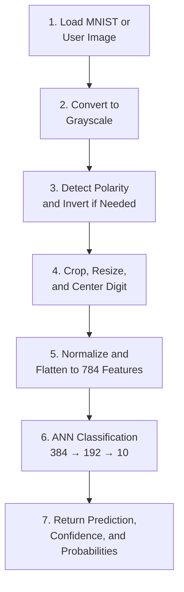

## Image Preprocessing

### Training images

1. Load 28×28 grayscale MNIST images.
2. Convert pixels from integers in `[0, 255]` to `float32` values in `[0, 1]`.
3. Flatten each image into a 784-value vector.
4. One-hot encode labels for categorical cross-entropy.

### Uploaded images

Real uploads often use black ink on a white page, unlike MNIST's white digit on a black background. The reusable preprocessing pipeline therefore:

1. flattens transparent backgrounds onto white;
2. converts the image to grayscale;
3. detects background polarity and inverts when needed;
4. finds and crops the foreground digit;
5. resizes it within a 20×20 content box while preserving aspect ratio;
6. places the result on a 28×28 black canvas;
7. centers the digit using its intensity centroid;
8. normalizes the pixels and creates the model batch dimension.

This step is essential because the same digit can produce very different pixel vectors when its scale, centering, contrast, or polarity changes.

## Why a Dense ANN?

This repository is part of a broader Artificial Neural Network portfolio, so the core model intentionally uses a fully connected ANN as a strong image-classification baseline.

The 28×28 image is flattened into 784 normalized pixel features and passed through two dense hidden layers. This architecture demonstrates:

- multiclass neural-network classification;
- nonlinear feature learning;
- dropout regularization;
- softmax probability estimation;
- hyperparameter comparison;
- model serialization and deployment.

A convolutional neural network would better preserve spatial relationships between neighboring pixels and is included as a logical future benchmark. Keeping the dense ANN as the primary model makes the project consistent with the ANN portfolio while still delivering strong held-out performance.

## ANN Architecture

| Layer | Configuration | Purpose |
|---|---|---|
| Input | 784 normalized pixels | Flattened 28×28 image |
| Dense | 384 units, ReLU | Learn nonlinear pixel interactions |
| Dropout | 0.20 | Reduce overfitting |
| Dense | 192 units, ReLU | Compress learned features |
| Dropout | 0.20 | Additional regularization |
| Output | 10 units, Softmax | Probability for each digit |

Training uses Adam, categorical cross-entropy, early stopping, and learning-rate reduction. The selected configuration uses a learning rate of `0.0005` and batch size of `256`.

## Evaluation and Error Analysis

### Training performance

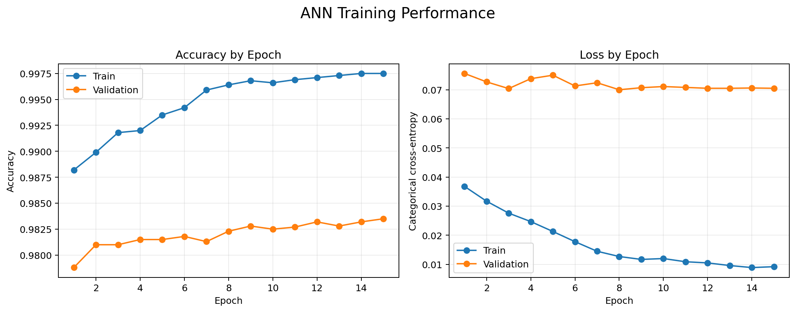

### Confusion matrix

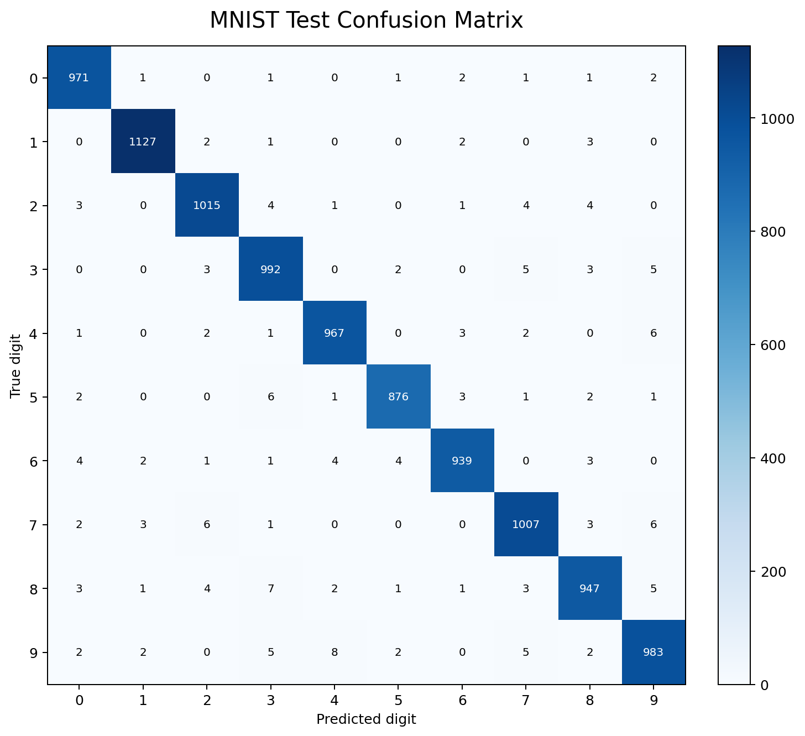

The most frequent observed confusions were:

- true 9 predicted as 4: 8 cases;
- true 8 predicted as 3: 7 cases;
- true 7 predicted as 2 or 9: 6 cases each;
- true 5 predicted as 3: 6 cases;
- true 4 predicted as 9: 6 cases.

These errors are visually plausible because handwritten digits can share strokes, loops, and incomplete closures.

### Correct predictions

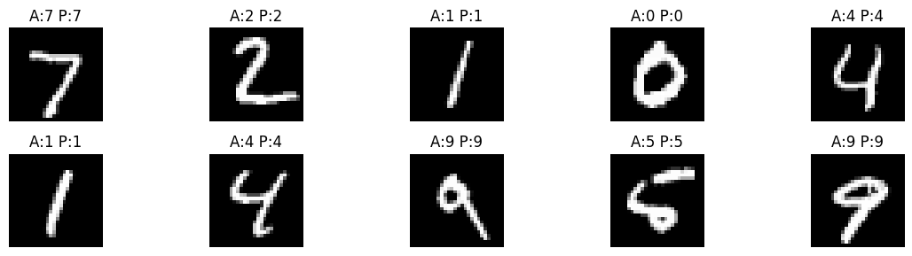

### Misclassified examples

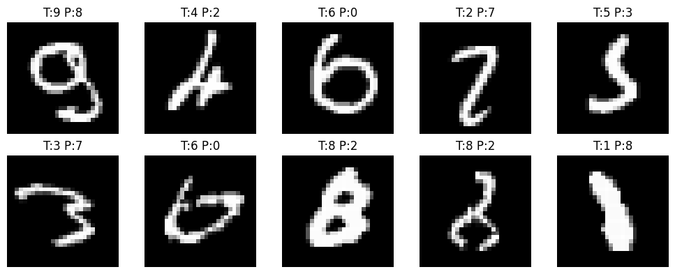

A confusion matrix reveals which classes are confused with one another rather than reducing performance to a single accuracy number. Misclassified-image review helps identify ambiguous handwriting, unusual stroke geometry, and potential preprocessing failures.

## Streamlit Demo

The live application supports:

- uploaded PNG, JPG, JPEG, or BMP images;
- built-in MNIST sample digits;
- original, grayscale, and final 28×28 previews;
- automatic black/white background inversion;
- predicted digit and confidence;
- runner-up prediction;
- probability table and interactive chart;
- CSV download of class probabilities;
- dynamic model metrics loaded from JSON.

**Open the application:**  
[https://ann-deep-learning-projects-gsnhfzexxframenzenm5rx.streamlit.app/](https://ann-deep-learning-projects-gsnhfzexxframenzenm5rx.streamlit.app/)

Drawing support was intentionally not added because upload and sample modes avoid an additional canvas dependency and are more reliable for Community Cloud deployment.

## Application Screenshots

### 1. Application overview

The home page summarizes the trained model, held-out metrics, input options, and expected image format.

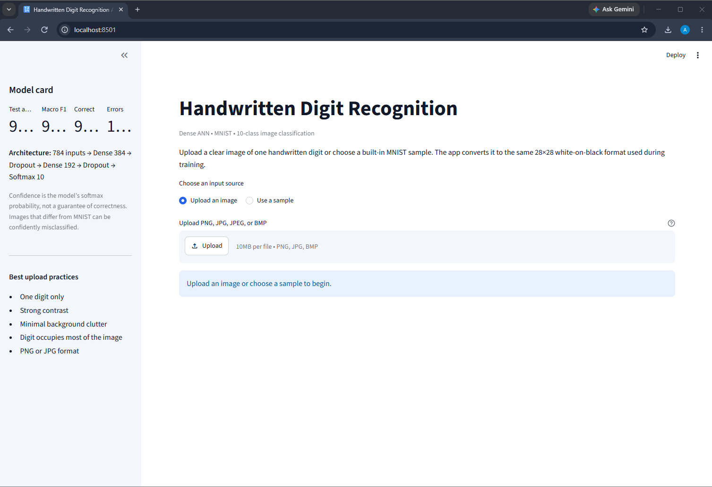

### 2. Sample-image preprocessing

The application shows the original input, grayscale representation, and centered 28×28 image supplied to the ANN.

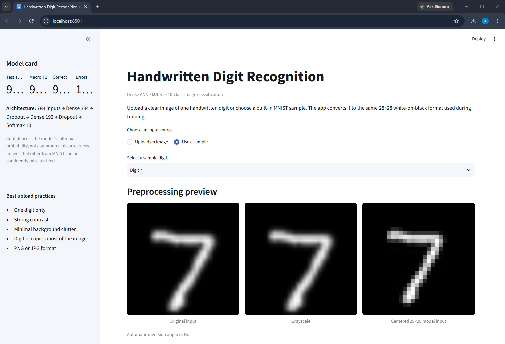

### 3. Prediction summary

The prediction panel displays the top digit, confidence, runner-up class, and confidence interpretation.

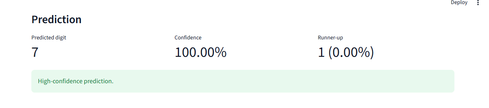

### 4. Probability distribution

The interactive chart compares predicted probabilities across all ten digit classes.

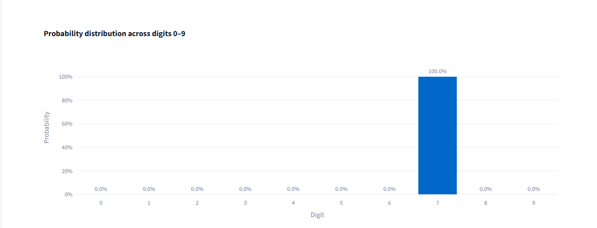

### 5. Probability table and export

Users can review the complete ranked class distribution and download it as a CSV file.

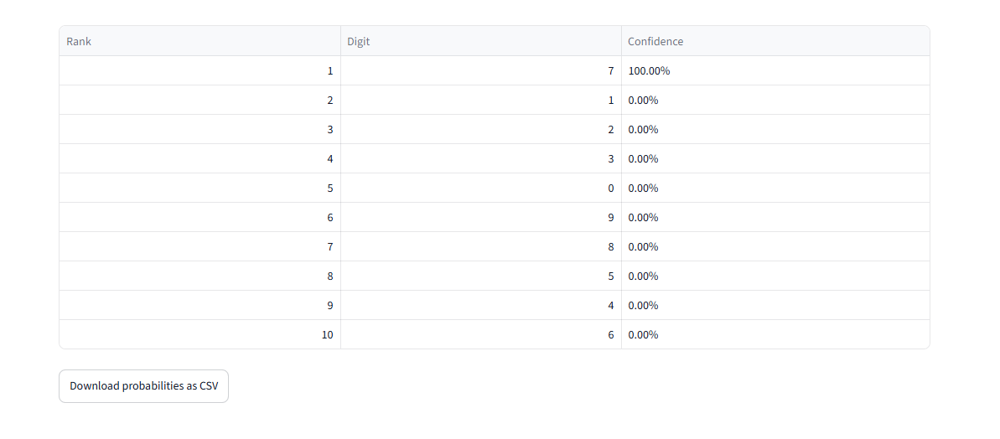

### 6. Uploaded-image preprocessing

External images are converted into the same MNIST-style representation used during training.

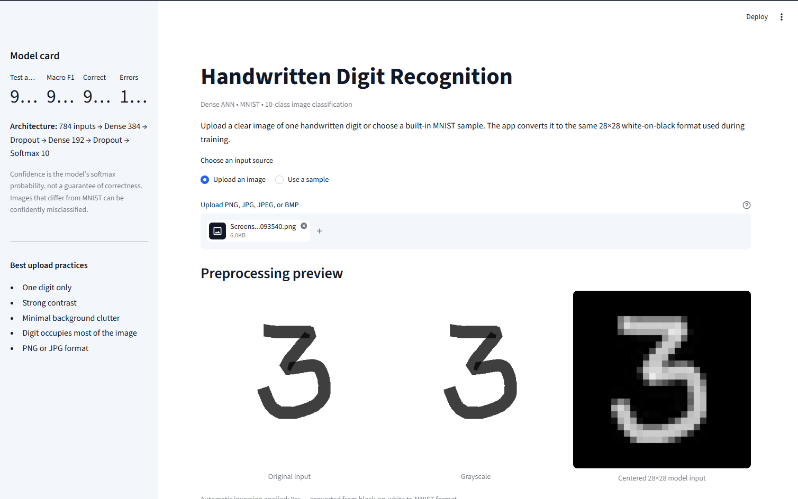

### 7. Uploaded-image prediction

The system generates a prediction and confidence distribution for a user-provided handwritten digit.

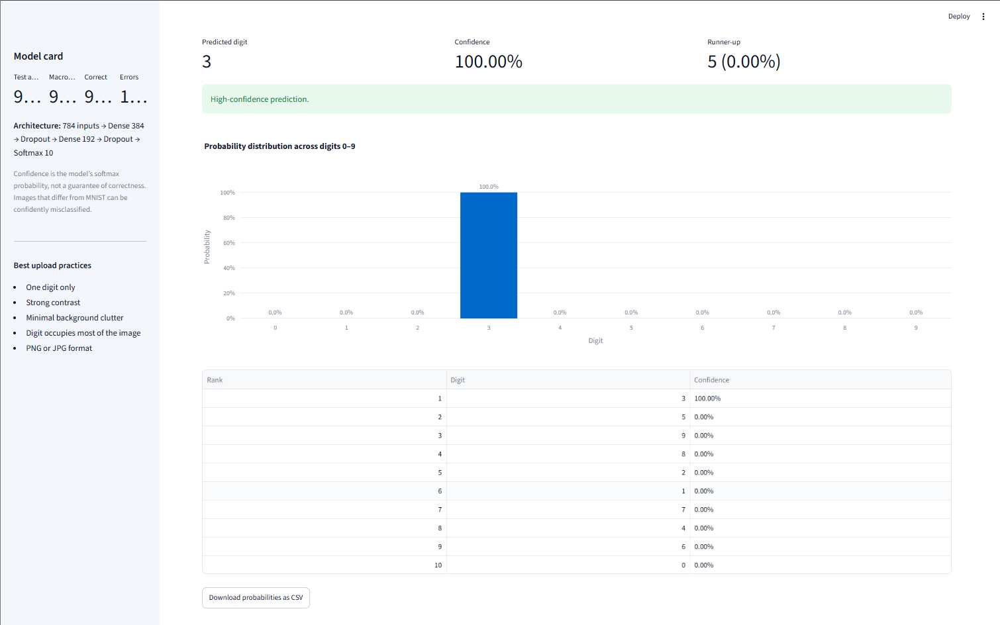

## Repository Structure

```text
07-handwritten-digit-recognition/
├── .streamlit/
│   └── config.toml
├── app/
│   ├── __init__.py
│   └── streamlit_app.py
├── data/
│   ├── sample_digits/
│   └── README_data.md
├── images/
│   ├── 01_app_home.png
│   ├── 02_sample_digit_7_preprocessing.png
│   ├── 03_sample_digit_7_prediction.png
│   ├── 04_sample_digit_7_probability_distribution.png
│   ├── 05_probability_table_and_download.png
│   ├── 06_uploaded_digit_preprocessing.png
│   ├── 07_uploaded_digit_prediction.png
│   └── README.md
├── models/
│   ├── best_params.json
│   └── digit_recognition_model.keras
├── notebooks/
│   └── handwritten_digit_recognition.ipynb
├── outputs/
│   ├── accuracy_loss_curve.png
│   ├── classification_report.csv
│   ├── confusion_matrix.csv
│   ├── confusion_matrix.png
│   ├── misclassified_digits.png
│   ├── model_metrics.json
│   ├── per_class_accuracy.csv
│   ├── sample_predictions.png
│   ├── training_history.csv
│   └── training_history.json
├── src/
│   ├── data_preprocessing.py
│   ├── image_preprocessing.py
│   ├── model_evaluation.py
│   ├── model_training.py
│   └── prediction_pipeline.py
├── tests/
├── .gitignore
├── FILE_MANIFEST.csv
├── IMPLEMENTATION_SUMMARY.md
├── LICENSE
├── MODEL_CARD.md
├── PORTFOLIO_COPY.md
├── README.md
├── README_HOSTING.md
├── requirements-dev.txt
├── requirements.txt
└── streamlit_app.py
```

The monorepo also includes the CI workflow at:

```text
.github/workflows/handwritten-digit-recognition-ci.yml
```

## Run Locally

Clone the repository and open the project directory:

```bat
git clone https://github.com/unit-mole/ann-deep-learning-projects.git
cd ann-deep-learning-projects\07-handwritten-digit-recognition
```

### Windows Command Prompt

The explicit virtual-environment interpreter is used below to avoid global Python and `PATH` conflicts:

```bat
python -m venv .venv
".venv\Scripts\python.exe" -m pip install --upgrade pip setuptools wheel
".venv\Scripts\python.exe" -m pip install -r requirements.txt
".venv\Scripts\python.exe" -m streamlit run streamlit_app.py
```

Open the local URL displayed by Streamlit, normally:

```text
http://localhost:8501
```

### macOS / Linux

```bash
python3 -m venv .venv
source .venv/bin/activate
python -m pip install --upgrade pip setuptools wheel
python -m pip install -r requirements.txt
python -m streamlit run streamlit_app.py
```

## Testing

Install the test dependency and run the automated test suite.

Windows:

```bat
".venv\Scripts\python.exe" -m pip install "pytest>=8,<10"
".venv\Scripts\python.exe" -m pytest tests -v
```

macOS/Linux:

```bash
python -m pip install "pytest>=8,<10"
python -m pytest tests -v
```

Expected result:

```text
6 passed
```

The tests validate image-polarity handling, 28×28 preprocessing, blank-image rejection, required artifacts, Keras model integrity, and metrics consistency.

## Optional Training and Evaluation

The committed model is inference-ready; retraining is not required to run the application.

### Retrain using the saved best configuration

```bat
".venv\Scripts\python.exe" -m src.model_training --epochs 30
```

### Repeat the three-candidate search

```bat
".venv\Scripts\python.exe" -m src.model_training --tune --epochs 30
```

### Regenerate evaluation outputs

```bat
".venv\Scripts\python.exe" -m src.model_evaluation
```

MNIST downloads automatically the first time a training or evaluation command runs.

## Deployment

The application is deployed on Streamlit Community Cloud:

[](https://ann-deep-learning-projects-gsnhfzexxframenzenm5rx.streamlit.app/)

Use this monorepo deployment entrypoint:

```text
07-handwritten-digit-recognition/streamlit_app.py
```

Deployment configuration:

```text
Repository: unit-mole/ann-deep-learning-projects
Branch: main
Python: 3.13
Secrets: None required
```

The root-level `streamlit_app.py` is the intended Community Cloud entrypoint. The implementation remains modularized under `app/streamlit_app.py`.

Full deployment and troubleshooting instructions are available in [`README_HOSTING.md`](README_HOSTING.md).

## Skills Demonstrated

`Artificial Neural Networks` · `TensorFlow` · `Keras` · `Multiclass Classification` · `Computer Vision` · `Image Preprocessing` · `Hyperparameter Comparison` · `Dropout Regularization` · `Model Evaluation` · `Confusion Matrix` · `Error Analysis` · `Model Serialization` · `Streamlit` · `Testing` · `CI/CD` · `Deployment Documentation`

## Limitations

- A dense ANN discards explicit two-dimensional spatial structure when flattening images. A CNN is a logical benchmark for future comparison.
- MNIST is clean and standardized. Phone photographs, multiple digits, textured paper, shadows, and highly unusual handwriting create domain shift.
- Softmax confidence is not calibrated certainty. A high probability can still be wrong on out-of-distribution images.
- The project recognizes one isolated digit at a time and is not a complete OCR pipeline.

## Future Improvements

- Train a CNN and compare accuracy, parameter count, and latency with the dense ANN.
- Add augmentation for rotation, translation, scale, blur, and brightness.
- Calibrate probabilities using temperature scaling.
- Add out-of-distribution and blank-image detection.
- Export to LiteRT/TensorFlow Lite for mobile or edge inference.
- Extend from isolated digits to multi-digit segmentation and OCR.

## Portfolio Description

**One line:** ANN-powered handwritten digit recognition system that standardizes user-uploaded images into MNIST format and returns real-time digit predictions with ranked class probabilities.

**Resume-ready description:** Built and deployed a TensorFlow/Keras ANN for ten-class handwritten digit recognition, achieving 98.24% test accuracy while productionizing image preprocessing, confidence-based inference, error analysis, testing, CI, and Streamlit model serving.

## Portfolio Positioning

This project demonstrates the transition from a notebook experiment to a reusable ML product: the trained model is preserved, preprocessing is productionized, evaluation is documented, tests and CI are added, and inference is exposed through a deployed application.

It complements quality and business analytics projects with image-based deep learning and model-serving experience, supporting a transition toward Data Science, Machine Learning, Applied AI, and Analytics Engineering roles.

## Responsible Use

This repository is an educational portfolio project. The model is designed for isolated handwritten digits and should not be treated as a complete production OCR system.

Real deployments would require:

- representative domain-specific training data;
- confidence thresholds and human review;
- privacy and data-retention controls;
- monitoring for model drift and input-quality changes;
- validation against the intended document and handwriting population;
- operational fallback and error-correction processes.

## License

Released under the MIT License.
