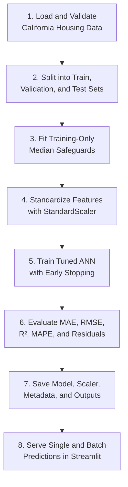
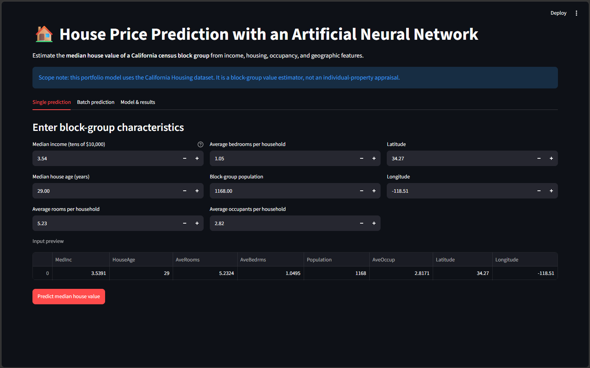
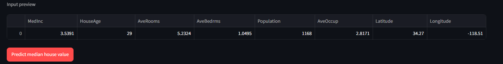
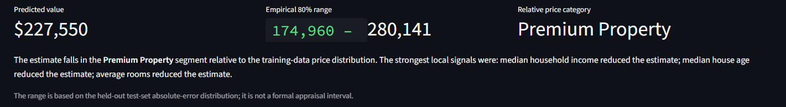
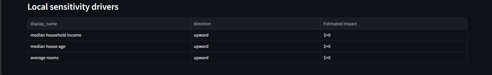
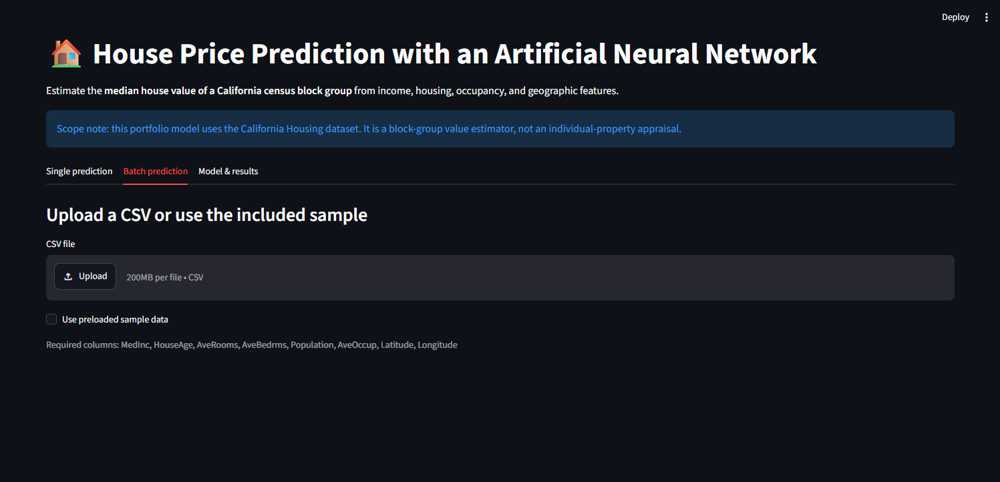
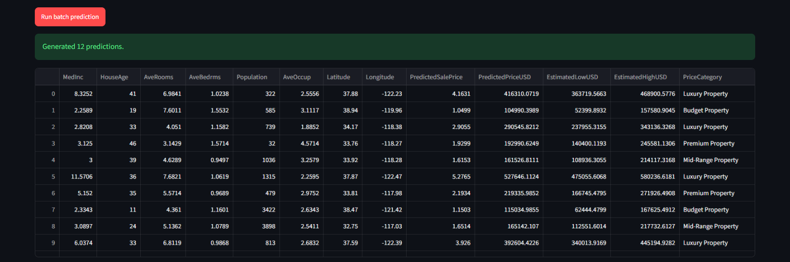
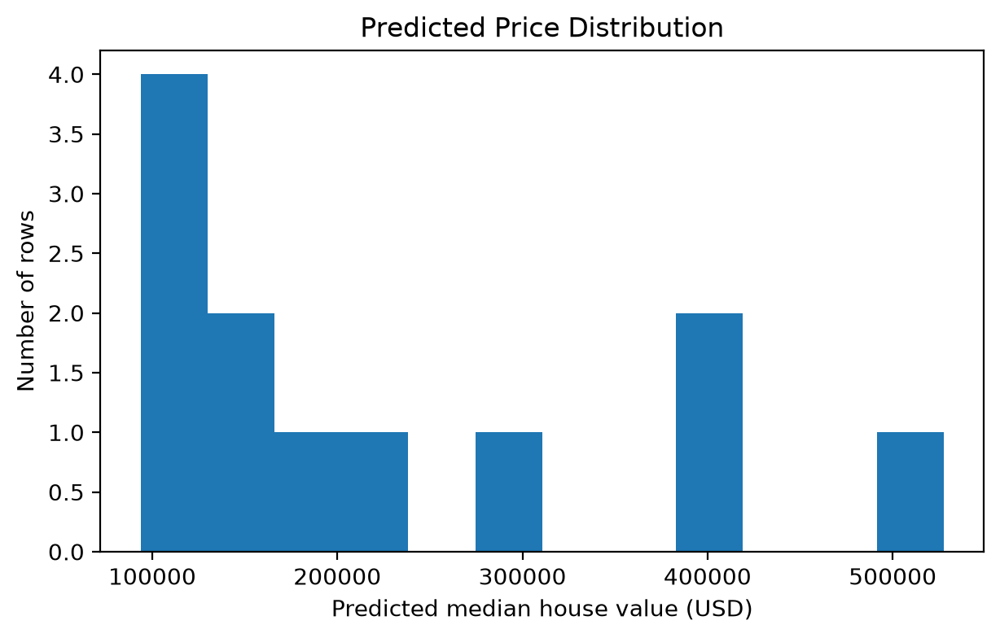
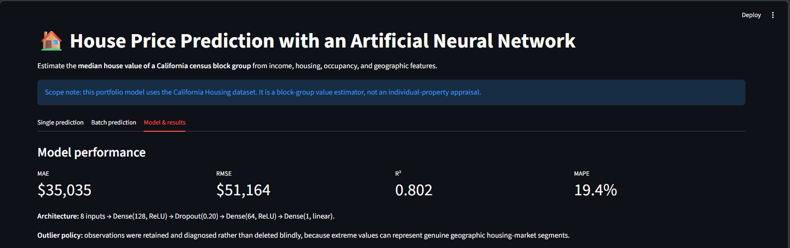
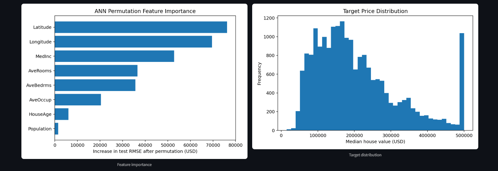

# ANN House Price Prediction System

[](https://www.python.org/)
[](https://www.tensorflow.org/)
[](https://keras.io/)
[](https://ann-deep-learning-projects-satmbakncxmlo2mmct5gvu.streamlit.app/)
[](https://github.com/unit-mole/ann-deep-learning-projects/actions/workflows/house-price-ann-ci.yml)

An end-to-end tabular regression project that uses an Artificial Neural Network
to estimate California census block-group median house values. The system
transforms model output into US-dollar estimates, an empirical price range, a
relative market category, and interpretable feature-level insights. The
repository includes reusable preprocessing and inference modules, saved model
artifacts, evaluation outputs, automated testing, CI, deployment documentation,
and a live Streamlit application.

**Status:** Portfolio-ready  
**Live demo:** [Open the Streamlit application](https://ann-deep-learning-projects-satmbakncxmlo2mmct5gvu.streamlit.app/)  
[](https://ann-deep-learning-projects-satmbakncxmlo2mmct5gvu.streamlit.app/)

**Primary stack:** Python · TensorFlow · Keras · pandas · NumPy · scikit-learn · Matplotlib · Streamlit

---

## Executive Summary

House-value estimation is a practical regression problem used in market
analysis, planning, portfolio review, and real-estate research. A deployable
solution requires more than training a model: the data pipeline must enforce a
consistent feature order, prevent preprocessing leakage, preserve model
artifacts, explain predictions, and provide a reliable interface for both
single-record and batch scoring.

This project converts the original ANN notebook into a reusable prediction
system with:

- a trained dense neural network for tabular regression;
- leakage-aware train, validation, and test preprocessing;
- exact feature-order validation and numeric input safeguards;
- saved TensorFlow model, scaler, metadata, and tuning parameters;
- predicted values converted into US dollars;
- an empirical 80% model-error range;
- dataset-relative Budget, Mid-Range, Premium, and Luxury categories;
- global permutation importance and local sensitivity explanations;
- individual and batch prediction workflows;
- downloadable batch-scoring results;
- automated tests, CI, and Streamlit deployment documentation.

The final model achieved **0.8020 R²**, **$35,035 MAE**, and **$51,164 RMSE**
on the held-out test set.

## Business Problem

Real-estate analysts, planners, and market researchers need consistent,
repeatable estimates of residential value from income, housing, occupancy, and
geographic characteristics.

Manual or rule-based estimation can be:

- inconsistent across users and locations;
- difficult to scale across large property datasets;
- unable to capture nonlinear interactions;
- vulnerable to subjective assumptions;
- unsuitable for repeatable batch-scoring workflows.

The practical question is:

> Given California census block-group characteristics, what median house value
> does the ANN estimate?

For each valid record, the system returns:

```text
Predicted median house value
Empirical 80% model-error range
Relative market category
Business interpretation
Local sensitivity drivers
```

The project is designed as an educational portfolio application and not as a
licensed individual-property appraisal system.

## Technical Objective

The modeling task is a supervised regression problem:

```text
Input: Eight standardized numeric block-group features
Output: Estimated median house value
```

The deployed model uses:

- median household income;
- median house age;
- average rooms;
- average bedrooms;
- population;
- average occupancy;
- latitude;
- longitude.

The ANN output is stored in the California Housing target scale and converted
to dollars during inference.

## Project Snapshot

| Item | Result |
|---|---:|
| Dataset | California Housing |
| Total observations | **20,640** |
| Input features | **8 numeric predictors** |
| Split | **70% train / 15% validation / 15% test** |
| Model | Dense ANN regression model |
| Held-out MAE | **$35,035** |
| Held-out RMSE | **$51,164** |
| Held-out R² | **0.8020** |
| Held-out MAPE | **19.39%** |
| Empirical 80% error band | **±$52,591** |
| Deployment | **Streamlit Community Cloud** |

## Held-Out Model Results

The final model was evaluated on a held-out test partition that was not used to
fit the scaler or train the neural network.

| Metric | Result | Interpretation |
|---|---:|---|
| MAE | **$35,035** | Average absolute difference between prediction and actual value |
| RMSE | **$51,164** | Penalizes larger prediction errors more heavily |
| R² | **0.8020** | Explains approximately 80.2% of held-out target variance |
| MAPE | **19.39%** | Average percentage error; interpret cautiously for lower-valued observations |
| Empirical error band | **±$52,591** | 80th percentile of held-out absolute errors |

The committed model reproduces the evaluation results from the uploaded
notebook and saved artifacts.

## Dataset

The project uses the **California Housing** dataset with 20,640 observations.
Each row represents a California census block group rather than an individual
house transaction.

The source target is stored in units of `$100,000` and is top-coded near
`$500,001`. Therefore:

- predictions represent median block-group house value;
- room, bedroom, and occupancy variables are block-group averages;
- the project does not estimate the sale price of a specific property;
- the target ceiling limits interpretation at the highest price levels.

See [`data/README_data.md`](data/README_data.md) for the project data policy and
input requirements.

## Dataset Features

| Feature | Meaning |
|---|---|
| `MedInc` | Median household income in tens of thousands of dollars |
| `HouseAge` | Median house age |
| `AveRooms` | Average rooms per household |
| `AveBedrms` | Average bedrooms per household |
| `Population` | Block-group population |
| `AveOccup` | Average occupants per household |
| `Latitude` | Geographic latitude |
| `Longitude` | Geographic longitude |
| `SalePrice` | Median house value in units of $100,000 |

The supplied dataset contains no categorical features and no missing values.
The reusable preprocessing pipeline still includes a training-derived median
imputation safeguard for future uploaded batch data.

## End-to-End Workflow



## Data Preprocessing

The preprocessing workflow includes:

1. schema and column validation;
2. deterministic 70/15/15 train, validation, and test splitting;
3. training-only median values for missing-data safeguards;
4. numeric type enforcement;
5. exact feature-order control;
6. `StandardScaler` fitting on the training partition only;
7. consistent transformation for validation, test, and uploaded records.

No categorical encoder is required because all eight predictors are numeric.

## Feature Engineering

The deployed model intentionally uses the original eight California Housing
predictors so that inference remains compatible with the saved scaler and ANN.

Optional exploratory ratios, such as rooms per bedroom or income per occupant,
can be studied during future retraining. They are not silently introduced into
the deployed inference pipeline.

## Outlier Strategy

Housing data can contain legitimate extreme values caused by geography,
population density, income concentration, and local market structure.

The project therefore:

- generates an IQR-based outlier report;
- retains observations by default;
- avoids blind row deletion;
- supports train-only clipping utilities for controlled experiments;
- treats the top-coded target ceiling as a more important modeling limitation
  than routine IQR filtering.

## Why a Dense ANN?

This repository is part of a broader Artificial Neural Network portfolio, so
the core model uses a fully connected neural network for tabular regression.

The ANN demonstrates:

- nonlinear regression;
- hidden-layer representation learning;
- dropout regularization;
- standardized numeric inference;
- hyperparameter comparison;
- early stopping;
- model serialization;
- deployment-ready prediction serving.

Tree-based methods may provide a useful benchmark, but the ANN remains the
primary model because this project is intended to demonstrate deep-learning
skills for structured data.

## ANN Architecture

| Layer | Configuration | Purpose |
|---|---|---|
| Input | 8 standardized numeric features | Model-ready block-group inputs |
| Dense | 128 units, ReLU | Learn nonlinear relationships |
| Dropout | 0.20 | Reduce overfitting |
| Dense | 64 units, ReLU | Refine learned representation |
| Output | 1 unit, linear | Predict continuous house value |

Training uses the Adam optimizer, mean squared error loss, early stopping, and
learning-rate reduction.

Selected hyperparameters:

```json
{
  "hidden_units": 128,
  "dropout_rate": 0.2,
  "learning_rate": 0.001,
  "batch_size": 128
}
```

## Price Range and Category Logic

The point prediction is converted into dollars using:

```text
Predicted USD = ANN output × 100,000
```

The application displays an empirical model-error range:

```text
Estimated range = prediction ± $52,591
```

This range is based on the 80th percentile of absolute errors from the held-out
test set. It is not a formal probabilistic confidence interval or professional
appraisal range.

Price categories are defined using training-target quartiles:

- **Budget Property:** below training Q1;
- **Mid-Range Property:** Q1 to median;
- **Premium Property:** median to Q3;
- **Luxury Property:** at or above Q3.

These labels are relative to this dataset and are not universal real-estate
thresholds.

## Explainability

### Global explanation

Permutation importance measures how much held-out RMSE increases when one
feature is randomly shuffled. The strongest global signals in the supplied
model are geographic coordinates, median income, and room structure.

### Local explanation

For individual predictions, the application compares the result with each
feature replaced by its training median. The change in prediction is reported as
a local sensitivity driver.

This explanation is useful for directional interpretation, but it is not a
causal estimate and should not be interpreted as a SHAP value.

## Evaluation and Diagnostic Outputs

### Actual vs Predicted


The plot compares held-out predictions with actual values. Points closer to the
diagonal indicate more accurate predictions.

### Residual Analysis


Residuals help identify systematic overprediction, underprediction, and changing
error patterns across the target range.

### Global Feature Importance


Permutation importance highlights the features that most strongly affect
held-out model performance.

### Target Distribution


The distribution shows the concentration of block-group values and the visible
effect of the dataset's upper target ceiling.

## Streamlit Demo

The live application supports:

- manual input for all eight model predictors;
- input preview before scoring;
- predicted value in US dollars;
- empirical price range;
- relative price category;
- local sensitivity drivers;
- preloaded sample batch data;
- CSV upload for batch scoring;
- predicted-price comparison and distribution charts;
- downloadable prediction results;
- dynamically loaded model metrics;
- clear dataset and appraisal limitations.

**Open the application:**  
[https://ann-deep-learning-projects-satmbakncxmlo2mmct5gvu.streamlit.app/](https://ann-deep-learning-projects-satmbakncxmlo2mmct5gvu.streamlit.app/)

## Application Screenshots

### 1. Application overview

The landing page introduces the model, dataset scope, input workflow, and
navigation options.



### 2. Single-record input preview

Users can review the eight feature values before generating a prediction.



### 3. Prediction summary

The result panel displays the predicted value, empirical error range, and
relative market category.



### 4. Local sensitivity drivers

The application highlights the features that most strongly increase or decrease
the selected prediction relative to training medians.



### 5. Batch sample preview

Users can test the batch workflow with a preloaded sample before uploading their
own file.



### 6. Batch prediction results

The batch-scoring output provides predictions, ranges, categories, and
record-level interpretations.



### 7. Batch prediction charts

The application compares predicted prices across records and summarizes the
prediction distribution.



### 8. Model performance summary

The model-results tab displays held-out MAE, RMSE, R², MAPE, and the ANN
architecture summary.



### 9. Feature importance and target distribution

The application displays the same global feature-importance and target-
distribution outputs used in the documented evaluation workflow.



## Repository Structure

```text
08-house-price-prediction/
├── app/
│   ├── streamlit_app.py
│   └── requirements.txt
├── data/
│   ├── house_prices.csv
│   ├── sample_input.csv
│   └── README_data.md
├── images/
│   ├── 01_app_home.png
│   ├── 02_single_input_preview.png
│   ├── 03_single_prediction_result.png
│   ├── 04_local_sensitivity_drivers.png
│   ├── 05_batch_sample_preview.png
│   ├── 06_batch_prediction_results.png
│   ├── 07_batch_prediction_charts.png
│   ├── 09_model_performance_metrics.png
│   └── 11_feature_importance_distribution.png
├── models/
│   ├── house_price_ann.keras
│   ├── house_price_scaler.pkl
│   ├── house_price_best_params.json
│   └── model_metadata.json
├── notebooks/
│   └── house_price_prediction.ipynb
├── outputs/
│   ├── actual_vs_predicted.png
│   ├── residual_plot.png
│   ├── price_distribution.png
│   ├── error_distribution.png
│   ├── feature_importance.png
│   ├── model_metrics.json
│   ├── outlier_report.csv
│   └── test_predictions_sample.csv
├── src/
│   ├── __init__.py
│   ├── config.py
│   ├── data_preprocessing.py
│   ├── feature_engineering.py
│   ├── model_training.py
│   ├── model_evaluation.py
│   ├── price_prediction.py
│   └── prediction_pipeline.py
├── tests/
│   └── test_project.py
├── .gitignore
├── FILE_MANIFEST.csv
├── PROJECT_AUDIT.md
├── README.md
├── README_HOSTING.md
└── requirements.txt
```

The monorepo also includes the CI workflow at:

```text
.github/workflows/house-price-ann-ci.yml
```

## Run Locally

Clone the repository and open the project directory:

```bat
git clone https://github.com/unit-mole/ann-deep-learning-projects.git
cd ann-deep-learning-projects\08-house-price-prediction
```

### Windows Command Prompt

The explicit virtual-environment interpreter is used below to avoid global
Python and `PATH` conflicts:

```bat
py -3.12 -m venv .venv
".venv\Scripts\python.exe" -m pip install --upgrade pip setuptools wheel
".venv\Scripts\python.exe" -m pip install -r requirements.txt
".venv\Scripts\python.exe" -m streamlit run app\streamlit_app.py
```

Open the local URL displayed by Streamlit, normally:

```text
http://localhost:8501
```

### macOS / Linux

```bash
python3.12 -m venv .venv
source .venv/bin/activate
python -m pip install --upgrade pip setuptools wheel
python -m pip install -r requirements.txt
python -m streamlit run app/streamlit_app.py
```

## Testing

Install the project dependencies and run the automated test suite.

Windows:

```bat
".venv\Scripts\python.exe" -m pytest tests -v
```

macOS/Linux:

```bash
python -m pytest tests -v
```

The tests validate required model artifacts, feature order, sample input schema,
metadata consistency, TensorFlow model loading, and prediction generation.

## Optional Training and Evaluation

The committed model is inference-ready; retraining is not required to run the
application.

### Retrain using the saved configuration

```bat
".venv\Scripts\python.exe" -m src.model_training --data-path data/house_prices.csv
```

### Regenerate evaluation outputs

```bat
".venv\Scripts\python.exe" -m src.model_evaluation
```

Small numerical differences can occur across TensorFlow versions and hardware.

## Deployment

The application is deployed on Streamlit Community Cloud:

[](https://ann-deep-learning-projects-satmbakncxmlo2mmct5gvu.streamlit.app/)

Use this monorepo deployment entrypoint:

```text
08-house-price-prediction/app/streamlit_app.py
```

Deployment configuration:

```text
Repository: unit-mole/ann-deep-learning-projects
Branch: main
Python: 3.12
Secrets: None required
```

Full deployment and troubleshooting instructions are available in
[`README_HOSTING.md`](README_HOSTING.md).

## Skills Demonstrated

`Artificial Neural Networks` · `TensorFlow` · `Keras` · `Tabular Regression` ·
`Leakage-Aware Preprocessing` · `Feature Scaling` · `Hyperparameter Comparison`
· `Dropout Regularization` · `Regression Evaluation` · `Residual Analysis` ·
`Permutation Feature Importance` · `Local Sensitivity Analysis` · `Model
Serialization` · `Batch Scoring` · `Streamlit` · `Testing` · `CI/CD` ·
`Deployment Documentation`

## Limitations

- The dataset represents California census block groups rather than individual
  property transactions.
- Room, bedroom, and occupancy variables are area-level averages.
- The target is capped near `$500,001`, limiting high-end price modeling.
- Predictions do not include property-specific condition, renovation, lot size,
  or neighborhood identifiers.
- The empirical range is a held-out error summary, not a calibrated prediction
  interval.
- Local sensitivity values are explanatory comparisons rather than causal
  effects.
- The application should not be used as a professional appraisal or lending
  decision system.

## Future Improvements

- Retrain on individual transaction data with bedrooms, bathrooms, lot size,
  renovations, condition, and neighborhood identifiers.
- Compare ANN performance with gradient boosting and ensemble baselines.
- Use spatial cross-validation to evaluate geographic generalization.
- Add calibrated conformal prediction intervals.
- Test log-target training on an uncapped transaction dataset.
- Add SHAP explanations in an offline analysis notebook.
- Monitor prediction drift after deployment.
- Containerize the application for alternative hosting.

## Portfolio Description

**One line:** ANN-powered regression system that estimates California median
house values and provides empirical price ranges, market categories, local
sensitivity drivers, and batch scoring through Streamlit.

**Resume-ready description:** Built and deployed a TensorFlow/Keras ANN
regression pipeline that achieved 0.802 R² on held-out California Housing data
while productionizing leakage-aware preprocessing, model evaluation,
explainability, batch inference, automated testing, CI, and Streamlit serving.

## Portfolio Positioning

This project demonstrates the transition from a notebook experiment to a
reusable machine-learning product: preprocessing is modularized, model artifacts
are preserved, evaluation is documented, inference is exposed through an
interactive application, and testing and CI support reproducibility.

It complements quality and business analytics work with end-to-end regression,
deep learning, model explainability, and model-serving experience, supporting a
transition toward Data Science, Machine Learning, Applied AI, and Analytics
Engineering roles.

## Responsible Use

This repository is an educational portfolio project. Predictions are analytical
estimates and must not replace a licensed real-estate appraisal, underwriting
decision, or professional valuation.

A real deployment would require:

- representative individual-property transaction data;
- calibrated uncertainty intervals;
- geographic and demographic bias review;
- privacy and data-retention controls;
- model monitoring and drift detection;
- human review for high-impact decisions.
