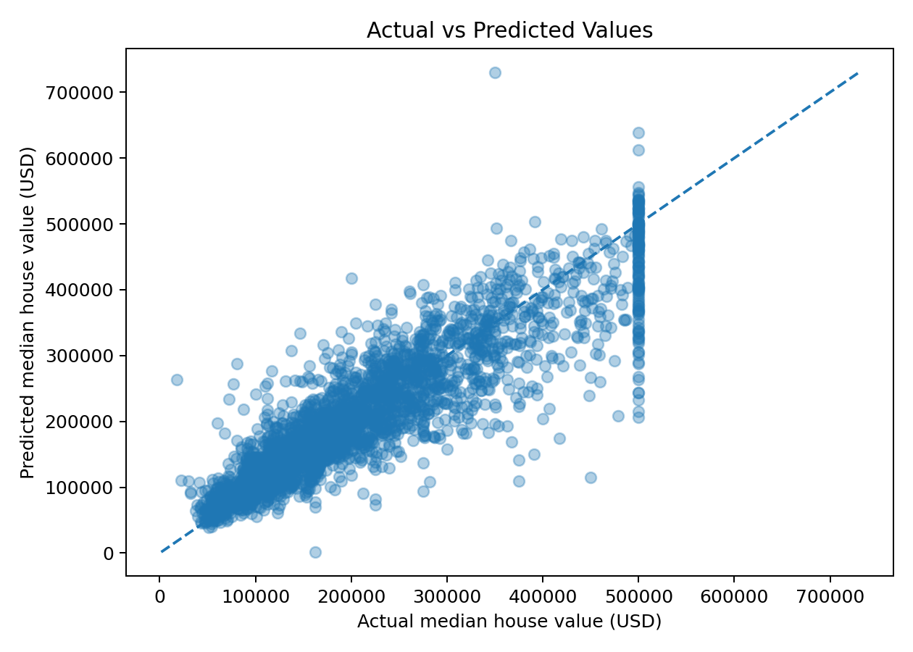
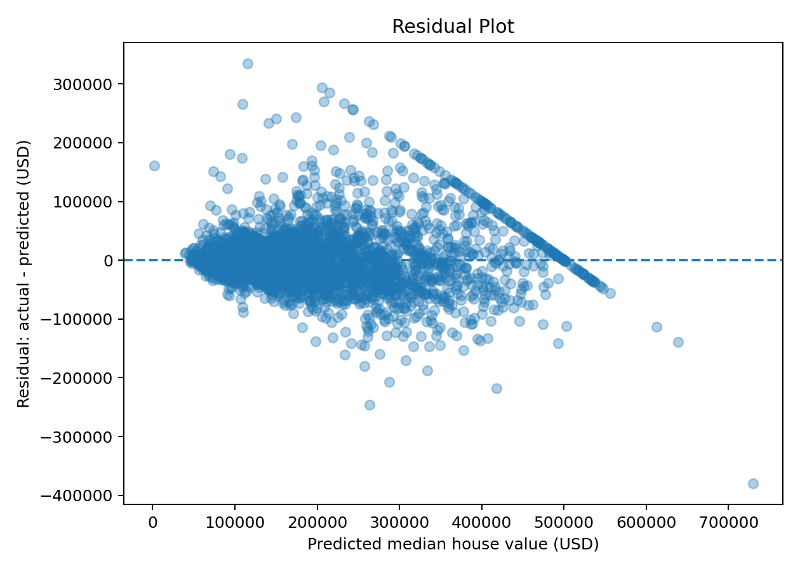
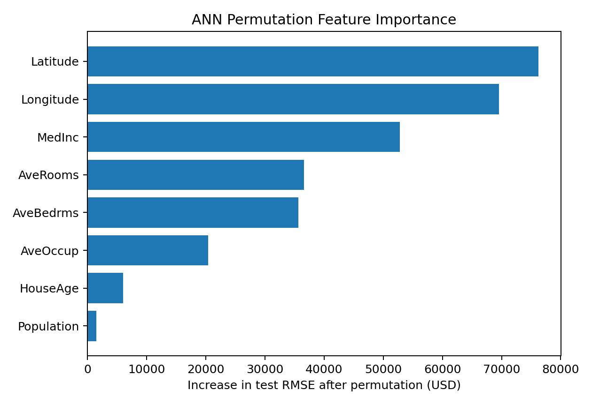
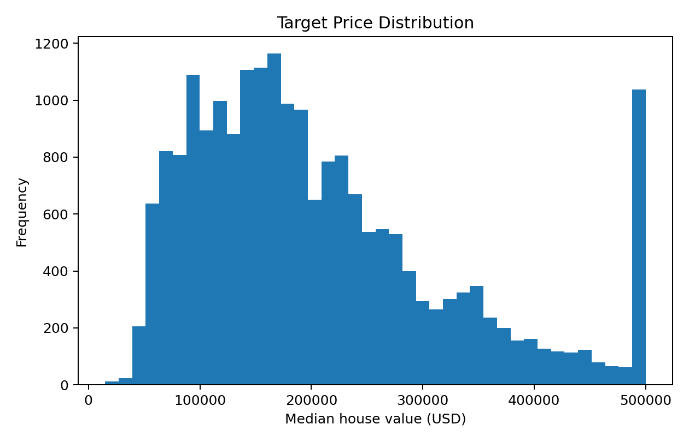

# House Price Prediction using Artificial Neural Networks

[](#)
[](#)
[](#)
[](https://github.com/unit-mole/ann-deep-learning-projects/actions/workflows/house-price-ann-ci.yml)

> A deployment-ready ANN regression project that estimates California census
> block-group median house value and converts model output into dollar values,
> an empirical price range, a relative market category, and an interpretable
> business summary.

## Live Demo

**Streamlit app:** `ADD_DEPLOYED_APP_URL_HERE`

## Business Problem

Real-estate analysts, planners, and market researchers need consistent estimates
of residential value from income, housing, occupancy, and geographic signals.
This project answers:

> **Given California block-group characteristics, what median house value does
> the ANN estimate?**

The result is displayed as:

- Predicted median house value in US dollars
- Empirical 80% error range
- Distribution-relative category: Budget, Mid-Range, Premium, or Luxury
- Local sensitivity drivers
- Batch prediction table and downloadable CSV

## Important Dataset Scope

The uploaded project uses the **California Housing** dataset with 20,640 rows.
It predicts **median block-group house value**, not the sale price of an
individual property. Features such as rooms, bedrooms, and occupancy are
block-group averages.

The source target is stored in units of `$100,000` and is capped near
`$500,001`. The application converts predictions to dollars and states these
limitations clearly.

## Model Results

| Metric | Held-out test result | Interpretation |
|---|---:|---|
| MAE | **$35,035** | Average absolute prediction error |
| RMSE | **$51,164** | Penalizes larger pricing errors more heavily |
| R² | **0.8020** | Explains about 80.2% of held-out target variance |
| MAPE | **19.39%** | Average percentage error; interpret cautiously at lower prices |
| Empirical error band | **±$52,591** | 80th percentile of held-out absolute errors |

The supplied model reproduces the uploaded notebook's test metrics.

## Dataset Features

| Feature | Meaning |
|---|---|
| `MedInc` | Median household income in tens of thousands of dollars |
| `HouseAge` | Median house age |
| `AveRooms` | Average rooms per household |
| `AveBedrms` | Average bedrooms per household |
| `Population` | Block-group population |
| `AveOccup` | Average occupants per household |
| `Latitude` | Geographic latitude |
| `Longitude` | Geographic longitude |
| `SalePrice` | Median house value in units of $100,000 |

There are no categorical fields and no missing values in the supplied CSV.
The preprocessing module nevertheless supports train-only median imputation so
the pipeline remains robust to future or uploaded batch data.

## Project Workflow

```text
Load and validate data
        ↓
Train / validation / test split (70 / 15 / 15)
        ↓
Training-only median imputation safeguards
        ↓
StandardScaler fitted on training data
        ↓
Transparent ANN hyperparameter search
        ↓
ANN regression training with early stopping
        ↓
MAE, RMSE, R², MAPE, residual analysis
        ↓
Permutation feature importance
        ↓
Saved model, scaler, metadata, and Streamlit inference app
```

## Data Preprocessing

- Deterministic 70% train, 15% validation, and 15% test split
- Training-only preprocessing to prevent leakage
- Exact feature-order enforcement
- Numeric type validation
- Median imputation fallback for uploaded data
- Standardization using the supplied `StandardScaler`

No encoder is required because the actual dataset contains only numeric
predictors.

## Feature Engineering

The deployed ANN uses the original eight California Housing predictors to stay
compatible with the supplied model and scaler. The project includes optional
exploratory ratios such as rooms per bedroom and income per occupant for future
retraining, but they are not silently added during inference.

## Outlier Handling

The project generates an IQR outlier report and **retains observations by
default**. Housing extremes can represent real geographic market segments, so
blind deletion could remove valid information. The training module contains
train-only utilities for optional clipping when an experiment justifies it.

The target is already top-coded near `$500,001`; this ceiling is a more important
model limitation than routine IQR removal.

## ANN Architecture

```text
Input: 8 standardized numeric features
Dense: 128 units, ReLU
Dropout: 0.20
Dense: 64 units, ReLU
Output: 1 unit, linear activation
Loss: Mean Squared Error
Optimizer: Adam
Training controls: EarlyStopping + ReduceLROnPlateau
```

Best uploaded hyperparameters:

```json
{
  "hidden_units": 128,
  "dropout_rate": 0.2,
  "learning_rate": 0.001,
  "batch_size": 128
}
```

## Price Range and Category Logic

The point estimate is converted from target units to dollars:

```text
Predicted USD = ANN output × 100,000
```

The displayed range uses the 80th percentile of absolute errors on the held-out
test set:

```text
Estimated range = prediction ± $52,591
```

This is an empirical model-error band, not a formal probabilistic confidence
interval or professional appraisal.

Price categories use training-target quartiles:

- Budget Property: below training Q1
- Mid-Range Property: Q1 to median
- Premium Property: median to Q3
- Luxury Property: at or above Q3

These labels are relative to this dataset, not universal real-estate thresholds.

## Explainability

Global permutation importance measures how much held-out RMSE increases after
each feature is shuffled. The strongest global signals in the supplied model are
geographic coordinates, median income, and room structure.

For a single prediction, the app also provides a lightweight local sensitivity
explanation by comparing the prediction with each input replaced by its
training median. This is useful for interpretation but is not a causal claim or
a SHAP value.

## Visual Results

### Actual vs Predicted



### Residual Analysis



### Feature Importance



### Target Distribution



## Streamlit Demo Features

- Manual input for all eight model predictors
- Input preview
- Predicted value in dollars
- Empirical price range
- Relative price category
- Local sensitivity drivers
- CSV upload or preloaded sample
- Batch predictions
- Prediction distribution chart
- Downloadable prediction CSV
- Model metrics and evaluation visuals
- Clear dataset and appraisal limitations

## Repository Structure

```text
08-house-price-prediction/
├── README.md
├── README_HOSTING.md
├── requirements.txt
├── .gitignore
├── app/
│   ├── streamlit_app.py
│   └── requirements.txt
├── data/
│   ├── house_prices.csv
│   ├── sample_input.csv
│   └── README_data.md
├── notebooks/
│   └── house_price_prediction.ipynb
├── src/
│   ├── __init__.py
│   ├── config.py
│   ├── data_preprocessing.py
│   ├── feature_engineering.py
│   ├── model_training.py
│   ├── model_evaluation.py
│   ├── price_prediction.py
│   └── prediction_pipeline.py
├── models/
│   ├── house_price_ann.keras
│   ├── house_price_scaler.pkl
│   ├── house_price_best_params.json
│   └── model_metadata.json
├── outputs/
│   ├── actual_vs_predicted.png
│   ├── residual_plot.png
│   ├── price_distribution.png
│   ├── error_distribution.png
│   ├── feature_importance.png
│   ├── model_metrics.json
│   ├── outlier_report.csv
│   └── test_predictions_sample.csv
├── images/
│   └── README.md
└── tests/
    └── test_project.py
```

The CI workflow belongs at the **monorepo root**:

```text
.github/workflows/house-price-ann-ci.yml
```

## Run Locally on Windows

```bat
cd /d "C:\path\to\ann-deep-learning-projects\08-house-price-prediction"
py -3.12 -m venv .venv
.venv\Scripts\activate
python -m pip install --upgrade pip
pip install -r requirements.txt
streamlit run app/streamlit_app.py
```

Open the local Streamlit URL shown in the terminal.

## Retrain the ANN

```bat
python -m src.model_training --data-path data/house_prices.csv
```

Retraining regenerates model artifacts and evaluation outputs. Small numerical
variation may occur across TensorFlow versions and hardware.

## Run Tests

```bat
pytest -q
```

## Deployment

See [README_HOSTING.md](README_HOSTING.md) for Streamlit Community Cloud setup,
required files, deployment testing, and troubleshooting.

## Recommended Portfolio Screenshots

1. App landing page and scope statement
2. Manual input form
3. Single prediction with price, range, and category
4. Local sensitivity drivers
5. Batch input preview
6. Batch output and predicted-price chart
7. Download prediction button
8. Model metrics and evaluation plots
9. Live demo URL in the browser

## Skills Demonstrated

- Artificial neural networks for tabular regression
- TensorFlow / Keras model development
- Hyperparameter tuning
- Leakage-aware preprocessing
- Regression evaluation
- Residual analysis
- Permutation feature importance
- Reusable Python modules
- Model serialization and inference
- Streamlit application development
- Batch scoring and CSV exports
- CI-ready testing
- Business communication and model limitation disclosure

## Recruiter-Friendly Description

**One-line summary**

> Built and deployed an ANN regression pipeline that estimates California median
> house values, achieves 0.802 R², and delivers business-friendly predictions,
> empirical price ranges, interpretability, and batch scoring through Streamlit.

**Pinned repository description**

> End-to-end TensorFlow ANN regression project with modular preprocessing,
> evaluation, explainability, saved inference artifacts, CI tests, and a
> deployment-ready Streamlit application.

## Future Improvements

- Retrain on individual property transaction data with bedrooms, bathrooms,
  lot size, renovations, condition, and neighborhood identifiers
- Compare ANN performance with gradient boosting and ensemble baselines
- Use spatial cross-validation to test geographic generalization
- Add calibrated conformal prediction intervals
- Test log-target training on an uncapped transaction dataset
- Add SHAP explanations in an offline analysis notebook
- Monitor prediction drift after deployment
- Containerize the application for alternative hosting

## Disclaimer

This project is for portfolio and educational use. Predictions are analytical
estimates and must not replace a licensed real-estate appraisal, underwriting
decision, or professional valuation.
