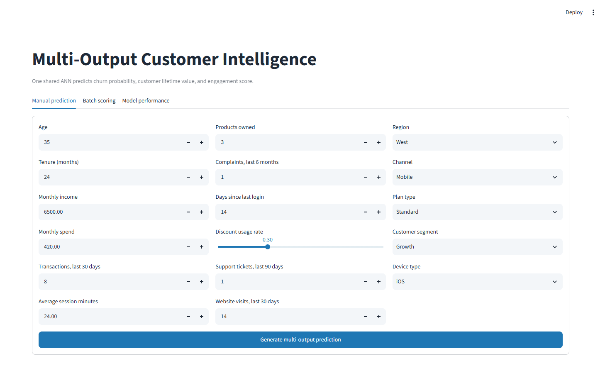
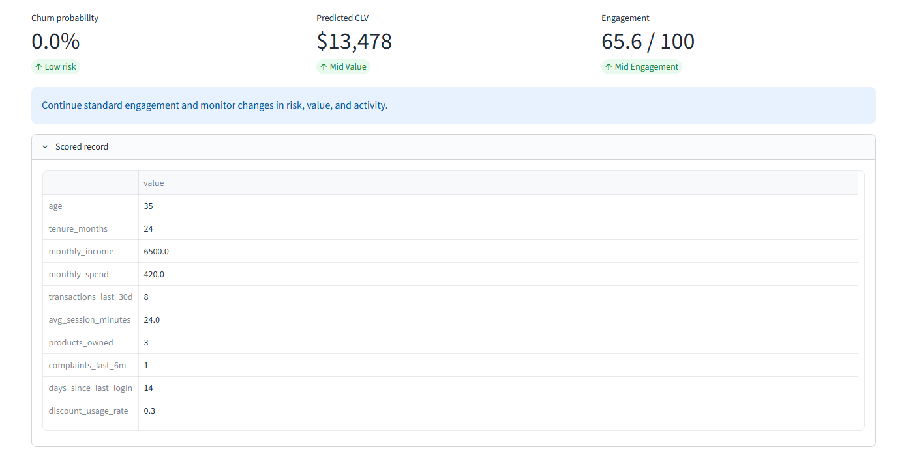
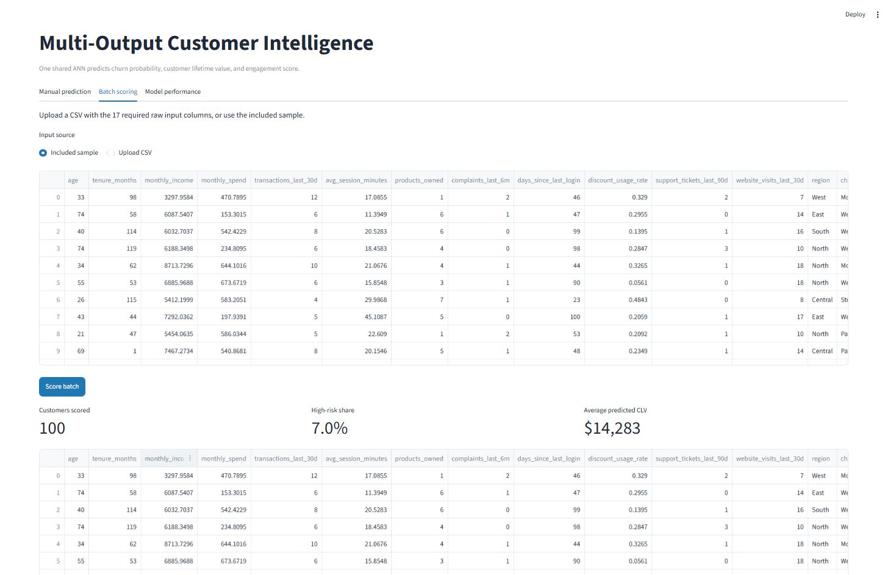
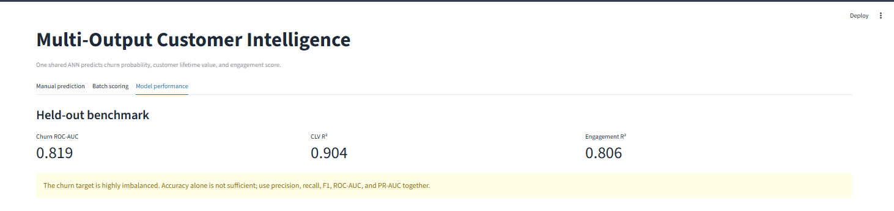
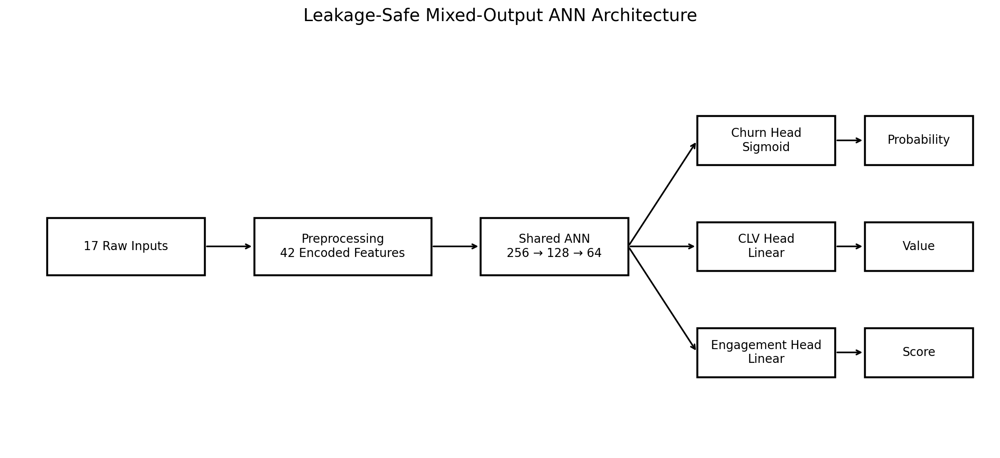
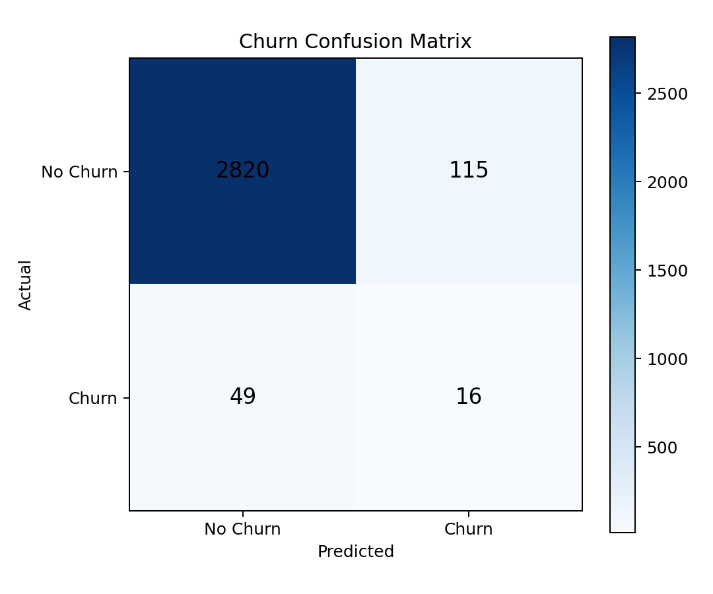
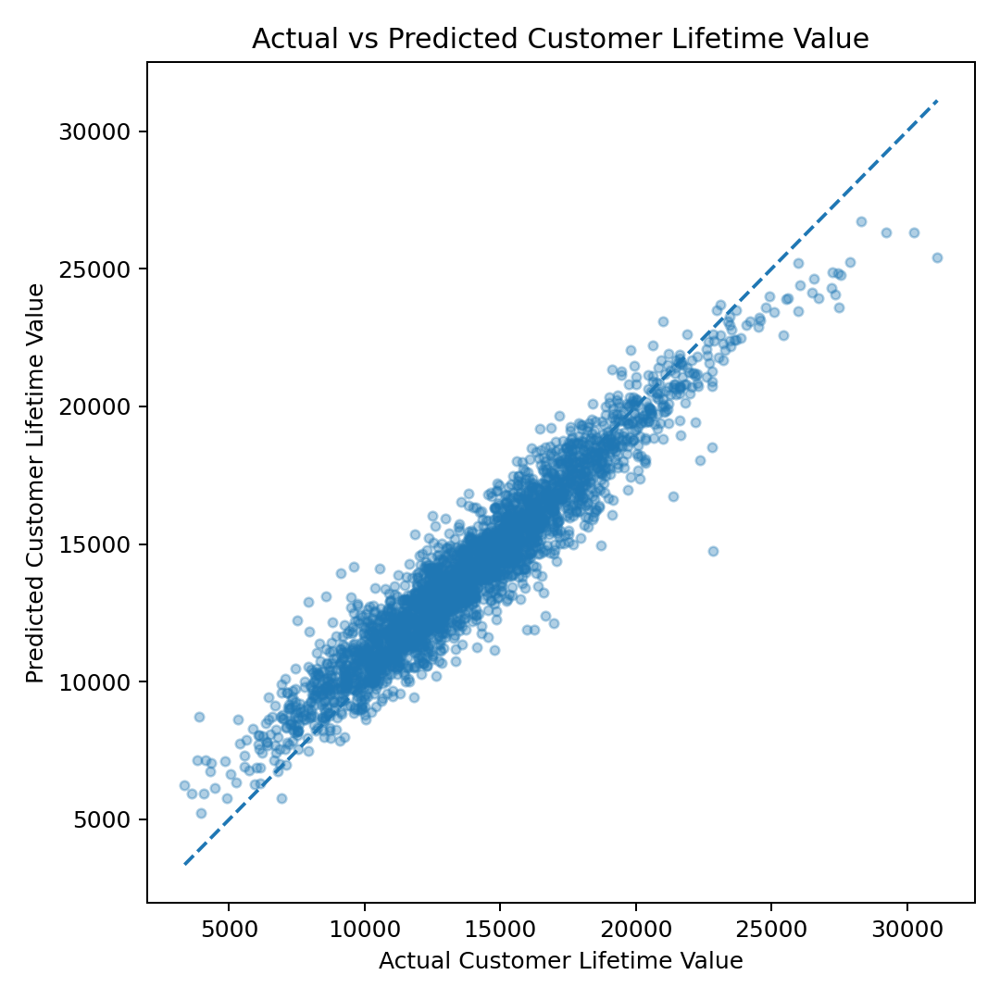
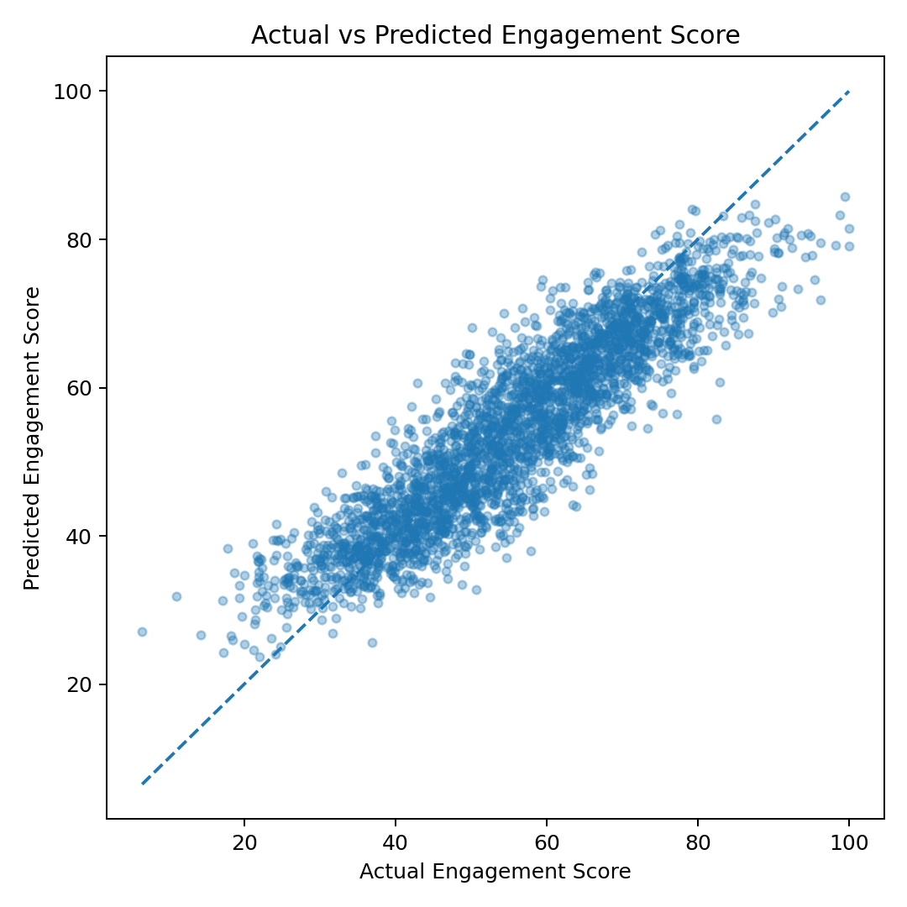

# Multi-Output Prediction System using Artificial Neural Networks

[](https://www.python.org/)
[](https://www.tensorflow.org/)
[](https://keras.io/)
[](https://ann-deep-learning-projects-5mvtt4spt9hwj28ytb8gze.streamlit.app/)
[](LICENSE)
[](https://github.com/unit-mole/ann-deep-learning-projects/actions/workflows/multi-output-ann-ci.yml)

An end-to-end mixed-output customer analytics project that uses a shared Artificial Neural Network to predict **customer churn probability**, **customer lifetime value**, and **engagement score** simultaneously. The system combines reproducible preprocessing, shared representation learning, task-specific output heads, business-oriented scoring, batch inference, automated testing, and an interactive Streamlit application.

**Status:** Portfolio-ready and deployed  
**Live demo:** [Open the Multi-Output Prediction System](https://ann-deep-learning-projects-5mvtt4spt9hwj28ytb8gze.streamlit.app/)  
**Project folder:** [View Project 09 on GitHub](https://github.com/unit-mole/ann-deep-learning-projects/tree/main/09-multi-output-prediction-system)  
**CI workflow:** [Multi-Output ANN CI](https://github.com/unit-mole/ann-deep-learning-projects/actions/workflows/multi-output-ann-ci.yml)  
[](https://ann-deep-learning-projects-5mvtt4spt9hwj28ytb8gze.streamlit.app/)  
**Primary stack:** Python · TensorFlow · Keras · scikit-learn · pandas · Streamlit

---

This project is the ninth completed application in the [ANN Deep Learning Projects portfolio](https://github.com/unit-mole/ann-deep-learning-projects).

## Business Problem

Customer-focused business decisions rarely depend on a single outcome. Retention teams need to understand churn risk, commercial teams need an estimate of customer value, and customer-success teams need a clear engagement signal.

Building three completely independent models can duplicate preprocessing, infrastructure, and maintenance while ignoring patterns shared across related outcomes.

This project answers:

> Given one customer profile, can a shared ANN generate multiple related business predictions in a single inference call?

The application produces:

- **Customer churn probability and risk classification**
- **Predicted customer lifetime value**
- **Predicted engagement score**
- **Business-friendly value and engagement bands**
- **Recommended customer-management action**

---

## Project Highlights

- Shared multi-task ANN representation with three output-specific prediction heads
- Mixed learning problem combining binary classification and two regression targets
- Leakage-safe feature preparation and train-only preprocessing
- Median and most-frequent imputation for missing values
- Numerical scaling and categorical one-hot encoding
- Validation-based churn-threshold selection
- Manual single-customer scoring and CSV batch prediction
- Downloadable multi-output prediction results
- Output-specific model evaluation and visualizations
- Persisted Keras model, preprocessing pipeline, target metadata, and input schema
- Modular Python source code, automated tests, CI workflow, and Streamlit deployment

---

## Application Preview

Only the essential application screenshots are included so the repository remains clear and recruiter-friendly.

### 1. Application overview and manual customer input

The manual prediction page allows users to enter customer profile, purchasing, support, engagement, and behavioral information through a structured form.



### 2. Single-customer multi-output prediction

The application returns churn probability, predicted customer lifetime value, predicted engagement score, business-friendly output bands, and a recommended action.



### 3. Batch customer scoring

Users can score the included sample dataset or upload a compatible CSV file. The application displays the number of customers scored, high-risk share, average predicted CLV, scored records, risk distribution, and a downloadable CSV.



### 4. Model-performance dashboard

The model-performance section presents the primary held-out metrics and output-specific evaluation visuals while highlighting the severe churn-class imbalance.



---

## Project Status and Honest Scope

This is a complete, deployable portfolio prototype built from the supplied notebook, saved ANN model, and prediction artifact.

The project uses **synthetic and privacy-safe customer data**, not real customer records. It is suitable for demonstrating advanced ANN design, mixed-output learning, preprocessing, evaluation, modular engineering, and deployment. It should not be used for real customer decisions without retraining, governance review, calibration, fairness testing, and validation on approved business data.

---

## Dataset

The project uses a reproducible synthetic customer analytics dataset containing 15,000 records. It preserves realistic preprocessing and modeling challenges without exposing personal or confidential information.

| Dataset detail | Value |
|---|---:|
| Total generated records | 15,000 |
| Held-out benchmark records | 3,000 |
| Raw application inputs | 17 |
| Engineered model features | 19 |
| Processed ANN input dimensions | 42 |
| Prediction targets | 3 |
| Personal or confidential data | None |
| Churn prevalence in held-out data | 2.17% |

The input variables cover:

- customer age and tenure;
- monthly income and monthly spend;
- recent transaction activity;
- average session duration;
- products owned;
- complaint and support-ticket history;
- days since last login;
- discount usage;
- website activity;
- region, acquisition channel, plan type, customer segment, and device type.

The full dataset can be regenerated through `src/data_generation.py` and is intentionally not committed. See [data/README_data.md](data/README_data.md).

---

## Feature Engineering and Preprocessing

The production pipeline uses 17 raw input variables and creates two additional deployment-safe features:

- **Tenure cohort:** Groups customer tenure into interpretable lifecycle bands.
- **Spend band:** Converts monthly spend into quartile-based categories learned from the training data.

The preprocessing workflow then applies:

1. schema validation;
2. numerical type conversion;
3. median imputation for numerical variables;
4. most-frequent imputation for categorical variables;
5. standard scaling for numerical inputs;
6. one-hot encoding for categorical variables;
7. fixed 42-dimensional model input generation.

All transformations are persisted in `models/preprocessor.joblib` and reused during inference so local predictions, batch scoring, and hosted predictions follow the same preparation logic.

---

## Model Outputs

| Output | Type | Activation | Loss | Primary evaluation |
|---|---|---|---|---|
| Churn probability | Binary classification | Sigmoid | Binary cross-entropy | F1, precision, recall, ROC-AUC, PR-AUC |
| Customer lifetime value | Regression | Linear | Huber during clean retraining | MAE, RMSE, R² |
| Engagement score | Regression | Linear | Huber during clean retraining | MAE, RMSE, R² |

The project is therefore a **mixed-output prediction system**: one classification output and two regression outputs.

---

## Technical Workflow

1. Generate or load privacy-safe customer data.
2. Validate the 17 required raw input columns.
3. Create tenure-cohort and spend-band features.
4. Split data into training, validation, and test sets.
5. Fit imputers, scaler, and categorical encoder on training data only.
6. Transform the prepared features into a 42-dimensional model input.
7. Learn a shared dense customer representation.
8. Route the shared representation into three task-specific output heads.
9. Select the churn decision threshold using validation F1.
10. Evaluate each output independently on held-out data.
11. Convert predictions into risk, value, and engagement bands.
12. Generate a combined recommended action.
13. Serve manual and batch predictions through Streamlit.

---

## ANN Architecture

The deployable Keras model contains approximately **60,000 parameters** and uses the Functional API.

```text
42 processed input dimensions
        ↓
Dense 256 + ReLU
        ↓
Batch Normalization + Dropout
        ↓
Dense 128 + ReLU
        ↓
Batch Normalization + Dropout
        ↓
Dense 64 shared representation
        ↓
 ┌──────────────────────┬──────────────────────┬──────────────────────┐
 │ Churn branch         │ CLV branch           │ Engagement branch    │
 │ Dense 32 + Dropout   │ Dense 32 + Dropout   │ Dense 32 + Dropout   │
 │ Sigmoid output       │ Linear output        │ Linear output        │
 └──────────────────────┴──────────────────────┴──────────────────────┘
```



The shared trunk learns common customer patterns, while each output head specializes in its own prediction objective.

---

## Current Held-Out Benchmark

The bundled deployable artifact was evaluated on 3,000 held-out synthetic records. Because the churn rate is only **2.17%**, accuracy is not used as the primary classification metric.

| Output | Metric | Result |
|---|---:|---:|
| Churn | ROC-AUC | **0.819** |
| Churn | PR-AUC | **0.092** |
| Churn | Precision | **0.122** |
| Churn | Recall | **0.246** |
| Churn | F1 | **0.163** |
| Customer lifetime value | MAE | **886.75** |
| Customer lifetime value | RMSE | **1,148.57** |
| Customer lifetime value | R² | **0.904** |
| Engagement score | MAE | **5.30** |
| Engagement score | RMSE | **6.68** |
| Engagement score | R² | **0.806** |

### Metric interpretation

- **ROC-AUC** measures how effectively the churn head ranks likely churners above non-churners.
- **PR-AUC** is especially informative when the positive class is rare.
- **Precision** measures how many customers flagged as churn risks are actual churners.
- **Recall** measures how many actual churners are identified.
- **F1** balances precision and recall.
- **MAE** represents the average absolute regression error.
- **RMSE** penalizes larger prediction errors more heavily.
- **R²** measures the proportion of target variance explained by the model.

The regression heads perform strongly on the synthetic benchmark. The churn head demonstrates useful risk ranking but remains challenging because of extreme class imbalance. Recommended experiments include focal loss, balanced mini-batches, probability calibration, precision-at-k, and business-cost threshold optimization.

---

## Important Technical Corrections

The supplied notebook is retained in `notebooks/original_supplied_notebook.ipynb` for provenance. The portfolio version makes the following important corrections:

1. **Target leakage removed**  
   The original `customer_segment_cluster` feature used CLV and engagement—the prediction targets—to create an input variable. This feature is excluded from the production pipeline.

2. **Threshold selection moved to validation data**  
   The original notebook explored churn thresholds on the test set. The cleaned training workflow selects the threshold on validation F1 and evaluates once on the test set.

3. **Deployment artifacts added**  
   The repository includes the fitted preprocessor, feature schema, target scaling metadata, decision threshold, and deployable Keras model.

4. **Batch-safe feature engineering added**  
   Tenure cohorts and spend bands are generated consistently during training and inference.

5. **Model and preprocessing alignment enforced**  
   The saved ANN expects exactly the same 42-dimensional transformed input produced by the persisted preprocessor.

6. **Evaluation expanded**  
   The portfolio version includes PR-AUC, confusion matrix, actual-versus-predicted charts, residual plots, output correlation, prediction summaries, and a feature-importance proxy.

---

## Business Scoring Layer

The prediction pipeline combines the three model outputs into business-friendly interpretations:

- **Churn-risk bucket**
- **Customer-value bucket**
- **Engagement bucket**
- **Recommended action**

A representative result may appear as:

```text
Churn probability: 38.4%
Predicted customer lifetime value: $14,850
Predicted engagement score: 67.2 / 100
Recommended action: Prioritize proactive retention while maintaining value-focused engagement.
```

These rules are demonstration logic rather than universal business policy. Production thresholds should be optimized using intervention capacity, customer economics, retention cost, and approved governance standards.

---

## Streamlit Application

The deployed application supports:

- manual customer-level input;
- included privacy-safe sample data;
- CSV batch upload;
- churn probability and churn-risk category;
- predicted customer lifetime value and value band;
- predicted engagement score and engagement band;
- combined business recommendation;
- batch summary metrics and risk distribution;
- downloadable scored CSV;
- model-performance metrics and evaluation images.

**Live application:**  
[Open the Multi-Output Prediction System](https://ann-deep-learning-projects-5mvtt4spt9hwj28ytb8gze.streamlit.app/)

**Streamlit entrypoint:**

```text
09-multi-output-prediction-system/streamlit_app.py
```

Changes pushed to the relevant Project 09 files on the repository's `main` branch automatically trigger a Streamlit Community Cloud application update.

See [README_HOSTING.md](README_HOSTING.md) for the deployment configuration and troubleshooting guidance.

---

## Visual Outputs

| Churn classification | Customer lifetime value | Engagement |
|---|---|---|
|  |  |  |

Additional repository outputs include:

- churn precision-recall curve;
- CLV residual plot;
- engagement residual plot;
- output-correlation heatmap;
- multi-output prediction summary;
- shared-layer feature-importance proxy;
- sample prediction CSV;
- machine-readable model metrics.

---

## Project Structure

```text
ann-deep-learning-projects/
├── .github/
│   └── workflows/
│       └── multi-output-ann-ci.yml
│
└── 09-multi-output-prediction-system/
    ├── app/
    │   ├── __init__.py
    │   └── streamlit_app.py
    ├── data/
    │   ├── sample_input.csv
    │   ├── sample_batch_input.csv
    │   └── README_data.md
    ├── images/
    │   ├── 01_app_home_manual_input.png
    │   ├── 02_single_customer_prediction.png
    │   ├── 03_batch_scoring_summary.png
    │   ├── 04_model_performance.png
    │   ├── model_architecture.png
    │   └── demo_preview.png
    ├── models/
    │   ├── multi_output_model.keras
    │   ├── original_supplied_model.keras
    │   ├── preprocessor.joblib
    │   ├── target_metadata.json
    │   ├── feature_schema.json
    │   └── README_models.md
    ├── notebooks/
    │   ├── multi_output_prediction_system.ipynb
    │   └── original_supplied_notebook.ipynb
    ├── outputs/
    │   ├── classification_confusion_matrix.png
    │   ├── classification_precision_recall_curve.png
    │   ├── regression_clv_actual_vs_predicted.png
    │   ├── regression_clv_residual_plot.png
    │   ├── regression_engagement_actual_vs_predicted.png
    │   ├── regression_engagement_residual_plot.png
    │   ├── output_correlation_heatmap.png
    │   ├── prediction_summary.png
    │   ├── feature_importance_proxy.png
    │   ├── model_metrics.json
    │   └── sample_predictions.csv
    ├── src/
    │   ├── constants.py
    │   ├── data_generation.py
    │   ├── data_preprocessing.py
    │   ├── feature_engineering.py
    │   ├── model_training.py
    │   ├── model_evaluation.py
    │   ├── multi_output_scoring.py
    │   ├── prediction_pipeline.py
    │   └── target_preprocessing.py
    ├── tests/
    ├── .gitignore
    ├── CHANGELOG.md
    ├── FILE_MANIFEST.csv
    ├── LICENSE
    ├── MODEL_CARD.md
    ├── README.md
    ├── README_HOSTING.md
    ├── requirements.txt
    ├── requirements-ci.txt
    └── streamlit_app.py
```

---

## Run Locally

Use Python 3.12 to match the tested development and deployment environment.

### Windows Command Prompt

Clone the repository and enter the project folder:

```bat
git clone https://github.com/unit-mole/ann-deep-learning-projects.git

cd ann-deep-learning-projects\09-multi-output-prediction-system
```

Create and activate a virtual environment:

```bat
py -3.12 -m venv .venv

.venv\Scripts\activate.bat
```

Install application and test dependencies:

```bat
python -m pip install --upgrade pip setuptools wheel

python -m pip install -r requirements.txt -r requirements-ci.txt
```

Run the automated tests:

```bat
python -m pytest tests -q
```

Launch the Streamlit application:

```bat
python -m streamlit run streamlit_app.py
```

Open the local URL displayed by Streamlit, normally:

```text
http://localhost:8501
```

### Future local runs

After the first installation:

```bat
cd ann-deep-learning-projects\09-multi-output-prediction-system

.venv\Scripts\activate.bat

python -m streamlit run streamlit_app.py
```

---

## Optional Retraining

The bundled model and preprocessing artifacts are ready for inference. Retraining is not required to run the application.

To rebuild the leakage-safe model from synthetic data:

```bash
python -m src.model_training --epochs 40
```

Retraining overwrites the deployable artifacts in `models/` and refreshes evaluation metrics and plots in `outputs/`.

---

## Deployment

The application is deployed on Streamlit Community Cloud and connected directly to the `main` branch of the GitHub repository.

**Live application:**  
[Open the Multi-Output Prediction System](https://ann-deep-learning-projects-5mvtt4spt9hwj28ytb8gze.streamlit.app/)

**Repository:**

```text
unit-mole/ann-deep-learning-projects
```

**Branch:**

```text
main
```

**Main file path:**

```text
09-multi-output-prediction-system/streamlit_app.py
```

No Streamlit secrets are required for this application.

---

## Data and Repository Safety

- The training workflow uses synthetic, privacy-safe customer data.
- Only small sample input files are included for application testing.
- The full generated dataset is not committed.
- Virtual environments, caches, logs, secrets, and local temporary outputs are excluded through `.gitignore`.
- Streamlit secrets must never be committed.
- The model and preprocessing artifacts under `models/` are required for inference and should remain in the repository.

---

## Known Limitations

- Synthetic data limits external validity.
- Churn prevalence is extremely low, making classification difficult.
- The churn probability output is not calibrated for a real business population.
- The business-recommendation rules are illustrative.
- The shared-layer importance chart is a proxy rather than full output-specific explainability.
- The project does not yet compare the shared multi-task model against three independently trained baselines.
- Production use would require governed data, fairness assessment, probability calibration, drift monitoring, auditability, and business-specific thresholds.

---

## Future Improvements

- retrain with focal loss, class weighting, or balanced mini-batches;
- optimize precision-at-k using retention-team capacity;
- calibrate churn probabilities;
- compare the shared ANN with independent ANN and tree-based baselines;
- add output-specific SHAP or permutation explanations;
- add uncertainty intervals for regression outputs;
- introduce data-quality and model-drift monitoring;
- optimize recommendations against intervention cost and expected customer value;
- add authentication and persistent scoring history for enterprise use.

---

## Skills Demonstrated

`Artificial Neural Networks` · `Multi-task Learning` · `Mixed-Output Prediction` · `Binary Classification` · `Regression` · `Class-Imbalance Evaluation` · `Feature Engineering` · `Leakage Prevention` · `scikit-learn Pipelines` · `TensorFlow` · `Keras Functional API` · `Batch Inference` · `Streamlit` · `Model Deployment` · `Testing` · `CI/CD` · `Business Translation`

---

## Portfolio Description

**One-line description**

> Built and deployed a multi-head ANN that simultaneously predicts customer churn risk, lifetime value, and engagement from a shared customer representation.

**Pinned-repository description**

> Advanced mixed-output deep-learning system combining imbalanced churn classification and two regression heads in one shared ANN, with leakage-safe preprocessing, validation-based thresholding, batch scoring, CI/CD, and a hosted Streamlit demo.

---

## Author

**Anmol Tripathi**  
Quality Data Scientist | Data Science | Machine Learning | Applied AI | Analytics
