# Tabular Deep Learning with Embeddings using Artificial Neural Networks

[](https://www.python.org/)
[](https://www.tensorflow.org/)
[](https://keras.io/)
[](https://ann-deep-learning-projects-budbjucqqrtaar2bjin76u.streamlit.app/)
[](#problem-definition)
[](../LICENSE)
[](https://github.com/unit-mole/ann-deep-learning-projects/actions/workflows/tabular-embedding-ci.yml)

An end-to-end tabular deep-learning project that uses separate categorical embedding layers and scaled numerical inputs to predict a synthetic positive business outcome. The project demonstrates how neural networks can learn compact representations for categorical variables, combine them with continuous business features, support single-record and batch scoring, and provide probability-based decision support through a deployed Streamlit application.

**Status:** Portfolio-ready  
**Live demo:** [Open the Streamlit application](https://ann-deep-learning-projects-budbjucqqrtaar2bjin76u.streamlit.app/)  
[](https://ann-deep-learning-projects-budbjucqqrtaar2bjin76u.streamlit.app/)  
**Primary stack:** Python · TensorFlow · Keras · scikit-learn · pandas · Streamlit

---

## Business Problem

Structured business datasets frequently combine numerical behavior with categorical attributes such as region, occupation, product category, acquisition channel, device type, and membership tier. Traditional one-hot encoding treats every category as unrelated and can create wide, sparse feature matrices as category cardinality grows.

This project answers:

> How can deep learning model mixed tabular business data more effectively by learning dense representations for categorical variables?

The deployed application produces:

- **Positive-outcome probability**
- **Predicted binary class**
- **Business propensity bucket**
- **Prediction interpretation**
- **Batch-scored downloadable CSV output**

The architecture is applicable to customer propensity, conversion prediction, risk ranking, prioritization, and other binary classification workflows.

---

## Project Highlights

- Multi-input Keras Functional API architecture
- Seven independent categorical embedding layers
- Seven scaled numerical inputs
- Leakage-aware numerical and categorical preprocessing
- Safe handling of missing and previously unseen categories
- Class-weighted ANN training for an imbalanced target
- Validation-based decision-threshold analysis
- Random Forest baseline comparison
- ROC-AUC, PR-AUC, precision, recall, F1, confusion matrix, and log-loss evaluation
- PCA-based embedding visualization
- Raw-feature permutation-importance analysis
- Single-record and batch-scoring Streamlit workflows
- Automated tests and repository-level GitHub Actions CI

---

## Application Preview

### 1. Single-record prediction

Users can enter numerical and categorical business attributes manually. The application returns the predicted class, positive-outcome probability, business propensity bucket, and a concise interpretation.

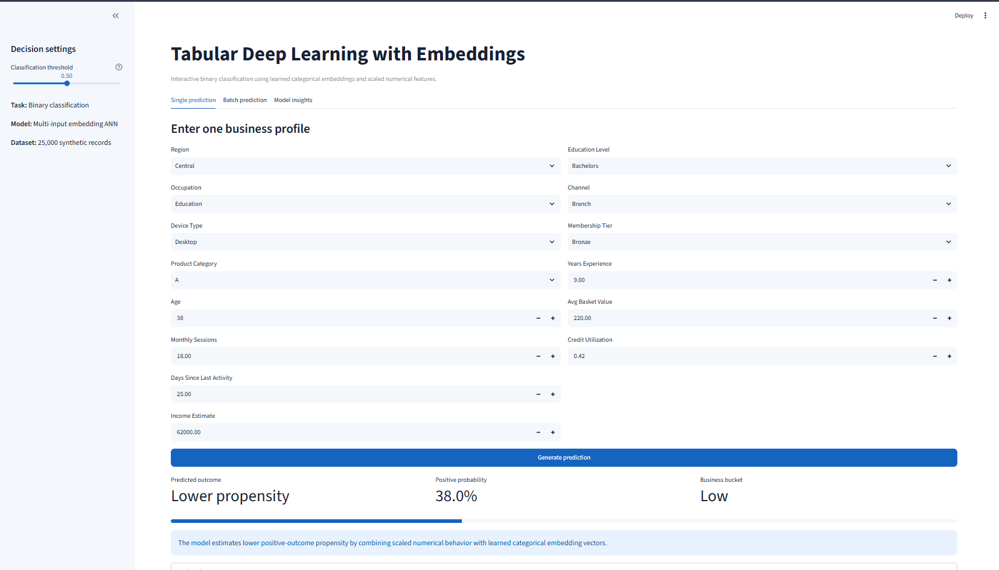

### 2. Batch prediction and downloadable results

Users can score the included privacy-safe sample dataset or upload a compatible CSV file. The application summarizes rows scored, higher-propensity records, average probability, class distribution, and probability distribution, while also providing a downloadable scored CSV file.

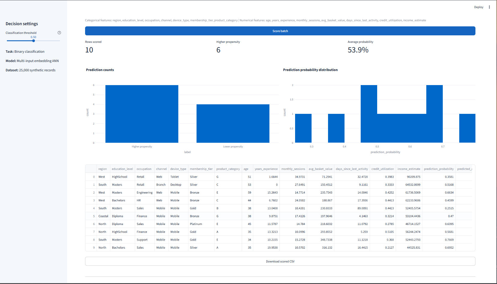

### 3. Model insights

The model-insights section explains why categorical embeddings are useful, compares the embedding ANN with the Random Forest baseline, and displays the learned embedding dimensions for each categorical input.

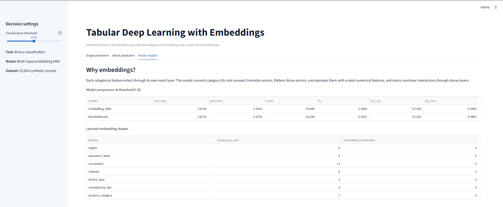

---

## Project Status and Honest Scope

This is a complete, deployable portfolio prototype built from a deterministic synthetic dataset containing **25,000 records**. The data is privacy-safe and does not represent real customers or production business outcomes.

The project is designed to demonstrate advanced tabular deep learning, preprocessing, model evaluation, embedding analysis, modular inference, testing, CI/CD, and deployment. It should not be used for real credit, employment, eligibility, healthcare, safety, or other high-impact decisions without retraining and validating it on governed business data.

---

## Problem Definition

The supplied notebook and artifacts implement **binary classification**.

| Component | Configuration |
|---|---|
| Output layer | One neuron |
| Output activation | Sigmoid |
| Loss function | Binary cross-entropy |
| Primary ranking metric | ROC-AUC |
| Minority-class metrics | Recall and F1 |
| Default threshold | 0.50 |
| Dataset size | 25,000 records |
| Positive-class share | 36.73% |

The target represents a synthetic positive business-outcome propensity.

---

## Dataset and Features

### Categorical inputs

- `region`
- `education_level`
- `occupation`
- `channel`
- `device_type`
- `membership_tier`
- `product_category`

### Numerical inputs

- `age`
- `years_experience`
- `monthly_sessions`
- `avg_basket_value`
- `days_since_last_activity`
- `credit_utilization`
- `income_estimate`

### Data safety

The full dataset is generated from code and is not committed to the repository. Only a small sample input file is included for application testing. This keeps the repository lightweight, reproducible, and suitable for public hosting.

---

## Feature Processing

### Numerical features

The numerical pipeline:

1. converts invalid values safely to missing values;
2. fills missing values using a saved median imputer;
3. scales features using a saved numerical scaler;
4. preserves the exact training-time feature order during inference.

### Categorical features

The categorical pipeline:

1. fills missing categories safely;
2. converts categories to integer IDs;
3. stores the fitted category mappings;
4. routes each categorical feature through its own embedding layer;
5. handles unknown categories without crashing the application;
6. reports unknown-category counts during batch inference.

The cleaned retraining workflow fits preprocessing only on the training split and reserves a dedicated out-of-vocabulary index.

---

## Why Embeddings Are Useful

A categorical embedding converts each category into a small trainable numerical vector. During training, categories that contribute similarly to the prediction can move closer together in embedding space.

Compared with one-hot encoding, embeddings can:

- reduce dimensionality for higher-cardinality variables;
- learn category similarity rather than treating categories as entirely unrelated;
- support nonlinear interactions between categorical and numerical features;
- produce reusable category representations for visualization and nearest-neighbor analysis.

The project uses the documented embedding-dimension rule:

```text
embedding_dimension = min(50, ceil(sqrt(vocabulary_size)) + 1)
```

This grows sub-linearly with vocabulary size and avoids arbitrary oversized embedding vectors. The current feature vocabularies are small, so learned embedding dimensions range from 3 to 5.

---

## ANN Architecture

```text
region ------------> Embedding -> Flatten --┐
education_level ----> Embedding -> Flatten --|
occupation ---------> Embedding -> Flatten --|
channel ------------> Embedding -> Flatten --|
device_type --------> Embedding -> Flatten --|--> Concatenate
membership_tier ----> Embedding -> Flatten --|        +
product_category ---> Embedding -> Flatten --┘   scaled numerical inputs
                                                     |
                                              Dense 128 + BN + Dropout
                                                     |
                                              Dense 64 + BN + Dropout
                                                     |
                                              Dense 32 + Dropout
                                                     |
                                               Sigmoid probability
```

The supplied model contains **15,649 trainable and non-trainable parameters**.

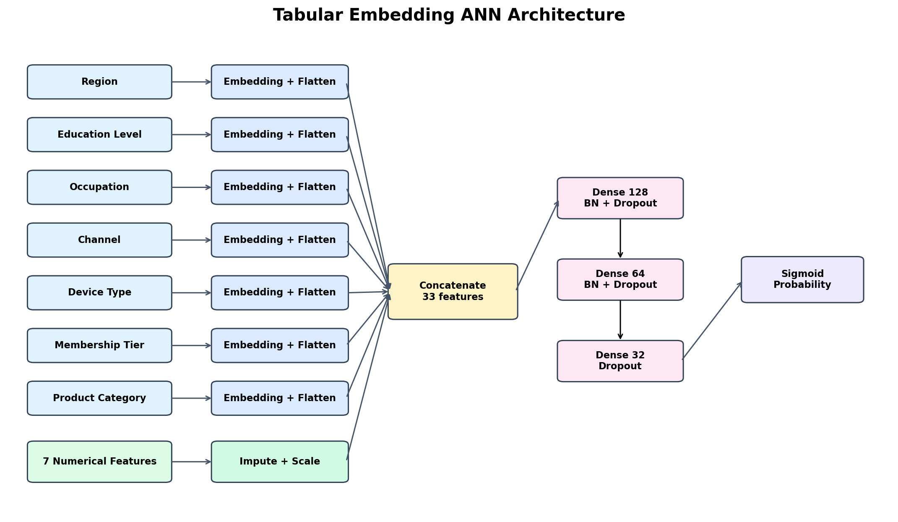

---

## Technical Workflow

1. Generate reproducible mixed-type synthetic data.
2. Separate categorical features, numerical features, and the target.
3. Create stratified training, validation, and test partitions.
4. Fit numerical imputation and scaling on training data.
5. Fit categorical mappings on training data.
6. Build one input and one embedding layer per categorical feature.
7. Flatten and concatenate all embeddings with scaled numerical inputs.
8. Train dense layers using class weights and early stopping.
9. Select the decision threshold using validation data.
10. Evaluate once on the held-out test set.
11. Compare the ANN with a Random Forest baseline.
12. Extract embeddings and generate PCA visualizations.
13. Save the model, preprocessing artifacts, metadata, metrics, and predictions.
14. Serve single-record and batch predictions through Streamlit.

---

## Model Results

| Model | Accuracy | Precision | Recall | F1 | ROC-AUC | Log loss |
|---|---:|---:|---:|---:|---:|---:|
| Embedding ANN | 0.6706 | 0.5436 | **0.6445** | **0.5898** | **0.7294** | 0.5994 |
| Random Forest | **0.6772** | **0.6756** | 0.2335 | 0.3471 | 0.7225 | **0.5961** |

### Interpretation

The Random Forest achieves slightly higher raw accuracy and precision. However, the embedding ANN is substantially stronger at identifying the positive class:

- Recall improves from **23.35% to 64.45%**.
- F1 improves from **34.71% to 58.98%**.
- ROC-AUC improves from **0.7225 to 0.7294**.

This makes the ANN more suitable when missing positive cases is costly and probabilities are used for ranking or prioritization rather than relying on accuracy alone.

Additional ANN results at threshold 0.50:

- PR-AUC: **0.5983**
- Confusion matrix: `[[2169, 994], [653, 1184]]`
- Validation-selected best-F1 threshold: approximately **0.34**

Decision thresholds should be selected from validation data and aligned with business costs. They should not be optimized on the final test set.

---

## Evaluation Visuals

### Training and validation performance

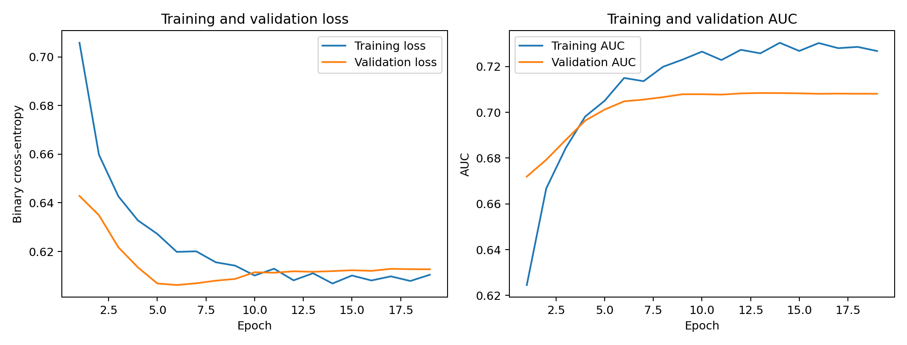

### Confusion matrix

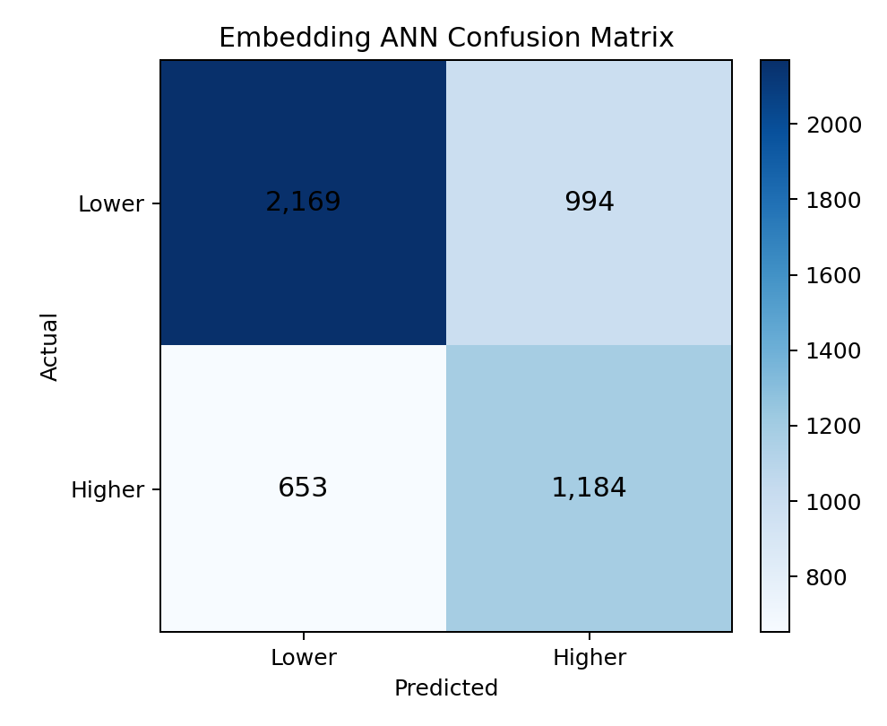

### ROC curve

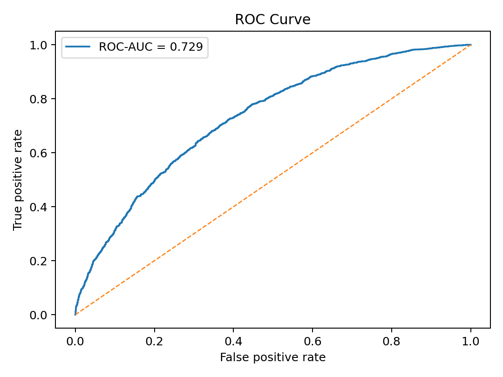

### Precision-recall curve

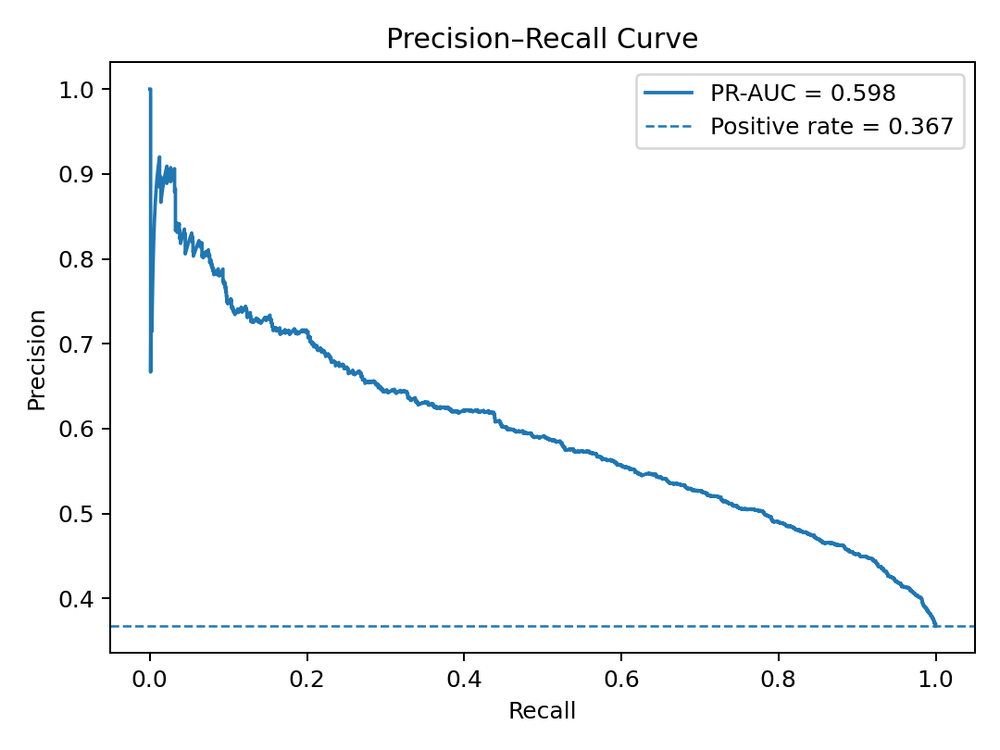

### Baseline comparison

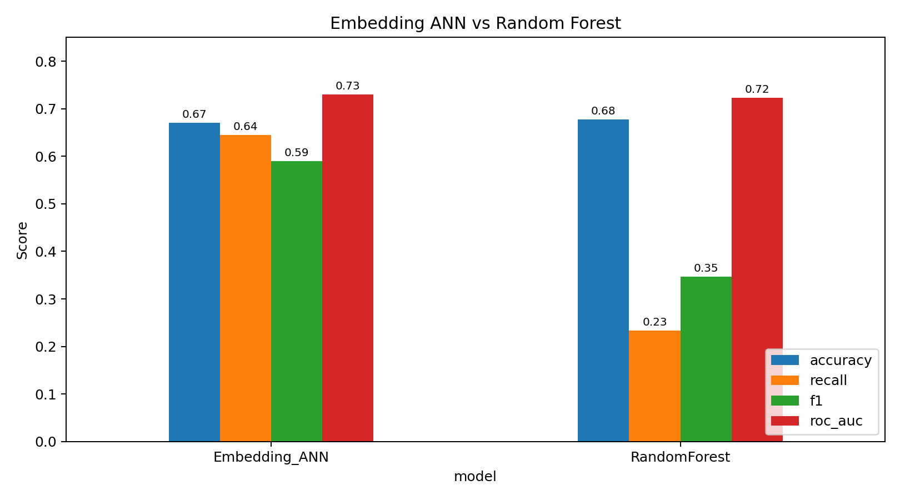

### Learned embedding visualization

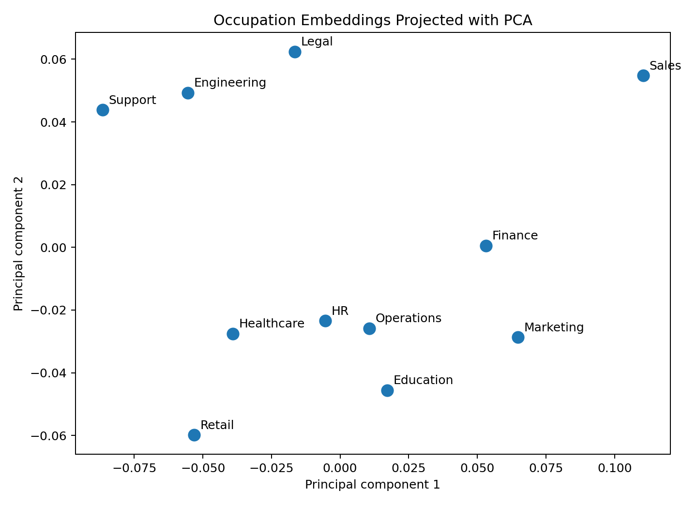

### Permutation importance

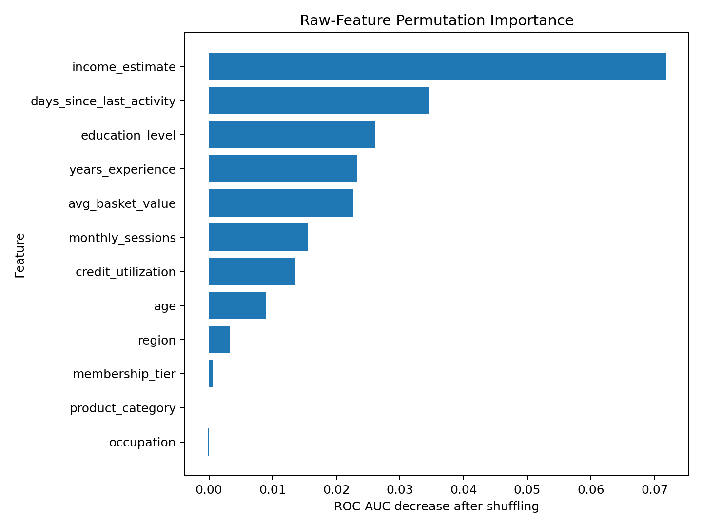

---

## Improvements Made to the Original Notebook

The supplied notebook was a strong experimentation prototype. The portfolio version strengthens it in the following areas:

- **Prevents encoder leakage:** categorical mappings in the cleaned retraining workflow are fitted on training data only.
- **Handles unseen categories:** the inference pipeline uses safe documented fallback behavior, while retraining reserves an out-of-vocabulary index.
- **Separates reusable modules:** preprocessing, model training, evaluation, embedding analysis, and prediction logic are moved into `src/`.
- **Uses validation thresholding:** decision-threshold selection is separated from final test evaluation.
- **Preserves inference consistency:** numerical and categorical feature order is stored and validated.
- **Adds production validation:** missing columns, numeric coercion, unsupported categories, and artifact compatibility are handled explicitly.
- **Adds automated testing:** sample inference and unseen-category behavior are validated through pytest.
- **Adds CI/CD:** the project is tested through a repository-level GitHub Actions workflow.
- **Adds a complete Streamlit workflow:** manual input, sample data, CSV upload, charts, warnings, and downloadable scored output are supported.

---

## Streamlit Application

The deployed application supports:

- manual single-record prediction;
- included sample-data scoring;
- uploaded CSV batch scoring;
- input preview and required-feature display;
- configurable decision threshold;
- positive-outcome probability;
- predicted class and business propensity bucket;
- unknown-category fallback warnings;
- class-count and probability-distribution charts;
- downloadable scored CSV output;
- baseline comparison and embedding insights.

**Live application:**  
[Open the Tabular Deep Learning with Embeddings application](https://ann-deep-learning-projects-budbjucqqrtaar2bjin76u.streamlit.app/)

---

## Project Structure

```text
ann-deep-learning-projects/
├── .github/
│   └── workflows/
│       └── tabular-embedding-ci.yml
│
└── 10-tabular-deep-learning-with-embeddings/
    ├── .streamlit/
    │   └── config.toml
    ├── app/
    │   ├── requirements.txt
    │   └── streamlit_app.py
    ├── data/
    │   ├── README_data.md
    │   └── sample_input.csv
    ├── images/
    │   ├── 01_single_prediction.png
    │   ├── 02_batch_prediction_results.png
    │   └── 03_model_insights.png
    ├── models/
    │   ├── feature_metadata.json
    │   ├── label_encoders.pkl
    │   ├── numeric_imputer.pkl
    │   ├── numeric_scaler.pkl
    │   └── tabular_embedding_ann.keras
    ├── notebooks/
    │   ├── tabular_deep_learning_with_embeddings.ipynb
    │   └── original_experiment_notebook.ipynb
    ├── outputs/
    │   ├── confusion_matrix.png
    │   ├── embedding_visualization.png
    │   ├── final_metrics_summary.csv
    │   ├── model_architecture.png
    │   ├── model_comparison.png
    │   ├── model_metrics.json
    │   ├── permutation_importance.png
    │   ├── precision_recall_curve.png
    │   ├── roc_curve.png
    │   ├── training_curves.png
    │   └── training_history.csv
    ├── src/
    │   ├── config.py
    │   ├── data_generation.py
    │   ├── data_preprocessing.py
    │   ├── embedding_analysis.py
    │   ├── embedding_preprocessing.py
    │   ├── feature_engineering.py
    │   ├── model_evaluation.py
    │   ├── model_training.py
    │   └── prediction_pipeline.py
    ├── tests/
    │   └── test_preprocessing.py
    ├── .gitignore
    ├── FILE_MANIFEST.csv
    ├── PROJECT_REVIEW.md
    ├── README.md
    ├── README_HOSTING.md
    ├── REPOSITORY_INTEGRATION.md
    ├── requirements.txt
    ├── run_local.bat
    └── train_model.py
```

---

## Run Locally

Use Python 3.12 to match the tested local and deployment environments.

### Windows Command Prompt

Clone the repository and enter the project folder:

```bat
git clone https://github.com/unit-mole/ann-deep-learning-projects.git

cd ann-deep-learning-projects\10-tabular-deep-learning-with-embeddings
```

Create and activate the virtual environment:

```bat
py -3.12 -m venv .venv

call .venv\Scripts\activate.bat
```

Install the application dependencies:

```bat
python -m pip install --upgrade pip setuptools wheel

python -m pip install -r requirements.txt
```

Install pytest and run the automated tests:

```bat
python -m pip install pytest

python -m pytest tests -q
```

Expected result:

```text
3 passed
```

Launch the Streamlit application:

```bat
python -m streamlit run app\streamlit_app.py
```

Open the local URL displayed by Streamlit, normally:

```text
http://localhost:8501
```

### Future local runs

```bat
cd ann-deep-learning-projects\10-tabular-deep-learning-with-embeddings

call .venv\Scripts\activate.bat

python -m streamlit run app\streamlit_app.py
```

---

## Optional Retraining

The included model and preprocessing artifacts are ready for inference, so retraining is not required to run the application.

To rebuild the model using the cleaned leakage-aware pipeline:

```bat
python train_model.py
```

Retraining replaces the model and preprocessing artifacts under `models/` and regenerates evaluation outputs under `outputs/`.

---

## Deployment

The application is deployed on Streamlit Community Cloud and connected directly to the `main` branch of this GitHub repository.

**Live application:**  
[Open the Tabular Deep Learning with Embeddings application](https://ann-deep-learning-projects-budbjucqqrtaar2bjin76u.streamlit.app/)

**Streamlit entrypoint:**

```text
10-tabular-deep-learning-with-embeddings/app/streamlit_app.py
```

Changes pushed to the relevant project files on the `main` branch automatically trigger a Streamlit application update.

See [README_HOSTING.md](README_HOSTING.md) for the complete deployment configuration, maintenance instructions, and troubleshooting guide.

---

## Data and Repository Safety

- The modeling data is synthetic and privacy-safe.
- The full generated training dataset is not committed.
- Only a small sample input file is included for application testing.
- Virtual environments, temporary files, local logs, downloaded results, and secrets are excluded through `.gitignore`.
- Streamlit secrets must never be committed to GitHub.
- The saved model and preprocessing artifacts under `models/` are required for hosted inference.

---

## Known Limitations

- Synthetic data limits external validity.
- The current categorical vocabularies are relatively small, so the dimensionality benefits of embeddings would be stronger on a genuinely high-cardinality dataset.
- The supplied legacy label encoders were originally fitted using categories across all splits; the cleaned retraining workflow removes this leakage.
- Random Forest remains slightly stronger on raw accuracy and precision.
- Model probabilities are not formally calibrated.
- PCA embedding projections provide global exploratory insight but are not causal explanations.
- Production use would require real-data retraining, governance review, probability calibration, fairness assessment, drift monitoring, and business-specific threshold selection.

---

## Future Improvements

- Retrain on a real, permissioned high-cardinality dataset
- Compare against CatBoost, XGBoost, LightGBM, and FT-Transformer
- Add SHAP or integrated-gradients explanations
- Calibrate probabilities using Platt scaling or isotonic regression
- Add model monitoring for data drift, unknown-category rates, and prediction stability
- Add nearest-category analysis from learned embedding vectors
- Introduce MLflow or Weights & Biases for experiment tracking
- Add Docker support for Hugging Face Spaces or other cloud platforms

---

## Skills Demonstrated

`Artificial Neural Networks` · `Tabular Deep Learning` · `Categorical Embeddings` · `Keras Functional API` · `Binary Classification` · `Class-Imbalance Handling` · `Feature Engineering` · `Leakage-Aware Preprocessing` · `Threshold Analysis` · `Baseline Comparison` · `Embedding Visualization` · `Permutation Importance` · `TensorFlow` · `Keras` · `scikit-learn` · `Streamlit` · `Testing` · `CI/CD` · `Model Deployment` · `Business Translation`

---

## Portfolio Description

**One-line description**

> Built and deployed a multi-input Keras ANN that learns categorical embeddings, combines them with scaled numerical features, and supports probability-based single and batch scoring through Streamlit.

**Pinned-repository description**

> Advanced tabular deep-learning project featuring categorical embeddings, leakage-aware preprocessing, class-imbalance handling, baseline comparison, embedding analysis, batch scoring, automated testing, CI/CD, and Streamlit deployment.

This project supports a transition from Quality Data Science into broader Data Science, Machine Learning, and Applied AI roles by demonstrating end-to-end model engineering rather than notebook-only experimentation.

---

## Author

**Anmol Tripathi**  
Quality Data Scientist | Data Science | Machine Learning | Applied AI | Analytics
